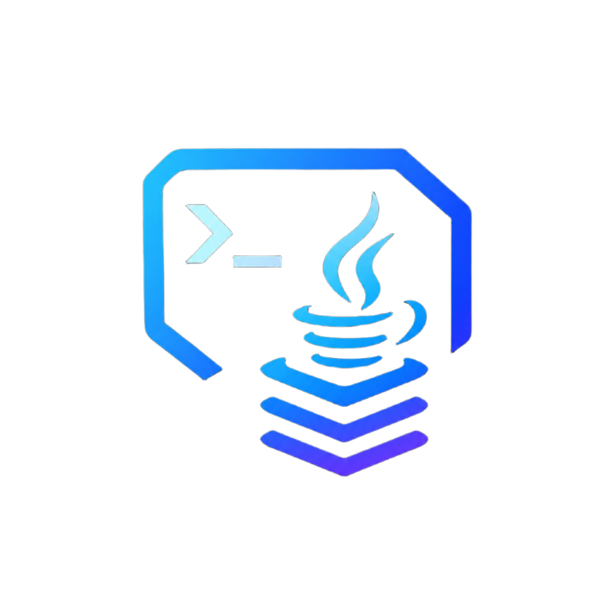

<p align="center">
  
</p>

<h1 align="center">Java Version Manager (JVM)</h1>

<p align="center">
  <strong>A lightweight, high-performance, color-coded Windows command-line utility designed to dynamically discover, download, and switch Java Development Kits (JDKs) and the entire JVM Ecosystem with native SDKMAN! parity.</strong>
</p>

<p align="center">
  <a href="https://github.com/DiamTek/Java-Version-Manager-Windows/actions/workflows/ci.yml"></a>
  <a href="https://github.com/DiamTek/Java-Version-Manager-Windows/releases"></a>
  <a href="https://github.com/DiamTek/Java-Version-Manager-Windows/releases"></a>
  <a href="https://github.com/DiamTek/Java-Version-Manager-Windows/blob/main/LICENSE"></a>
  <a href="https://github.com/DiamTek/Java-Version-Manager-Windows"></a>
</p>

<p align="center">
  <a href="#installation">📥 Installation</a> &nbsp;•&nbsp;
  <a href="#features">🚀 Features</a> &nbsp;•&nbsp;
  <a href="#enterprise--corporate-deployment">🏢 Enterprise</a> &nbsp;•&nbsp;
  <a href="#documentation">📚 Documentation</a> &nbsp;•&nbsp;
  <a href="#usage">🛠️ Usage</a> &nbsp;•&nbsp;
  <a href="#version-history">📜 Version History</a> &nbsp;•&nbsp;
  <a href="#community--contributing">🤝 Community</a>
</p>

---

<a id="installation"></a>
<a id="-installation"></a>
## 📥 Installation

Open Windows PowerShell (no Administrator privileges required) and run the one-liner:

```powershell
irm https://raw.githubusercontent.com/DiamTek/Java-Version-Manager-Windows/main/install.ps1 | iex
```

Or via explicit `Invoke-WebRequest`:
```powershell
Invoke-WebRequest -Uri "https://raw.githubusercontent.com/DiamTek/Java-Version-Manager-Windows/main/install.ps1" -OutFile "$env:TEMP\install.ps1"; & "$env:TEMP\install.ps1"
```
*This instantly downloads the core engine, provisions `%LOCALAPPDATA%\DiamTek\JVM`, registers the Windows uninstaller, and updates your PowerShell Profile so the `jvm` command is available everywhere.*

### Or via your favorite Package Manager:
```powershell
winget install DiamTek.JVM
scoop install jvm
choco install jvm-windows
```
*Or grab the standalone MSI installers (`x64` / `arm64`), portable `.zip`, or raw `jvm.bat` directly from [Releases](https://github.com/DiamTek/Java-Version-Manager-Windows/releases).*

<a id="uninstallation"></a>
<a id="-uninstallation"></a>
## 🗑️ Uninstallation

Easily remove JVM and all associated configurations:
- **Windows Settings:** Open **Installed apps** -> **DiamTek Java Version Manager** -> **Uninstall**.
- **Start Menu:** Search **"Uninstall Java Version Manager"** and hit Enter.
- **Terminal:** Run `jvm self-uninstall` or select Option 4 in the **Settings** menu.

<a id="features"></a>
<a id="-features"></a>
## 🚀 Features

* **Zero Dependencies (100% Native Windows):** Unlike SDKMAN or similar Unix-ports that require heavy POSIX subsystems (WSL, MSYS2, Git Bash, `curl`, `zip`), this utility is built entirely on native Windows APIs. It leverages pure Batch and embedded `.NET` Framework endpoints for networking, zip extraction, and SHA256 cryptography to run instantly out-of-the-box on any Windows 10/11 machine.
* **Windows Terminal & Modern Shell Integration:** Automatically registers a native "Java Version Manager" profile in Windows Terminal with custom high-resolution branding (`icon.png`), seamless `+` new tab dropdown access, and auto-closing tab lifecycles (`closeOnExit: always`). Generates Start Menu application shortcuts and automatically synchronizes existing pinned taskbar shortcuts.
* **Full JVM Ecosystem Support (SDKMAN Parity):** Move beyond just Java! This tool features a powerful, UAC-free Universal Candidate Engine that natively resolves, downloads, and symlinks modern JVM build tools. Install and switch between **Maven**, **Gradle**, **Kotlin**, **Scala**, and **Groovy** instantly (`jvm install maven latest`, `jvm gradle 8.5`) — all without adding any heavy dependencies.
* **Dynamic Vendor Architecture:** Menus are dynamically grouped and filtered by vendor (Oracle, Adoptium, GraalVM, Corretto, Zulu, Microsoft) to keep your workspace clean and organized.
* **Intelligent Background Sorting:** Features a built-in, stable bubble-sort algorithm that organizes all discovered JDKs by their major version in descending order, ensuring your newest installations are always at the top of the list.
* **Semantic Target Routing:** Speak to the tool in human terms. Automatically jump to or install the latest available JDK using targets like `jvm latest` or `jvm lts`. The engine queries the Adoptium API at runtime to dynamically resolve the true latest feature release and LTS version numbers, so you never have to hardcode them.
* **ARM64 / AArch64 Auto-Detection:** Automatically detects your CPU architecture at startup (`x64` vs `ARM64`) and routes all vendor API queries to the correct architecture-specific download endpoint. Zero configuration needed — it just works on both Intel/AMD and ARM Windows machines.
* **Dual-Architecture Core (UAC-Free vs Registry):** Toggle seamlessly between lightning-fast **Symlink Mode** (bypasses UAC completely using a Directory Junction at `%LOCALAPPDATA%\DiamTek\JVM\current`) and legacy **Registry Mode** (auto-elevating background scripts to update system `HKLM` environment variables) based on your system compatibility needs.
* **Accurate Windows 11 Installed Apps Footprint:** Calculates dynamic recursive file size across your installation and candidate stores, enforcing a 1,024 KB minimum floor so Windows 11 Settings displays your true storage footprint.
* **Directory-based Auto-Switching (`.java-version` & `.sdkmanrc`):** Instantly configure a project's required environment by simply running `jvm` inside any directory containing a `.java-version` or SDKMAN `.sdkmanrc` file. The tool parses the file and seamlessly swaps your environment in the background with **True Session Isolation** (doesn't pollute your global Windows Registry). 
  * **`.java-version`** is strictly for JDKs, but our engine is incredibly advanced: it natively supports parsing full CLI flags directly from the file (e.g., `21 --vendor adoptium --legacy`), allowing you to lock specific vendors or architecture modes on a strict per-project basis.
  * **`.sdkmanrc`** natively supports the **entire JVM Ecosystem**! If you're collaborating with SDKMAN users on macOS/Linux, JVM will happily hijack their `.sdkmanrc` files on Windows, mapping their JDK vendor strings (`-tem`, `-amzn`, etc.) directly to your native JDKs, *and* automatically isolating and activating the project's exact required versions of Maven, Gradle, Kotlin, Scala, and Groovy for that specific terminal session.
* **Interactive Ecosystem Auto-Updater:** Engineered with a dynamic, vendor-sorted Updater menu that displays your active versions across JDKs and Ecosystem tools, queries GitHub/Apache APIs to resolve the absolute latest stable releases in real-time, and seamlessly prompts to upgrade any out-of-date binaries.
* **Global Command & Shell Hooks:** Features a built-in Settings menu that dynamically injects the `jvm` command into your system PATH, and can optionally install a native PowerShell Profile Hook to enable true, isolated `--session` support across multiple terminal tabs.
* **Advanced CLI Quick-Switching:** Supports intelligent argument parsing to bypass the UI entirely. If multiple vendors are installed for the same JDK version, it safely pauses to ask you which vendor you want to switch to, which can be bypassed on the fly with the `--vendor` flag.
* **Multi-Vendor API Auto-Downloader:** Connects directly to official vendor APIs (Oracle, GitHub for GraalVM, Adoptium v3, Azul, etc.) via a transparent, isolated PowerShell instance to dynamically resolve, download, and extract modern JDK versions.
* **Enterprise-Grade Integrity Verification:** Enforces strict SHA256/SHA512 checksum verification across all remote download pathways using native `.NET` Cryptography APIs. Validates payload integrity against official vendor checksum mirrors before extraction, protecting against transmission corruption, incomplete downloads, or CDN cache desynchronization.
* **Inline Multi-Vendor Update Checker:** Dynamically generates and executes a self-contained PowerShell update script at runtime to query all six vendor APIs (Oracle, Adoptium, GraalVM, Corretto, Zulu, Microsoft) for newer builds. Compares `SEMANTIC_VERSION` and `JAVA_VERSION` strings from the local `release` file against live API responses, with automatic `-LTS` suffix normalization for Adoptium. Oracle uses a legacy `HEAD`-request date comparison against `download.oracle.com` for maximum reliability.
* **Offline-Aware Error Handling:** All network operations (downloads, update checks, API queries) are wrapped in structured error boundaries. If you are offline or an API is unreachable, the tool displays a clean `[ ERROR ] Network connection failed. You appear to be offline.` message with a `[ DETAIL ]` trace instead of crashing with raw exception dumps.
* **Dynamic Environment Switching:** Atomically updates `JAVA_HOME` and your user/system `PATH` globally while cleanly updating the environment variables of your active terminal session without spawning double paths.
* **The "Phantom Path" Killer:** Unlike other version managers that passively append to your PATH (which Windows often ignores if a hardcoded shortcut exists), JVM actively hunts down and scrubs rogue, hardcoded Oracle shortcuts (e.g., `Common Files\Oracle\Java\javapath`) that MSIs forcefully inject into the front of your `PATH`, ensuring your selected `JAVA_HOME` is always respected.
* **Bring Your Own JDK (BYO-JDK):** Have a custom JDK build or a GraalVM native-image compiler installed manually? Use `jvm link <path> [name]` to register it, and it will instantly integrate into the dynamic UI and CLI routing alongside your auto-downloaded JDKs.
* **Instant Menu Navigation:** Uses a smart `NEEDS_RESCAN` caching architecture to guarantee zero-latency navigation when moving back and forth between interactive submenus.
* **Built-in Self-Updater with Integrity Verification:** Run `jvm version` (or `-v`) to trigger the intelligent semantic versioning engine. If an update is available, `jvm self-update` dynamically bypasses CDN edge cache, chains execution to an external handoff runner (`%TEMP%\jvm_updater_*.bat`) to eliminate `cmd.exe` file-offset shifting, renders an interactive ANSI progress bar across all installation phases, validates a `rem END OF SCRIPT` integrity sentinel, and atomically hot-swaps the core script.
* **Comprehensive Diagnostic Health Audit (`jvm doctor`):** Instant one-click diagnostic scanner that audits AppData storage root access, active architecture mode, directory junction integrity and target validity, User vs Machine `JAVA_HOME` registry synchronization, `where.exe java` PATH precedence and rogue Oracle shadowing detection, and PowerShell profile hook status.
* **Ephemeral One-Off Subshell Runner (`jvm exec` / `jvm run`):** Execute builds, tests, or scripts against any installed JDK in an ephemeral isolated subshell (`jvm exec 21 -- java -version`, `jvm run 17 mvn clean verify`) without modifying your active Directory Junction, system environment, or Windows Registry. Accurately propagates the invoked command's exit code back to your host terminal.
* **Project Version Pinning (`jvm pin` / `jvm local`):** Effortlessly lock or inspect the directory-level `.java-version` file (`jvm pin 21`, `jvm pin 21 --vendor adoptium`) to guarantee seamless team coordination.
* **Instant Windows File Explorer Jump (`jvm open` / `jvm home`):** Instantly navigate to the active JDK installation, ecosystem candidate folder, or JVM storage root in Windows File Explorer directly from the CLI (`jvm open`, `jvm open maven`, `jvm home`).
* **PowerShell Profile Hook (`jvm hook`):** One-command manager (`jvm hook`, `jvm hook status`, `jvm hook remove`) to install, inspect, and remove the auto-sync wrapper function across Windows PowerShell 5.1 and PowerShell 7+ profiles without touching your global User PATH.
* **Ergonomic Transparent Aliases (`jvm use` / `jvm default`):** Native SDKMAN/nvm muscle memory support allowing developers to switch JDKs seamlessly using familiar commands.
* **Headless CI/CD Automation:** Every command is engineered with zero-prompt bypass flags. Run complex installations like `jvm install lts --latest --vendor oracle` or `jvm uninstall 21 --vendor adoptium` to bypass all interactive menus for frictionless integration into CI/CD pipelines, DevOps scripts, or automated machine provisioning workflows.

<a id="dual-architecture-core"></a>
<a id="-dual-architecture-core-symlink-vs-legacy"></a>
## 🏗️ Dual-Architecture Core (Symlink vs Legacy)

Windows Directory Junctions (Symlinks) provide a massive speed and workflow improvement because they allow the script to instantly swap your Java version without ever needing Administrator privileges (UAC). By routing your User `PATH` to a single junction (`%LOCALAPPDATA%\DiamTek\JVM\current`), 99% of modern tools (Gradle, Maven, IDEs) can natively resolve the path entirely in the background.

However, some ultra-legacy enterprise Java applications or obscure classloaders perform strict canonical path resolution that can occasionally fail to traverse Windows Directory Junctions. To ensure 100% unbreakable compatibility for all workflows, we built a **Dual-Architecture Core**.

By navigating to the **Settings** menu, users can freely toggle between the two modes:

| Mode | Mechanism | Privileges Required | Legacy App Compatibility |
|------|-----------|---------------------|--------------------------|
| **Symlink Mode** (Default) | Dynamically updates a junction pointer in your User `PATH`. | Standard User (UAC-Free) | Extremely High (99%) |
| **Registry Mode** (Legacy) | Hardcodes absolute paths directly into the Machine `HKLM` Registry. | Administrator (Prompts UAC) | 100% Unbreakable |

> [!WARNING]
> **Architecture Conflicts:** Windows evaluates Machine (`HKLM`) paths before User (`HKCU`) paths. If you use Registry Mode (which writes to the Machine level) and later switch back to Symlink Mode (which writes to the User level), the old Machine path would normally stubbornly override your new Symlink! To prevent this, toggling back to Symlink Mode inside the Settings Menu will now automatically scrub the legacy Machine pollution for you. (Note: If you manually bypass the menu using `--legacy` and `--symlink` CLI flags and experience an override, simply run `jvm clear` to wipe the slate).

You can even override your global setting dynamically on a per-command basis using the `--symlink` or `--legacy` CLI flags (e.g., `jvm 21 --legacy`).

<a id="enterprise"></a>
<a id="-enterprise"></a>
<a id="enterprise--corporate-deployment"></a>
<a id="-enterprise--corporate-deployment"></a>
## 🏢 Enterprise & Corporate Deployment

DiamTek JVM is engineered for real-world enterprise IT environments, strict security compliance standards (SecOps/EDR), and frictionless cross-platform engineering team onboarding.

### 🔑 The Four Pillars of Corporate Adoption

1. **Zero Admin Rights Required (Zero IT Helpdesk Tickets)**
   - **The Enterprise Bottleneck:** On locked-down corporate laptops, developers lack local administrator privileges (`UAC`). Traditional JDK installers write to `C:\Program Files` and machine-level registry keys, requiring IT helpdesk tickets for every routine Java or build tool update.
   - **The JVM Solution:** DiamTek JVM installs into user space (`%LOCALAPPDATA%\DiamTek\JVM`) and switches active versions using user-mode NTFS Directory Junctions (`current`). Version switching requires **0 UAC prompts**, 0 admin credentials, and 0 IT tickets. Developers control their toolchains independently while corporate endpoint policies remain intact.

2. **Mixed-OS Team Onboarding (`.sdkmanrc` & `.java-version` Parity)**
   - **Cross-Platform Repositories:** Modern engineering teams rarely use homogeneous operating systems. Repositories committed by macOS/Linux developers standardizing on SDKMAN! include `.sdkmanrc` or `.java-version` files.
   - **Native Windows Parity:** Windows engineers run `jvm` inside any repository, and the engine automatically parses the file, translates SDKMAN! vendor strings (`-tem`, `-amzn`, `-graal`) to native Windows JDKs, and isolates required versions of Maven, Gradle, Kotlin, Scala, and Groovy in active session memory. No WSL virtualization overhead, no Git Bash quirks, and zero cross-platform friction.

3. **Turnkey Fleet Management (Intune, MECM / SCCM, Group Policy)**
   - **Silent Enterprise Distribution:** Shipped with pre-compiled, standalone WiX Toolset v4 MSIs (`x64` and `ARM64`) embedding all cabinet payloads.
   - **Unattended Rollout:** Deploys silently via standard system management tools:
     ```cmd
     msiexec /i jvm-windows-1.0.0-x64.msi /qn /norestart
     ```
   - **Deterministic Fleet Telemetry:** Built with strict standard exit codes (`0` Success, `1` Abort/Error, `1602` Canceled, `1603` Fatal) and deterministic registry detection rules (`HKCU\Software\DiamTek\JVM`, DWORD `installed=1`) for Microsoft Intune / MECM application packaging.

4. **SecOps, EDR & Audit Compliance**
   - **Zero-File In-Memory UAC Elevation:** Never drops temporary `.bat` or `.ps1` files into `%TEMP%`. Administrative operations execute in-memory via parameterized PowerShell process APIs, eliminating Time-of-Check to Time-of-Use (TOCTOU) race conditions and Local Privilege Escalation (LPE) flags from corporate EDR agents (CrowdStrike, Microsoft Defender for Endpoint).
   - **No 1024-Character PATH Truncation:** Completely avoids legacy `setx.exe` buffer overruns by performing all environment modifications through infinite-length `.NET` environment APIs.
   - **Cryptographic Provenance Attestation:** Official release binaries are cryptographically signed and attested via GitHub Sigstore OIDC (`actions/attest-build-provenance`). SecOps teams can verify binary authenticity directly against the source Git commit SHA using `gh attestation verify`.
   - **Corporate Proxy & CA Integration:** Inherits system WinINet proxy settings, supports authenticated proxy variables (`HTTP_PROXY`, `HTTPS_PROXY`), and automatically trusts corporate root certificates (Zscaler, Netskope, Palo Alto) via the Windows Certificate Store.

<a id="extreme-performance--safety"></a>
<a id="-extreme-performance--safety"></a>
## ⚡ Extreme Performance & Safety

Despite being nearly 100 KB in size, the `jvm.bat` engine is mathematically optimized to bypass the notorious bottlenecks and memory leaks of standard Windows Batch scripts:
* **Zero Label-Scanning Latency:** Standard scripts suffer severe performance penalties when using `call :label` for high-frequency loops (because `cmd.exe` searches the file linearly from top to bottom). Our heaviest logic, such as the multi-vendor Semantic Bubble Sort algorithm, is written as a strictly in-memory inline array swapper, ensuring instantaneous sorting regardless of file size.
* **Leak-Proof `SETLOCAL` Boundaries:** We completely sidestepped the dreaded `Maximum setlocal recursion level reached` crash. Every single utility function explicitly pops its scope boundary back to the system using terminal `exit /b` unwinds, guaranteeing zero memory leaks across thousands of loop iterations.
* **Bulletproof Escape Boundaries:** We utilize hexadecimal parsing and dedicated PowerShell payloads (`$null`) to ensure that `cmd.exe` never accidentally swallows caret characters (`^`), exclamation marks (`!`), or spaces when resolving UAC-elevated registry wrappers in the background.
* **Quote-Safe PATH Export:** All `for /f` loops that transfer variables across `setlocal`/`endlocal` boundaries use a double-quote encapsulation strategy (`""!VAR!""` with `%%~A` stripping) to guarantee safe handling of `PATH` strings containing embedded double-quotes — a common Windows scenario that normally causes `cmd.exe` to misinterpret path segments as filenames.

<a id="prerequisites"></a>
<a id="-prerequisites"></a>
## 📋 Prerequisites
  
| Requirement | Specification | Notes |
|-------------|---------------|-------|
| **OS** | Windows 10 or Windows 11 | Full support for x64 and native ARM64 detection. |
| **Privileges** | Standard User | UAC is bypassed by default via the Symlink Architecture. Admin is only required for legacy Registry Mode. |
| **Dependencies**| None | Runs purely on native CMD and PowerShell. No WSL, Cygwin, or MSYS2 required. |


<a id="documentation"></a>
<a id="-documentation"></a>
## 📚 Documentation

For deep technical details, CI/CD automation, and advanced usage, refer to the official documentation:

| Document | Description |
|----------|-------------|
| [**Installation Guide**](docs/INSTALLATION.md) | PowerShell one-liners, Package Managers, MSI standalone installers, Enterprise Fleet Deployment (Intune/MECM), and WiX v4 build pipeline. |
| [**Usage Guide**](docs/USAGE.md) | Semantic routing, `.java-version` isolation, BYO-JDK, and Ecosystem commands. |
| [**Architecture**](docs/ARCHITECTURE.md) | Technical deep-dive into Directory Junctions and PowerShell Native execution. |
| [**SDKMAN! Comparison**](docs/SDKMAN-Comparison.md)| Why this is the premier native alternative to SDKMAN! for Windows. |
| [**FAQ**](docs/FAQ.md) | Common questions about UAC-free zero-admin usage, enterprise proxies, global routing, and Windows Registry bridging. |
| [**Changelog**](docs/CHANGELOG.md) | Detailed chronological release history and bug fixes. |
| [**Support & Help**](docs/SUPPORT.md) | Where to get help, ask questions, Discord community, and issue reporting channels. |
| [**Contributing Guide**](docs/CONTRIBUTING.md) | Development workflow, pull requests, issue templates, and coding standards. |
| [**Code of Conduct**](docs/CODE_OF_CONDUCT.md) | Standards, pledge, and reporting procedures for healthy community interaction. |
| [**Security Policy**](docs/SECURITY.md) | Vulnerability reporting procedures, supported versions, and response SLAs. |

<a id="usage"></a>
<a id="-usage"></a>
## 🛠️ Usage

1. Launch `jvm.bat` to open the interactive menu, or run it from any terminal.
2. Navigate to **Settings (Global Command & Setup)** to install the `jvm` global command.
3. Once installed globally, you can use the following commands from anywhere:

#### ⚡ Quick-Switching (CLI)
Instantly update your `JAVA_HOME` and system PATH without opening menus. If there are duplicates, you will be prompted to pick a vendor.

| Command | Action / Description |
|---------|----------------------|
| `jvm 21` | Switch to JDK 21 globally. |
| `jvm use 21` | Switch to JDK 21 globally (SDKMAN/nvm compatible alias). |
| `jvm default 21` | Set default JDK 21 globally (SDKMAN alias). |
| `jvm 21 --session` | Switch *locally* for the current terminal only (requires PowerShell Profile hook). |
| `jvm 21 --symlink` | Force switch using Symlink Mode (UAC-Free) for this command. |
| `jvm 21 --legacy` | Force switch using Registry Mode (Requests UAC) for this command. |
| `jvm 21 --vendor adoptium` | Override priority and explicitly switch to Adoptium's JDK 21. |
| `jvm latest` | Dynamically switch to the absolute highest installed JDK version. |
| `jvm lts` | Dynamically switch to the highest installed LTS version. |
| `jvm pin [version]` | Lock or inspect directory-level `.java-version` (`jvm local`). |
| `jvm exec <ver> [--] <cmd>` | Execute command in ephemeral isolated JDK subshell without changing global state (`jvm run`). |
| `jvm` | Silently parses `.java-version` and auto-switches locally (or opens UI if missing). |
| `jvm --global` | Parses `.java-version` and forces the switch globally to your registry. |

> **Note on `.java-version`:** Your file can contain inline CLI flags (e.g., `21 --vendor adoptium --legacy`). Make sure the version and flags are on a single line. Architecture flags (`--legacy`) only apply when using `jvm --global`.

### 📥 Installations

| Command | Action / Description |
|---------|----------------------|
| `jvm install` | Opens the fully interactive Installation Wizard UI. |
| `jvm install 21` | Initiates the installation of JDK 21 (pauses to prompt for Vendor). |
| `jvm install 21 --vendor oracle` | Bypasses all prompts to silently download and install Oracle JDK 21. |
| `jvm install lts` | Prompts you to pick an LTS version (e.g., 17, 21), then prompts for Vendor. |
| `jvm install lts --latest` | Locks onto the highest available LTS, but still pauses for Vendor prompt. |
| `jvm install lts --latest --vendor oracle` | **100% automated headless installation** of the newest Oracle LTS version. |
| `jvm install 17 --vendor oracle -y` | Aggressively bypasses all safety warnings (caps, overwrites) for CI/CD automation. |
| `jvm install 21 --skip-checksum` | Bypasses checksum verification if hash is unavailable or unresolvable. |

### 📦 Ecosystem Build Tools (SDKMAN Parity)
JVM supports downloading, switching, and managing tools natively alongside Java. You can manage these via the command line or through the interactive **Ecosystem Management** sub-menu (Option 2 in the main UI).

| Command | Action / Description |
|---------|----------------------|
| `jvm install maven latest` | Installs the absolute newest version of Maven directly from Apache. |
| `jvm install gradle 8.9` | Installs a specific version of Gradle. |
| `jvm kotlin 2.0.20` | Instantly switches your active `KOTLIN_HOME` (and PATH) to the specified version. |
| `jvm list` | Lists Ecosystem tools and their currently `[ACTIVE]` versions at the bottom. |
| `jvm uninstall groovy 4.0.23` | Safely uninstalls the tool and cleanly scrubs its environment variables. |

### 🔄 Updates & Uninstalls

| Command | Action / Description |
|---------|----------------------|
| `jvm update` | Opens the dynamic, vendor-sorted Updater menu UI. |
| `jvm update --all` | Silently patches all installed JDKs and Ecosystem Tools to their newest releases. |
| `jvm update --all --vendor oracle` | Silently checks and automatically patches *only* your Oracle JDKs. |
| `jvm uninstall` | Opens the dynamic, vendor-sorted Uninstaller menu UI. |
| `jvm uninstall 21` | Headless uninstallation for JDK 21. Pauses if multiple vendors exist. |
| `jvm uninstall 21 --vendor oracle` | 100% headless uninstallation targeting Oracle (bypasses all prompts). |

### 🧹 Global Environment Management

| Command | Action / Description |
|---------|----------------------|
| `jvm list` | Lists all installed JDKs (version, vendor, path), highlighting the `[ACTIVE]` one. |
| `jvm current` | Displays comprehensive status card: active JDK, switching mode, junction target, and tools (`jvm status`). |
| `jvm which [candidate]` | Prints absolute filesystem path to active `java.exe` or ecosystem binary (`jvm path`). |
| `jvm doctor` | Deep diagnostic health audit and conflict scanner (permissions, junctions, PATH shadowing, hooks). |
| `jvm hook [install/remove]` | Manage PowerShell profile auto-sync wrapper hook (status, install, remove). |
| `jvm open [candidate]` | Instantly opens active candidate, JDK, or root in Windows File Explorer (`jvm home`). |
| `jvm clean` | Safely purges temporary installer caches and extraction artifacts to reclaim disk space. |
| `jvm clear` | Instantly wipes `JAVA_HOME` and purges Java from your PATH. |
| `jvm env` | Displays current environment variables and status card. |
| `jvm link <path> [name]` | Manually links a custom JDK directory (e.g., `jvm link C:\my-jdk jdk-custom`). |
| `jvm unlink <name>` | Removes a custom linked JDK. |
| `jvm version` | Checks your current `jvm.bat` build number against GitHub for updates. |
| `jvm self-update` | Automatically downloads and atomic-swaps the core script if an update exists. |
| `jvm self-uninstall` | Launches the deep uninstaller with UAC elevation (full system wipe). |
| `jvm help` / `--help` / `/?` | Displays the complete CLI command reference and flag overrides. |
| `jvm <semantic-alias>` | Routes dynamically (e.g., `jvm latest`, `jvm lts`, `jvm 21`). |

> **Pro Tip:** Use `jvm doctor` for an instant system health and conflict check, `jvm current` for an active environment status card, `jvm which` to dynamically feed the active `java.exe` path into scripts/IDE configurations, and `jvm clean` to sweep orphaned download archives without touching installed runtimes.

<a id="interface-guide"></a>
<a id="-interface-guide"></a>
## 🎨 Interface Guide

The utility uses native ANSI terminal color formatting to protect system stability:
* 🔹 **Cyan `[ ACTION ]` / `[  INFO  ]`** — Indicates system operations, network lookups, and diagnostic information. Version numbers are highlighted in cyan for rapid scanning.
* 🔸 **Yellow `[ WARNING ]` / `[ UPDATE ]`** — Points out non-critical issues, available patches, or destructive prompts.
* 🔺 **Red `[ ERROR  ]`** — Warns of network failures, blocked file permissions, or locked folders.
* 🔹 **Green `[ACTIVE]` / `[   OK   ]`** — Highlights the JDK entry currently actively powering your terminal environment, or signifies a successful operation.
* ◽ **Gray** — Mutes absolute file paths to reduce terminal clutter.

<a id="safety-defaults"></a>
<a id="-safety-defaults"></a>
## 🛡️ Safety Defaults

To prevent catastrophic accidental deletions on local filesystems, all critical prompts obey standard developer conventions:
* The uninstaller and update prompts use a strict `(y/N)` validation. 
* Pressing **Enter** or typing anything other than an explicit `Y`/`y` acts as an immediate safe abort.
* Custom loops trap premature `Ctrl+C` commands gracefully, and auto-close countdowns can be interrupted with any keystroke.

<a id="version-history"></a>
<a id="-version-history"></a>
## 📜 Version History

* **v1.0.0 (Latest):** Official General Availability release. Added complete package manager distribution (Scoop, Chocolatey, Winget, and WiX v4 MSI installer). Introduced deep UAC uninstaller engine (`uninstall.ps1`), native Windows Settings "Installed apps" integration, Start Menu uninstaller shortcuts, interactive Settings menu uninstaller, and `jvm self-uninstall` CLI command. Introduced full suite of developer Quality-of-Life (QoL) commands: `jvm doctor` (system diagnostic health audit, permissions check, junction integrity, and PATH shadowing detector), `jvm exec` / `jvm run` (ephemeral one-off command runner in isolated subshell with exit code propagation), `jvm pin` / `jvm local` (instant `.java-version` project lock writer and inspector), `jvm open` / `jvm home` (instant Windows File Explorer jump to active candidate, JDK, or storage root), `jvm use` / `jvm default` (ergonomic transparent aliases for SDKMAN/nvm workflows), and `jvm hook` (PowerShell profile auto-sync hook management with status diagnostics and removal). Migrated the entire storage architecture from the user profile to `%LOCALAPPDATA%\DiamTek\JVM` for enterprise-grade path compliance. Introduced a bulletproof one-liner installation script (`install.ps1`) for frictionless setup and automatic code sanitization. Overhauled the Self-Updater to utilize the Universal Candidate Downloader engine, granting it native ANSI progress bars. Fixed critical Windows `cmd.exe` UTF-8 BOM interpretation bugs and UNIX (LF) line-ending crashes (the `cho` bug) by enforcing explicit CRLF encoding during downloads. Added native terminal code page preservation and restoration to seamlessly handle UTF-8 rendering without corrupting the user's host environment. Hardened the Global Command installer, resolved subshell variable slicing errors, and patched multiple path-parsing faults and update-checker hangs for maximum stability. Massive architecture overhaul: migrated core architecture to use Directory Junctions (`%LOCALAPPDATA%\DiamTek\JVM\current`), enabling 100% UAC-free, instantaneous version switching that dynamically syncs across all open terminal windows. Built a Dual-Architecture engine, allowing users to seamlessly toggle between the new Symlink Mode and the legacy Registry Mode directly from the Settings Menu. Re-engineered legacy Registry Mode to utilize background PowerShell wrappers, fixing a major historical bug where switching versions would fail silently for non-Admin users. Introduced dynamic Vendor grouping (Oracle, Adoptium, GraalVM, Corretto, Zulu, Microsoft) across all menus. Built an optimized, strictly in-memory Bubble Sort algorithm to organize JDKs by newest version. Added `.java-version` and `.sdkmanrc` directory-based auto-switching (defaults to session-mode isolation) with an explicit `--global` CLI override flag, support for passing full CLI flags directly inside `.java-version`, and a native `.sdkmanrc` parser to dynamically hijack cross-platform SDKMAN workflows with True Session Isolation across all ecosystem tools. Built a Universal Candidate Engine to natively support the JVM Ecosystem (Maven, Gradle, Kotlin, Scala, Groovy), downloading, extracting, and symlinking binaries with inline progress bars and dynamic SHA256/SHA512 validation (with automatic SHA1 fallback for older Maven legacy endpoints). Consolidated the Main Menu into two unified "JDK Management" and "Ecosystem Management" sub-hubs, each mirroring the same "Switch Active" / "Version Management" architecture. Engineered an interactive Ecosystem Auto-Updater with a vendor-selection menu that displays active versions, lets the user check individual tools or all at once, resolves the absolute latest releases from GitHub/Apache APIs, and seamlessly prompts to upgrade out-of-date binaries. Replaced duplicated code in UpdateJDKs and UninstallJDK with a shared generic vendor menu builder for massive code reduction. Enforced consistent, unified UI layouts (`--- Manage by Vendor/Tool ---` and `--- Actions ---`) across all JDK and Ecosystem menus. Fixed the notorious Windows `setx` 1024-character PATH truncation bug by completely replacing all environment variable updates with infinite-length `.NET` API calls. Implemented enterprise-grade SHA256 checksum verification for all JDK downloads using native `.NET` Cryptography APIs to protect against corrupted payloads. Added semantic CLI routing (`jvm latest`, `jvm lts`) and flag overrides (`--symlink`, `--legacy`, `--vendor`, `--latest`, `-y`). Added ARM64/AArch64 hardware auto-detection, routing all vendor API queries to architecture-specific download endpoints. Built a dynamic `FetchLatestVersions` resolver that queries the Adoptium API at runtime to resolve the true latest feature release and LTS version numbers, eliminating hardcoded version constants. Re-engineered the `UpdateChecker` as a fully self-contained inline PowerShell script generated at runtime for all six vendors, removing all external `.ps1` file dependencies. Added structured offline-aware error handling across all network operations with clean `[ ERROR ]` / `[ DETAIL ]` output instead of raw exception dumps. Eliminated hardcoded UI prioritization in favor of interactive vendor-selection prompts. Restored native extraction progress bars (with a forced final 100% frame to fix a rounding edge case) and stabilized interactive installer UI layout. Improved navigation speed via a smart caching `NEEDS_RESCAN` architecture. Fixed cross-architecture registry conflicts between User and Machine environment variables. Fixed UAC elevation deadlocks, delayed expansion engine parsing bugs affecting the `--global` flag and exclamation marks, character-encoding path bugs for user profiles, and critical bugs that corrupted paths containing exclamation marks (`!`). Fixed Oracle update checks crashing with `'$' is not recognized` by switching the PowerShell payload to pipe-safe string concatenation. Replaced deprecated `wmic` environment queries with direct `reg query` calls for forward compatibility with Windows 11. Hardened all `for /f` variable export loops with double-quote encapsulation to prevent `cmd.exe` from misinterpreting `PATH` strings containing embedded quotes as file lists. Added conditional `rmdir` guard to prevent extracted files from being destroyed on move failure. Added a `rem END OF SCRIPT` sentinel integrity check to the self-updater to reject truncated or corrupted downloads. Aligned all UI tags to a strict 10-character padded format. Built a seamless semantic self-updater engine (`jvm version`, `jvm self-update`) that securely compares build numbers using the native `.NET` `[version]` class before automatically downloading and atomic-swaps the core script. Patched a variable state-leak during cross-menu navigation and stabilized the back-navigation structural loop across all interactive UI hubs. Added comprehensive enterprise documentation suite across six dedicated guides (`INSTALLATION.md`, `USAGE.md`, `ARCHITECTURE.md`, `FAQ.md`, `SDKMAN-Comparison.md`, `CHANGELOG.md`), including Mermaid SVG architecture diagrams, complete IDE integration workflows (IntelliJ IDEA, VS Code, Gradle, Maven), enterprise IT deployment rules (Intune, MECM, GPO, exit codes), in-depth PATH shadowing diagnostics (`where.exe java`), script unblocking (`Unblock-File`), and Jekyll Cayman GitHub Pages portal optimization. Hardened engine security by eliminating all temporary script elevation payloads in `%TEMP%` in favor of direct in-memory parameterized execution (mitigating TOCTOU/LPE vectors), decoupling `-y` prompt bypass from checksum verification via the new `--skip-checksum` flag, and sanitizing repository `.java-version` and `.sdkmanrc` parsing against shell metacharacter injection.
* **v0.5.0:** Introduced CLI Quick-Switching (`jvm <version>`) for silent background execution. Added Global Command Installer (Settings menu). Overhauled UI with strict ANSI color hierarchy, path muting, and interruptible auto-close countdowns. Hardened UAC elevation and menu scanning against Windows PATH corruption bugs.
* **v0.4.0:** Re-engineered dynamic auto-scanner supporting developer toolkits (Scoop, Gradle, IntelliJ), fast release-file parsing, and a massive architectural UI overhaul for robust sub-menu navigation.
* **v0.3.0:** Relicensed the project to the GNU Affero General Public License v3.0 (AGPL-3.0).
* **v0.2.0:** Added intelligent update checker (via HTTP `HEAD` requests), "Update All" bulk-patching, and automated directory hot-swapping.
* **v0.1.1:** Patched `PATH` variable corruption bugs and improved delayed-expansion safety protocols during active session switching.
* **v0.1.0:** Initial Release.

<a id="community"></a>
<a id="-community"></a>
<a id="community--contributing"></a>
<a id="-community--contributing"></a>
## 🤝 Community & Contributing

Contributions, issues, and feature requests are welcome!
- 📖 Read the [Contributing Guide](docs/CONTRIBUTING.md) to get started.
- 🛡️ Review our [Security Policy](docs/SECURITY.md) to report vulnerabilities privately.
- 💬 Need help? Check the [Support Guide](docs/SUPPORT.md), open an [Issue](https://github.com/DiamTek/Java-Version-Manager-Windows/issues), or reach out on Discord (**@thehawk01**).
- 📜 Review our [Code of Conduct](docs/CODE_OF_CONDUCT.md).

<a id="license"></a>
<a id="-license"></a>
<a id="license--legal-notices"></a>
<a id="-license--legal-notices"></a>
## 📄 License & Legal Notices

Copyright (c) 2026 DiamTek / Alexéy Shishkin.

This project is licensed under the [GNU Affero General Public License v3.0 (AGPL-3.0)](https://www.gnu.org/licenses/agpl-3.0.html). See the [LICENSE](https://github.com/DiamTek/Java-Version-Manager-Windows/blob/main/LICENSE) file for details.

### Third-Party Software & Trademarks
* **Oracle JDK**: Downloads triggered by this tool are subject to the [Oracle No-Fee Terms and Conditions (NFTC)](https://www.oracle.com/downloads/licenses/no-fee-license.html) or [Oracle Technology Network (OTN)](https://www.oracle.com/legal/terms.html) license depending on the selected version. End users are solely responsible for compliance with Oracle's licensing terms in their respective environments.
* **OpenJDK Distributions**: Builds provided by Adoptium (Eclipse Temurin), Amazon Corretto, Microsoft Build of OpenJDK, Azul Zulu, and GraalVM Community Edition are distributed under the [GNU General Public License v2 with Classpath Exception (GPLv2+CE)](https://openjdk.org/legal/gplv2+ce.html).
* **JVM Ecosystem Build Tools**: Apache Maven, Gradle, Kotlin Compiler, Scala, and Apache Groovy are distributed under the [Apache License 2.0](https://www.apache.org/licenses/LICENSE-2.0).
* **Trademarks**: Java, OpenJDK, and the Duke mascot are trademarks or registered trademarks of Oracle Corporation. Windows is a registered trademark of Microsoft Corporation. SDKMAN! is an independent project by Marco Vermeulen and community contributors. All other product names, logos, and brands are property of their respective owners and used solely for identification. DiamTek JVM is an independent open-source utility and is not affiliated with, sponsored by, or endorsed by these entities.