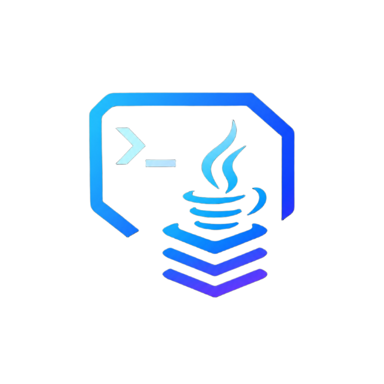

<p align="center">
  
</p>

<h1 align="center">Java Version Manager (JVM)</h1>

<p align="center">
  <strong>A lightweight, high-performance, color-coded Windows command-line utility designed to dynamically discover, download, and switch Java Development Kits (JDKs) and the entire JVM Ecosystem with native SDKMAN! parity.</strong>
</p>

<p align="center">
  <a href="https://github.com/DiamTek/Java-Version-Manager-Windows/actions/workflows/ci.yml"></a>
  <a href="https://github.com/DiamTek/Java-Version-Manager-Windows/releases"></a>
  <a href="#dual-update-channels"></a>
  <a href="tests/Test-JvmSecurity.ps1"></a>
  <a href="docs/SECURITY.md"></a>
  <a href="docs/SECURITY.md#100--100-audit-scorecard"></a>
  <a href="https://github.com/DiamTek/Java-Version-Manager-Windows/releases"></a>
  <a href="https://github.com/DiamTek/Java-Version-Manager-Windows/blob/main/LICENSE"></a>
  <a href="https://github.com/DiamTek/Java-Version-Manager-Windows"></a>
</p>

<p align="center">
  <a href="#installation">📥 Installation</a> &nbsp;•&nbsp;
  <a href="#dual-update-channels">🔄 Channels</a> &nbsp;•&nbsp;
  <a href="#features">🚀 Features</a> &nbsp;•&nbsp;
  <a href="#enterprise--corporate-deployment">🏢 Enterprise</a> &nbsp;•&nbsp;
  <a href="#documentation">📚 Documentation</a> &nbsp;•&nbsp;
  <a href="#usage">🛠️ Usage</a> &nbsp;•&nbsp;
  <a href="#version-history">📜 Version History</a> &nbsp;•&nbsp;
  <a href="#community--contributing">🤝 Community</a>
</p>

---

<a id="installation"></a>
<a id="-installation"></a>
## 📥 Installation

Choose your update channel and run the one-liner in Windows PowerShell (no Administrator privileges required):

**🟢 Stable Channel (Official Releases — Recommended):**
```powershell
irm https://raw.githubusercontent.com/DiamTek/Java-Version-Manager-Windows/main/install.ps1 | iex
```

**🟣 Nightly Channel (Cutting-Edge — Latest commits from main branch):**
```powershell
& ([scriptblock]::Create((irm https://raw.githubusercontent.com/DiamTek/Java-Version-Manager-Windows/main/install.ps1))) -Channel Nightly
```

Or via explicit `Invoke-WebRequest`:
```powershell
Invoke-WebRequest -Uri "https://raw.githubusercontent.com/DiamTek/Java-Version-Manager-Windows/main/install.ps1" -OutFile "$env:TEMP\install.ps1"; & "$env:TEMP\install.ps1"
```
*This instantly downloads the core engine, provisions `%LOCALAPPDATA%\DiamTek\JVM`, registers the Windows uninstaller, and updates your PowerShell Profile so the `jvm` command is available everywhere. You can switch channels at any time using `jvm channel`.*

*Tip: You can switch between channels at any time after installation via `jvm channel [stable|nightly]` or via Option 4 in the interactive Settings menu (`jvm` -> `Settings`).*

### Or via your favorite Package Manager:

**Winget**
```powershell
winget install DiamTek.JVM
```

**Scoop (Official Bucket)**
```powershell
scoop bucket add diamtek https://github.com/DiamTek/scoop-bucket
scoop install jvm
```

**Chocolatey**
```powershell
choco install jvm-windows
```
*Or inspect the [Chocolatey Package Guide](packages/choco/README.md), [WiX MSI Package Guide](packages/msi/README.md), or grab standalone MSI installers (`x64` / `arm64`), portable `.zip`, or raw `jvm.bat` directly from [Releases](https://github.com/DiamTek/Java-Version-Manager-Windows/releases).*

<a id="uninstallation"></a>
<a id="-uninstallation"></a>
## 🗑️ Uninstallation

Easily remove JVM and all associated configurations:
- **Windows Settings:** Open **Installed apps** -> **DiamTek Java Version Manager** -> **Uninstall**.
- **Start Menu:** Search **"Uninstall Java Version Manager"** and hit Enter.
- **Terminal:** Run `jvm self-uninstall` or select Option 6 in the **Settings** menu.

<a id="features"></a>
<a id="-features"></a>
## 🚀 Features

* **Zero Dependencies (100% Native Windows):** Unlike SDKMAN or similar Unix-ports that require heavy POSIX subsystems (WSL, MSYS2, Git Bash, `curl`, `zip`), this utility is built entirely on native Windows APIs. It leverages pure Batch and embedded `.NET` Framework endpoints for networking, zip extraction, and SHA256 cryptography to run instantly out-of-the-box on any Windows 10/11 machine.
* **Windows Terminal & Modern Shell Integration:** Automatically registers a native "Java Version Manager" profile in Windows Terminal with custom high-resolution branding (`icon.png`), seamless `+` new tab dropdown access, and auto-closing tab lifecycles (`closeOnExit: always`). Generates Start Menu application shortcuts and automatically synchronizes existing pinned taskbar shortcuts.
* **Full JVM Ecosystem Support (SDKMAN Parity):** Move beyond just Java! This tool features a powerful, UAC-free Universal Candidate Engine that natively resolves, downloads, and symlinks modern JVM build tools. Install and switch between **Maven**, **Gradle**, **Kotlin**, **Scala**, **Groovy**, **Ant**, **sbt**, **JBang**, **Quarkus**, **Spring Boot CLI**, and **Micronaut** instantly (`jvm install maven`, `jvm install quarkus`, `jvm ant 1.10.15`, `jvm sbt 1.10.2`) — all without adding any heavy dependencies. Version arguments default to `latest` on installation and are automatically detected on uninstallation.
* **Dynamic Vendor Architecture:** Menus are dynamically grouped and filtered by vendor (Oracle, Adoptium, GraalVM, Corretto, Zulu, Microsoft, Liberica, Semeru, SapMachine, Mandrel, Dragonwell, Kona) to keep your workspace clean and organized.
* **Intelligent Background Sorting:** Features a built-in, stable bubble-sort algorithm that organizes all discovered JDKs by their major version in descending order, ensuring your newest installations are always at the top of the list.
* **Semantic Target Routing:** Speak to the tool in human terms. Automatically jump to or install the latest available JDK using targets like `jvm latest` or `jvm lts`. The engine queries the Adoptium API at runtime to dynamically resolve the true latest feature release and LTS version numbers, so you never have to hardcode them.
* **ARM64 / AArch64 Auto-Detection:** Automatically detects your CPU architecture at startup (`x64` vs `ARM64`) and routes all vendor API queries to the correct architecture-specific download endpoint. Zero configuration needed — it just works on both Intel/AMD and ARM Windows machines.
* **Dual-Architecture Core (UAC-Free vs Registry):** Toggle seamlessly between lightning-fast **Symlink Mode** (bypasses UAC completely using a Directory Junction at `%LOCALAPPDATA%\DiamTek\JVM\current`) and legacy **Registry Mode** (auto-elevating background scripts to update system `HKLM` environment variables) based on your system compatibility needs.
* **Accurate Windows 11 Installed Apps Footprint:** Calculates dynamic recursive file size across your installation and candidate stores, enforcing a 1,024 KB minimum floor so Windows 11 Settings displays your true storage footprint.
* **Directory-based Auto-Switching (`.java-version` & `.sdkmanrc`):** Instantly configure a project's required environment by simply running `jvm` inside any directory containing a `.java-version` or SDKMAN `.sdkmanrc` file. The tool parses the file and seamlessly swaps your environment in the background with **True Session Isolation** (doesn't pollute your global Windows Registry). 
  * **`.java-version`** is strictly for JDKs, but our engine is incredibly advanced: it natively supports parsing full CLI flags directly from the file (e.g., `21 --vendor adoptium --legacy`), allowing you to lock specific vendors or architecture modes on a strict per-project basis.
  * **`.sdkmanrc`** natively supports the **entire JVM Ecosystem**! If you're collaborating with SDKMAN users on macOS/Linux, JVM will happily hijack their `.sdkmanrc` files on Windows, mapping their JDK vendor strings (`-tem`, `-amzn`, `-librca`, `-sem`, `-sapm`, `-mandrel`, etc.) directly to your native JDKs, *and* automatically isolating and activating the project's exact required versions of Maven, Gradle, Kotlin, Scala, Groovy, Ant, sbt, JBang, Quarkus, Spring Boot, and Micronaut for that specific terminal session.
* **Interactive Ecosystem Auto-Updater:** Engineered with a dynamic, vendor-sorted Updater menu that displays your active versions across JDKs and Ecosystem tools, queries GitHub/Apache APIs to resolve the absolute latest stable releases in real-time, and seamlessly prompts to upgrade any out-of-date binaries.
* **Global Command & Shell Hooks:** Features a built-in Settings menu that dynamically injects the `jvm` command into your system PATH, and can optionally install a native PowerShell Profile Hook to enable true, isolated `--session` support across multiple terminal tabs.
* **Advanced CLI Quick-Switching:** Supports intelligent argument parsing to bypass the UI entirely. If multiple vendors are installed for the same JDK version, it safely pauses to ask you which vendor you want to switch to, which can be bypassed on the fly with the `--vendor` flag.
* **Multi-Vendor API Auto-Downloader:** Connects directly to official vendor APIs (Oracle, Adoptium v3, GitHub for GraalVM, Amazon Corretto, Azul Zulu, Microsoft Build of OpenJDK, BellSoft Liberica, IBM Semeru, SAP SapMachine, Red Hat Mandrel, Alibaba Dragonwell, Tencent Kona) via a transparent, isolated PowerShell instance to dynamically resolve, download, and extract modern JDK versions.
* **Enterprise-Grade Integrity Verification:** Enforces strict SHA256/SHA512 (and SHA1 for Liberica, MD5 for Kona) checksum verification across all remote download pathways using native `.NET` Cryptography APIs. Validates payload integrity against official vendor checksum mirrors before extraction, protecting against transmission corruption, incomplete downloads, or CDN cache desynchronization.
* **Inline Multi-Vendor Update Checker:** Dynamically generates and executes a self-contained PowerShell update script at runtime to query all 12 vendor APIs (Oracle, Adoptium, GraalVM, Corretto, Zulu, Microsoft, Liberica, Semeru, SapMachine, Mandrel, Dragonwell, Kona) for newer builds. Compares `SEMANTIC_VERSION` and `JAVA_VERSION` strings from the local `release` file against live API responses, with automatic `-LTS` suffix normalization for Adoptium and `IMPLEMENTOR_VERSION` parsing for Semeru, Corretto, SapMachine, Mandrel, Dragonwell, and Kona. Oracle uses a legacy `HEAD`-request date comparison against `download.oracle.com` for maximum reliability.
* **Offline-Aware Error Handling:** All network operations (downloads, update checks, API queries) are wrapped in structured error boundaries. If you are offline or an API is unreachable, the tool displays a clean `[ ERROR ] Network connection failed. You appear to be offline.` message with a `[ DETAIL ]` trace instead of crashing with raw exception dumps.
* **Dynamic Environment Switching:** Atomically updates `JAVA_HOME` and your user/system `PATH` globally while cleanly updating the environment variables of your active terminal session without spawning double paths.
* **The "Phantom Path" Killer:** Unlike other version managers that passively append to your PATH (which Windows often ignores if a hardcoded shortcut exists), JVM actively hunts down and scrubs rogue, hardcoded Oracle shortcuts (e.g., `Common Files\Oracle\Java\javapath`) that MSIs forcefully inject into the front of your `PATH`, ensuring your selected `JAVA_HOME` is always respected.
* **Bring Your Own JDK (BYO-JDK):** Have a custom JDK build or a GraalVM native-image compiler installed manually? Use `jvm link <path> [name]` to register it, and it will instantly integrate into the dynamic UI and CLI routing alongside your auto-downloaded JDKs.
* **Instant Menu Navigation:** Uses a smart `NEEDS_RESCAN` caching architecture to guarantee zero-latency navigation when moving back and forth between interactive submenus.
* **Dual Update Channels with SHA-256 Verification (Stable vs Nightly):** Seamlessly switch between official, tagged GitHub releases (🟢 Green `[Stable]`) and cutting-edge development builds directly from the `main` branch (🟣 Purple `[Nightly]`) via `jvm channel [stable|nightly]` or the interactive Settings menu. Features cryptographic SHA-256 integrity verification against official `SHA256SUMS.txt` release digests, ahead-of-remote safety checks that prevent downgrading local builds, and automated rate-limit safe GitHub fallbacks.
* **Built-in Self-Updater with External Handoff:** Run `jvm version` (or `-v`) to compare your semantic version and build number against GitHub. If an update is available, `jvm self-update` dynamically bypasses CDN edge caching, chains execution to an external handoff runner (`%TEMP%\jvm_updater_*.bat`) to eliminate Windows `cmd.exe` file locks, renders an interactive ANSI progress bar across all installation phases, validates a `rem END OF SCRIPT` integrity sentinel, and atomically hot-swaps the core script without touching installed runtimes or user settings.
* **Comprehensive Diagnostic Health Audit (`jvm doctor`):** Instant one-click diagnostic scanner that audits AppData storage root access, active architecture mode, directory junction integrity and target validity, User vs Machine `JAVA_HOME` registry synchronization, `where.exe java` PATH precedence and rogue Oracle shadowing detection, and PowerShell profile hook status.
* **Ephemeral One-Off Subshell Runner (`jvm exec` / `jvm run`):** Execute builds, tests, or scripts against any installed JDK in an ephemeral isolated subshell (`jvm exec 21 -- java -version`, `jvm run 17 mvn clean verify`) without modifying your active Directory Junction, system environment, or Windows Registry. Accurately propagates the invoked command's exit code back to your host terminal.
* **Project Version Pinning (`jvm pin` / `jvm local`):** Effortlessly lock or inspect the directory-level `.java-version` file (`jvm pin 21`, `jvm pin 21 --vendor adoptium`) to guarantee seamless team coordination.
* **Instant Windows File Explorer Jump (`jvm open` / `jvm home`):** Instantly navigate to the active JDK installation, ecosystem candidate folder, or JVM storage root in Windows File Explorer directly from the CLI (`jvm open`, `jvm open maven`, `jvm home`).
* **PowerShell Profile Hook (`jvm hook`):** One-command manager (`jvm hook`, `jvm hook status`, `jvm hook remove`) to install, inspect, and remove the auto-sync wrapper function across Windows PowerShell 5.1 and PowerShell 7+ profiles without touching your global User PATH.
* **Native PowerShell Dynamic Tab-Completion:** Features sub-millisecond, context-aware autocompletion for both Windows PowerShell 5.1 and PowerShell 7+ (`pwsh`) via native `Register-ArgumentCompleter`. Pressing `<Tab>` intelligently auto-completes commands across all invocation styles (`jvm <Tab>`, `jvm.bat <Tab>`, `.\jvm.bat <Tab>`), 11 ecosystem candidates, flags (`--vendor`, `--no-color`), all 12 vendors (+ aliases), and dynamically scans installed JDK versions.
* **Industry-Standard `NO_COLOR` & CI/CD Redirection:** 100% compliant with the [no-color.org](https://no-color.org) specification. When the `NO_COLOR` environment variable is defined or `--no-color` is passed, all ANSI color codes are cleanly suppressed, preventing log artifact pollution in GitHub Actions, Azure DevOps, GitLab CI, and file redirections (`jvm list --no-color > jdks.txt`).
* **Machine-Readable CLI JSON Contract (`--json`):** Emits structured, machine-parsable JSON across status and inspection subcommands (`jvm current --json`, `jvm which --json`, `jvm doctor --json`, `jvm list --json`). Completely strips ANSI escape sequences, status badges (`[ OK ]`), and ASCII header rules for integration into developer tools, IDE extensions, and automation pipelines (`CWE-20` / `CWE-754`).
* **Air-Gapped & Offline Isolation (`--offline`):** Deterministic network barrier enforcing offline isolation (`CWE-918` / `CWE-754`). Mutating network operations (`install`, `update`, `self-update`) fail closed immediately with a clean diagnostic notice, while read-only inspection commands (`current`, `which`, `doctor`) execute locally without network calls or hangs.
* **Process Concurrency & Mutex State Lock (`state.lock`):** Employs an atomic directory-based state lock (`%LOCALAPPDATA%\DiamTek\JVM\state.lock`) and `owner.pid` tracking to prevent race conditions (`CWE-362`) during parallel script executions. Automatically detects and reclaims stale locks from dead parent process IDs, and provides a `--no-lock` override flag for manual intervention.
* **Reproducible Lockfiles (`.jvm.lock` & `jvm install --locked`):** Freeze and deterministically reproduce identical Java and candidate runtime environments across engineering teams, CI/CD runners, and production builders (`CWE-354` / `CWE-494`). The `jvm lock` command captures the active JDK and all ecosystem candidate tools into a cryptographically anchored `.jvm.lock` file recording candidate type, exact build version, vendor, target architecture, official download URL, and cryptographic SHA-256 hash. Running `jvm install --locked` (or `-l` / `--lock`) guarantees zero environment drift by strictly validating URLs against official vendor domain allowlists and verifying download integrity against the recorded SHA-256 digest before extraction.
* **Ergonomic Shorthand Aliases:** Supports intuitive, muscle-memory shortcuts from Unix, Docker, Git, and SDKMAN (`jvm ls`, `jvm rm`, `jvm info`, `jvm whoami`, `jvm check`, `jvm prune`, `jvm path`, `jvm home`, `jvm local`, `jvm run`) for zero cognitive friction.
* **Ergonomic Transparent Aliases (`jvm use` / `jvm default`):** Native SDKMAN/nvm muscle memory support allowing developers to switch JDKs seamlessly using familiar commands.
* **Headless CI/CD Automation:** Every command is engineered with zero-prompt bypass flags. Run complex installations like `jvm install lts --latest --vendor oracle` or `jvm uninstall 21 --vendor adoptium` to bypass all interactive menus for frictionless integration into CI/CD pipelines, DevOps scripts, or automated machine provisioning workflows.

<a id="dual-architecture-core"></a>
<a id="-dual-architecture-core-symlink-vs-legacy"></a>
## 🏗️ Dual-Architecture Core (Symlink vs Legacy)

Windows Directory Junctions provide a significant performance and workflow benefit by swapping the active Java runtime without requiring Administrator privileges (UAC). By routing your User `PATH` to a single junction (`%LOCALAPPDATA%\DiamTek\JVM\current`), modern developer tooling (Gradle, Maven, IntelliJ IDEA, VS Code, Eclipse) resolves and follows the target runtime seamlessly without requiring terminal restarts.

However, certain legacy enterprise Java applications or custom classloaders perform strict canonical path resolution that may not follow Windows Directory Junctions. To ensure dependable compatibility across both modern development workflows and legacy enterprise environments, JVM implements a **Dual-Architecture Core**.

By navigating to the **Settings** menu, users can freely toggle between the two modes:

| Mode | Mechanism | Privileges Required | Target Environments |
|------|-----------|---------------------|---------------------|
| **Symlink Mode** (Default) | Dynamically updates a junction pointer in your User `PATH`. | Standard User (UAC-Free) | Modern Build Tools & Standard Classloaders |
| **Registry Mode** (Legacy) | Writes absolute paths directly into the Machine `HKLM` Registry. | Administrator (Prompts UAC) | Legacy Enterprise Apps & Strict Canonical Resolvers |

> [!WARNING]
> **Architecture Conflicts:** Windows evaluates Machine (`HKLM`) paths before User (`HKCU`) paths. If you use Registry Mode (which writes to the Machine level) and later switch back to Symlink Mode (which writes to the User level), the old Machine path would normally stubbornly override your new Symlink! To prevent this, toggling back to Symlink Mode inside the Settings Menu will now automatically scrub the legacy Machine pollution for you. (Note: If you manually bypass the menu using `--legacy` and `--symlink` CLI flags and experience an override, simply run `jvm clear` to wipe the slate).

You can even override your global setting dynamically on a per-command basis using the `--symlink` or `--legacy` CLI flags (e.g., `jvm 21 --legacy`).

<a id="dual-update-channels"></a>
<a id="-dual-update-channels-stable-vs-nightly"></a>
## 🔄 Dual Update Channels (Stable vs Nightly)

DiamTek JVM features a built-in **Dual Update Channel Engine** that gives developers, DevOps engineers, and enterprise teams complete control over update cadences, release stability, and preview features.

### 🟢 Stable vs 🟣 Nightly at a Glance

| Feature / Property | 🟢 `[Stable]` Channel (Recommended) | 🟣 `[Nightly]` Channel (Cutting-Edge) |
| :--- | :--- | :--- |
| **Release Target** | Official, tagged GitHub releases (`releases/latest`) | Tip of the repository's `main` branch (`HEAD`) |
| **ANSI Terminal Badge** | Green (`[Stable]`) across menus, cards, and CLI | Bright Purple (`[Nightly]`) across menus, cards, and CLI |
| **Release Cadence** | Thoroughly vetted milestones (`v1.0.0`, `v1.1.0`) | Continuous — immediate access upon commit merge |
| **Cryptographic Trust** | Validated against official `SHA256SUMS.txt` digests | Tracked via Git Commit SHA & computed SHA-256 hash |
| **Downgrade Safety** | Refuses to downgrade unreleased local development builds | Refuses to downgrade local builds ahead of `main` |
| **Offline / Rate-Limit** | Automated HTTP 302 web redirect fallback (no 403s) | Direct Fastly CDN-backed raw endpoints (no 403s) |
| **Ideal For** | Primary workstations, production fleets, CI/CD | Contributors, beta testers, previewing new scrapers |

### 🛠️ Switching & Managing Channels

* **View Active Channel:**
  ```cmd
  jvm channel
  ```
  *Displays your current active channel (`[Stable]` or `[Nightly]`), description, and available channel switches.*

* **Switch to Stable Channel (Recommended):**
  ```cmd
  jvm channel stable
  ```

* **Switch to Nightly Channel:**
  ```cmd
  jvm channel nightly
  ```

* **One-Off Command Overrides:**
  Override the active channel for a single update run without modifying your saved configuration:
  ```cmd
  jvm self-update --nightly
  jvm self-update --stable
  jvm self-update --channel nightly
  ```

* **Interactive Menu Toggle:**
  Run `jvm` without arguments, enter **Settings** (`3`), and select **Option 4** (`Update Channel: [...] - Click to switch`).

### 🛡️ Security & Safe Update Architecture

1. **Cryptographic SHA-256 Verification:** When updating on the `[Stable]` channel, JVM downloads `SHA256SUMS.txt` from the official release assets and verifies the SHA-256 hash of `install.ps1` before execution. Any checksum mismatch immediately terminates the update to prevent supply chain tampering.
2. **Ahead-of-Remote Protection (Downgrade Prevention):** JVM parses and compares both the Semantic Version (`v!JVM_VERSION!`) and Build Number (`Build !JVM_BUILD!`). If you are running an unreleased local build ahead of official releases or ahead of `main`, JVM alerts you with `[ INFO ]` and safely **blocks accidental downgrades**.
3. **Rate-Limit Safe Fallback:** Unauthenticated GitHub API calls are capped at 60 requests/hour per IP. JVM incorporates an automated non-blocking fallback architecture (using Fastly CDN raw endpoints and GitHub web redirects) so update checks never crash with `403 Forbidden`.

<a id="enterprise"></a>
<a id="-enterprise"></a>
<a id="enterprise--corporate-deployment"></a>
<a id="-enterprise--corporate-deployment"></a>
## 🏢 Enterprise & Corporate Deployment

DiamTek JVM is engineered for real-world enterprise IT environments, strict security compliance standards (SecOps/EDR), and frictionless cross-platform engineering team onboarding.

### 🔑 The Four Pillars of Corporate Adoption

1. **Zero Admin Rights Required (Zero IT Helpdesk Tickets)**
   - **The Enterprise Bottleneck:** On locked-down corporate laptops, developers lack local administrator privileges (`UAC`). Traditional JDK installers write to `C:\Program Files` and machine-level registry keys, requiring IT helpdesk tickets for every routine Java or build tool update.
   - **The JVM Solution:** DiamTek JVM installs into user space (`%LOCALAPPDATA%\DiamTek\JVM`) and switches active versions using user-mode NTFS Directory Junctions (`current`). Version switching requires **0 UAC prompts**, 0 admin credentials, and 0 IT tickets. Developers control their toolchains independently while corporate endpoint policies remain intact.

2. **Mixed-OS Team Onboarding (`.sdkmanrc` & `.java-version` Parity)**
   - **Cross-Platform Repositories:** Modern engineering teams rarely use homogeneous operating systems. Repositories committed by macOS/Linux developers standardizing on SDKMAN! include `.sdkmanrc` or `.java-version` files.
   - **Native Windows Parity:** Windows engineers run `jvm` inside any repository, and the engine automatically parses the file, translates SDKMAN! vendor strings (`-tem`, `-amzn`, `-graal`, `-sapm`, `-mandrel`) to native Windows JDKs, and isolates required versions of Maven, Gradle, Kotlin, Scala, Groovy, Ant, sbt, JBang, Quarkus, Spring Boot, and Micronaut in active session memory. No WSL virtualization overhead, no Git Bash quirks, and zero cross-platform friction.

3. **Turnkey Fleet Management (Intune, MECM / SCCM, Group Policy)**
   - **Silent Enterprise Distribution:** Shipped with pre-compiled, standalone WiX Toolset v4 MSIs (`x64` and `ARM64`) embedding all cabinet payloads.
   - **Unattended Rollout:** Deploys silently via standard system management tools:
     ```cmd
     msiexec /i jvm-windows-1.0.1-x64.msi /qn /norestart
     ```
   - **Deterministic Fleet Telemetry:** Built with strict standard exit codes (`0` Success, `1` Abort/Error, `1602` Canceled, `1603` Fatal) and deterministic registry detection rules (`HKCU\Software\DiamTek\JVM`, DWORD `installed=1`) for Microsoft Intune / MECM application packaging.

4. **SecOps, EDR & Audit Compliance**
   - **Zero-File Elevation & Environment Saturation Immunity:** Avoids temporary `.bat` or `.ps1` staging files in `%TEMP%` during elevation handoffs. Resolves system directories and binaries strictly through immutable Win32 SpecialFolder APIs (`[Environment]::GetFolderPath([Environment+SpecialFolder]::System)`), protecting elevation boundaries against user-level `$env:SystemRoot` spoofing / saturation attacks (`CWE-426`) and minimizing false-positive Endpoint Detection and Response (EDR) behavioral alerts.
   - **218-Test Automated Security & Adversarial Suite (`40 MITRE CWEs`):** Continuously validated by an automated test suite passing all 218 test cases (`218 / 218 PASS`) across 10 defensive suites and 40 MITRE CWE vulnerability classes (`CWE-20` through `CWE-918`), covering path traversal, command injection, SSRF/open-redirect vendor host allowlisting (both payload and checksum streams), Zip Bomb decompression bounds (`CWE-409`), XXE/DTD prohibition, CSPRNG temp file isolation, Nightly Git Blob SHA-1 verification, non-destructive junction unbinding, PowerShell ConstrainedLanguageMode early enforcement, atomic staged configuration file replacement (`CWE-362`), timestamped process identity locking, live process-kill recovery (`taskkill /T`), crash-safe directory junction pre-state restoration (`CWE-460`), and cyclic directory junction immunity (`CWE-674`).
   - **Atomic Failure-Path Rollback & Deterministic Resource Hygiene:** Zero dangling state across all failure, interrupt, and elevation-abort paths. If any operation aborts (UAC declined, network drop, corrupted stream, unverified checksum), previous junction targets (`PREV_JUNCTION_TARGET`), scripts (`jvm.bat.bak`), and registry entries are atomically restored (`CWE-460`), partial downloads and staged files are unlinked in `finally` blocks, Win32 registry handles and COM apartments are deterministically released (`CWE-459`), and all silent `catch {}` blocks are eliminated (`CWE-390`).
   - **No 1024-Character PATH Truncation:** Completely avoids legacy `setx.exe` buffer overruns by performing all environment modifications through infinite-length `.NET` environment APIs.
   - **Cryptographic Provenance Attestation:** Official release binaries are cryptographically signed and attested via GitHub Sigstore OIDC (`actions/attest-build-provenance`). SecOps teams can verify binary authenticity directly against the source Git commit SHA using `gh attestation verify`.
   - **Corporate Proxy & CA Integration:** Inherits system WinINet proxy settings, supports authenticated proxy variables (`HTTP_PROXY`, `HTTPS_PROXY`), and automatically trusts corporate root certificates (Zscaler, Netskope, Palo Alto) via the Windows Certificate Store.

<a id="extreme-performance--safety"></a>
<a id="-extreme-performance--safety"></a>
## ⚡ Extreme Performance & Safety

Despite being over 500 KB in size, the `jvm.bat` engine is mathematically optimized to bypass the notorious bottlenecks and memory leaks of standard Windows Batch scripts:
* **Zero Label-Scanning Latency:** Standard scripts suffer severe performance penalties when using `call :label` for high-frequency loops (because `cmd.exe` searches the file linearly from top to bottom). Our heaviest logic, such as the multi-vendor Semantic Bubble Sort algorithm, is written as a strictly in-memory inline array swapper, ensuring instantaneous sorting regardless of file size.
* **Leak-Proof `SETLOCAL` Boundaries:** We completely sidestepped the dreaded `Maximum setlocal recursion level reached` crash. Every single utility function explicitly pops its scope boundary back to the system using terminal `exit /b` unwinds, guaranteeing zero memory leaks across thousands of loop iterations.
* **Bulletproof Escape Boundaries:** We utilize hexadecimal parsing and dedicated PowerShell payloads (`$null`) to ensure that `cmd.exe` never accidentally swallows caret characters (`^`), exclamation marks (`!`), or spaces when resolving UAC-elevated registry wrappers in the background.
* **Quote-Safe PATH Export:** All `for /f` loops that transfer variables across `setlocal`/`endlocal` boundaries use a double-quote encapsulation strategy (`""!VAR!""` with `%%~A` stripping) to guarantee safe handling of `PATH` strings containing embedded double-quotes — a common Windows scenario that normally causes `cmd.exe` to misinterpret path segments as filenames.

<a id="prerequisites"></a>
<a id="-prerequisites"></a>
## 📋 Prerequisites
  
| Requirement | Specification | Notes |
|-------------|---------------|-------|
| **OS** | Windows 10 or Windows 11 | Full support for x64 and native ARM64 detection. |
| **Privileges** | Standard User | UAC is bypassed by default via the Symlink Architecture. Admin is only required for legacy Registry Mode. |
| **Dependencies**| None | Runs purely on native CMD and PowerShell. No WSL, Cygwin, or MSYS2 required. |


<a id="documentation"></a>
<a id="-documentation"></a>
## 📚 Documentation

For deep technical details, CI/CD automation, and advanced usage, refer to the official documentation:

| Document | Description |
|----------|-------------|
| [**Installation Guide**](docs/INSTALLATION.md) | PowerShell one-liners, Package Managers, MSI standalone installers, Enterprise Fleet Deployment (Intune/MECM), and WiX v4 build pipeline. |
| [**Usage Guide**](docs/USAGE.md) | Semantic routing, `.java-version` isolation, BYO-JDK, and Ecosystem commands. |
| [**Architecture**](docs/ARCHITECTURE.md) | Technical deep-dive into Directory Junctions, UAC Process Isolation, and PowerShell Native execution. |
| [**SDKMAN! Comparison**](docs/SDKMAN-Comparison.md)| Why this is the premier native alternative to SDKMAN! for Windows. |
| [**FAQ**](docs/FAQ.md) | Common questions about UAC-free zero-admin usage, enterprise proxies, global routing, and Windows Registry bridging. |
| [**Changelog**](docs/CHANGELOG.md) | Detailed chronological release history and bug fixes. |
| [**Support & Help**](docs/SUPPORT.md) | Where to get help, ask questions, Discord community, and issue reporting channels. |
| [**Contributing Guide**](docs/CONTRIBUTING.md) | Development workflow, pull requests, issue templates, and coding standards. |
| [**Code of Conduct**](docs/CODE_OF_CONDUCT.md) | Standards, pledge, and reporting procedures for healthy community interaction. |
| [**Security Policy**](docs/SECURITY.md) | Comprehensive threat model, zero-file elevation, adversarial input sanitization, and disclosure procedures. |
| [**Chocolatey Packaging**](packages/choco/README.md) | Chocolatey nuspec specification, package automation (`build-choco.ps1`), testing workflow, and CWE security matrix. |
| [**WiX MSI Packaging**](packages/msi/README.md) | Dual-strategy WiX v4/v3 compiler (`build-msi.ps1`), custom action hooks, 21-point automated verification suite, and architecture. |

<a id="usage"></a>
<a id="-usage"></a>
## 🛠️ Usage

1. Launch `jvm.bat` to open the interactive menu, or run it from any terminal.
2. Navigate to **Settings (Global Command & Setup)** to install the `jvm` global command.
3. Once installed globally, you can use the following commands from anywhere:

#### ⚡ Quick-Switching (CLI)
Instantly update your `JAVA_HOME` and system PATH without opening menus. If there are duplicates, you will be prompted to pick a vendor.

| Command | Action / Description |
|---------|----------------------|
| `jvm 21` | Switch to JDK 21 globally. |
| `jvm use 21` | Switch to JDK 21 globally (SDKMAN/nvm compatible alias). |
| `jvm default 21` | Set default JDK 21 globally (SDKMAN alias). |
| `jvm 21 --session` | Switch *locally* for the current terminal only (requires PowerShell Profile hook). |
| `jvm 21 --symlink` | Force switch using Symlink Mode (UAC-Free) for this command. |
| `jvm 21 --legacy` | Force switch using Registry Mode (Requests UAC) for this command (alias: `--registry`). |
| `jvm 21 --vendor adoptium` | Override priority and explicitly switch to Adoptium's JDK 21. |
| `jvm latest` | Dynamically switch to the absolute highest installed JDK version. |
| `jvm lts` | Dynamically switch to the highest installed LTS version. |
| `jvm pin [version]` | Lock or inspect directory-level `.java-version` (`jvm local`). |
| `jvm exec <ver> [--] <cmd>` | Execute command in ephemeral isolated JDK subshell without changing global state (`jvm run`). |
| `jvm` | Silently parses `.java-version` and auto-switches locally (or opens UI if missing). |
| `jvm --global` | Parses `.java-version` and forces the switch globally to your registry. |

> **Note on `.java-version`:** Your file can contain inline CLI flags (e.g., `21 --vendor adoptium --legacy`). Make sure the version and flags are on a single line. Architecture flags (`--legacy`) only apply when using `jvm --global`.

### 📥 Installations

| Command | Action / Description |
|---------|----------------------|
| `jvm install` | Opens the fully interactive Installation Wizard UI. |
| `jvm install 21` | Initiates the installation of JDK 21 (pauses to prompt for Vendor). |
| `jvm install 21 --vendor oracle` | Bypasses all prompts to silently download and install Oracle JDK 21. |
| `jvm install lts` | Prompts you to pick a supported LTS version (17, 21, 25), then prompts for Vendor. |
| `jvm install lts --latest` | Locks onto the highest available LTS, but still pauses for Vendor prompt. |
| `jvm install lts --latest --vendor oracle` | **100% automated headless installation** of the newest Oracle LTS version. |
| `jvm install 17 --vendor oracle -y` | Aggressively bypasses all safety warnings (caps, overwrites) for CI/CD automation. |
| `jvm install 21 --skip-checksum` | Bypasses checksum verification if hash is unavailable or unresolvable. |
| `jvm lock [candidate] [ver]` | Generates or updates reproducible `.jvm.lock` manifest (`--check`, `--diff`, `--update`). |
| `jvm install --locked` | Reproduces exact team runtime environment from `.jvm.lock` with strict SHA-256 validation (`-l`, `--lock`). |
| `jvm verify [version/all]` | Audits cryptographic provenance, HTTPS origins, host trust, and digital signatures (supports `--json`). |
| `jvm transaction [show/rollback]` | Displays atomic transaction journal or rolls back interrupted installations, restoring pre-state directory junctions and backups. |

### 📦 Ecosystem Build Tools (SDKMAN Parity)
JVM supports downloading, switching, and managing tools natively alongside Java. You can manage these via the command line or through the interactive **Ecosystem Management** sub-menu (Option 2 in the main UI). Supported candidates: **Maven**, **Gradle**, **Kotlin**, **Scala**, **Groovy**, **Ant**, **sbt**, **JBang**, **Quarkus**, **Spring Boot CLI**, and **Micronaut**.

| Command | Action / Description |
|---------|----------------------|
| `jvm install maven [latest]` | Installs Maven directly from Apache (omitting version defaults to `latest`; e.g., `jvm install quarkus`). |
| `jvm install gradle 8.9` | Installs a specific version of Gradle. |
| `jvm kotlin 2.0.20` | Instantly switches your active `KOTLIN_HOME` (and PATH) to the specified version. |
| `jvm ant 1.10.15` | Switches active `ANT_HOME` (and PATH) to Apache Ant. |
| `jvm sbt 1.10.2` | Switches active `SBT_HOME` (and PATH) to Scala Build Tool. |
| `jvm jbang 0.119.0` | Switches active `JBANG_HOME` (and PATH) to JBang. |
| `jvm quarkus 3.15.1` | Switches active `QUARKUS_HOME` (and PATH) to Quarkus CLI. |
| `jvm spring 3.3.4` | Switches active `SPRING_HOME` (and PATH) to Spring Boot CLI. |
| `jvm micronaut 4.6.3` | Switches active `MICRONAUT_HOME` (and PATH) to Micronaut (`mn`). |
| `jvm update maven` | Checks and updates Maven (or `jvm maven update`, `jvm update ant`, etc.). |
| `jvm list` | Lists all Ecosystem tools and their currently `[ACTIVE]` versions at the bottom. |
| `jvm uninstall groovy [version]` | Safely uninstalls the tool; auto-selects if one version is installed, or prompts with an interactive list if multiple. |

### 🔄 Updates & Uninstalls

| Command | Action / Description |
|---------|----------------------|
| `jvm update <version>` | Automatically checks and updates a specific installed JDK (e.g., `jvm update 21`). |
| `jvm update --all` | Silently patches all installed JDKs and Ecosystem Tools to their newest releases. |
| `jvm update --all --vendor oracle` | Silently checks and automatically patches *only* your Oracle JDKs. |
| `jvm uninstall` | Displays an interactive numbered selection list of installed JDKs with paths, `[ACTIVE]` indicator, and Cancel option (aliases: `jvm rm`, `jvm remove`). |
| `jvm uninstall --vendor <name>` | Displays interactive uninstallation list filtered to a specific vendor (e.g., `jvm uninstall --vendor semeru`). |
| `jvm uninstall <version>` | Headless uninstallation for a specific JDK version (aliases: `jvm rm <version>`, `jvm remove <version>`). |
| `jvm uninstall <version> --vendor oracle` | Automated uninstallation targeting Oracle (bypasses all prompts). |
| `jvm` *(no args)* | Opens the interactive terminal dashboard (access interactive Uninstaller and Updater sub-menus). |

### 🧹 Global Environment Management

| Command | Action / Description |
|---------|----------------------|
| `jvm list` | Lists all installed JDKs (version, vendor, path), highlighting the `[ACTIVE]` one (alias: `jvm ls`). |
| `jvm current` | Displays comprehensive status card: active JDK, switching mode, junction target, and tools (aliases: `jvm status`, `jvm info`, `jvm whoami`, `jvm env`). |
| `jvm which [candidate]` | Prints absolute filesystem path to active `java.exe` or ecosystem binary (alias: `jvm path`). |
| `jvm doctor` | Deep diagnostic health audit and conflict scanner (permissions, junctions, PATH shadowing, hooks; alias: `jvm check`). |
| `jvm verify [version/all]` | Audits cryptographic provenance, HTTPS origins, host trust, and digital signatures. |
| `jvm transaction [show/rollback]` | Displays atomic transaction journal or rolls back failed/aborted installations (`jvm txn`). |
| `jvm hook [action]` | Manage PowerShell profile auto-sync wrapper hook (`install`, `setup`, `status`, `check`, `remove`, `uninstall`). |
| `jvm open [candidate]` | Instantly opens candidate (`maven`, `gradle`), installed JDK version (`21`), `candidates`, or root in File Explorer (alias: `jvm home`). |
| `jvm clean` | Safely purges temporary installer caches and extraction artifacts to reclaim disk space (alias: `jvm prune`). |
| `jvm clear` | Instantly wipes `JAVA_HOME` and purges Java from your PATH. |
| `jvm env` | Displays current environment variables and status card (alias for `jvm current`). |
| `jvm link [path] [name]` | Manually links a custom JDK directory (or lists all registered custom links if run with no arguments). |
| `jvm unlink <name>` | Removes a custom linked JDK. |
| `jvm version` | Checks your current `jvm.bat` build number against GitHub for updates (`--version`, `-v`). |
| `jvm channel [stable/nightly]` | View or switch active update channel ([Stable] green vs [Nightly] purple). |
| `jvm self-update [ch] [-y]` | Automatically downloads and atomic-swaps the core script (`stable`/`nightly`, `--channel`, `-c`, `-y`/`--yes`; alias: `jvm update self`). |
| `jvm self-uninstall` | Launches the deep uninstaller with UAC elevation (full system wipe; alias: `jvm uninstall-self`). |
| `jvm <command> --json` | Emits pure, machine-readable JSON without ANSI codes or headers (`current`, `which`, `doctor`, `list`). |
| `jvm <command> --offline` | Enforces air-gapped isolation; blocks mutating downloads while keeping local commands functional. |
| `jvm <command> --no-lock` | Bypasses the concurrent process state lock (`state.lock`) in emergency recovery scenarios. |
| `jvm <command> --no-color` | Suppresses ANSI color codes for clean redirection and CI/CD logs (also honors `NO_COLOR` env). |
| `jvm help` / `--help` / `/?` | Displays the complete CLI command reference and flag overrides. |
| `jvm <semantic-alias>` | Routes dynamically (e.g., `jvm latest`, `jvm lts`, `jvm 21`). |

> **Pro Tip:** Use `jvm doctor` for an instant system health and conflict check, `jvm current` for an active environment status card, `jvm which` to dynamically feed the active `java.exe` path into scripts/IDE configurations, and `jvm clean` to sweep orphaned download archives without touching installed runtimes.

<a id="interface-guide"></a>
<a id="-interface-guide"></a>
## 🎨 Interface Guide

The utility uses native ANSI terminal color formatting to protect system stability:
* 🔹 **Cyan `[ ACTION ]` / `[  INFO  ]`** — Indicates system operations, network lookups, and diagnostic information. Version numbers are highlighted in cyan for rapid scanning.
* 🔸 **Yellow `[ WARNING ]` / `[ UPDATE ]`** — Points out non-critical issues, available patches, or destructive prompts.
* 🔺 **Red `[ ERROR  ]`** — Warns of network failures, blocked file permissions, or locked folders.
* 🟢 **Green `[ACTIVE]` / `[   OK   ]` / `[Stable]`** — Highlights the JDK entry currently actively powering your terminal environment, signifies a successful operation, or denotes the official **Stable** update channel.
* 🟣 **Purple `[Nightly]`** — Highlights the cutting-edge **Nightly** update channel receiving unreleased commits directly from the `main` branch.
* ◽ **Gray** — Mutes absolute file paths to reduce terminal clutter.

<a id="safety-defaults"></a>
<a id="-safety-defaults"></a>
## 🛡️ Safety Defaults

To prevent catastrophic accidental deletions on local filesystems, all critical prompts obey standard developer conventions:
* The uninstaller and update prompts use a strict `(y/N)` validation. 
* Pressing **Enter** or typing anything other than an explicit `Y`/`y` acts as an immediate safe abort.
* Custom loops trap premature `Ctrl+C` commands gracefully, and auto-close countdowns can be interrupted with any keystroke.

<a id="version-history"></a>
<a id="-version-history"></a>
## 📜 Version History

* **v1.0.2:** Expanded upstream JDK vendor support to 12 native distributions with the addition of **SAP SapMachine** (direct zero-rate-limit release API, SHA256), **Red Hat Mandrel** (downstream GraalVM Native Image for Quarkus, GitHub Releases API), **Alibaba Dragonwell** (high-throughput e-commerce runtime with JWarmup/Wisp, GitHub Releases API), and **Tencent Kona** (cloud-scale OpenJDK with MD5/SHA256 checksums), with `GET_BV_CHOICE_MANUAL` safe input handling when choices exceed 9. Expanded the Universal Candidate Engine to 11 ecosystem tools with the addition of **Apache Ant** (Apache mirror API, SHA512), **sbt** (Scala Build Tool, GitHub Releases, SHA256), **JBang** (GitHub Releases, SHA256), **Quarkus CLI** (GitHub Releases, multi-line SHA256 checksum file parsing), **Spring Boot CLI** (Spring repo, SHA1), and **Micronaut** (GitHub Releases, SHA256, `mn.bat` binary mapping). Added direct candidate update commands (`jvm update <candidate>` and `jvm <candidate> update`), double-dash candidate flags (`--ant`, `--sbt`, `--jbang`, `--quarkus`, `--spring`, `--micronaut`, `--mn`), candidate folder navigation in `jvm open`, synchronized all 12 environment variables across `install.ps1`, `uninstall.ps1`, and `jvm.bat` (`JAVA_HOME`, `MAVEN_HOME`, `GRADLE_HOME`, `KOTLIN_HOME`, `SCALA_HOME`, `GROOVY_HOME`, `ANT_HOME`, `SBT_HOME`, `JBANG_HOME`, `QUARKUS_HOME`, `SPRING_HOME`, `MICRONAUT_HOME`), and expanded `.sdkmanrc` translations (`-sapm`, `-mandrel`, `-dragonwell`, `-kona`). Comprehensive defensive security hardening, elevation boundary immunization, supply chain pinning, atomic failure-path rollback, deterministic handle hygiene, and 218-test adversarial fuzzing and error-injection suite across 40 MITRE CWE classes (`CWE-20` through `CWE-918`) achieving a verified 10.0 / 10.0 security audit scorecard (`218 / 218 PASS`). Added reproducible lockfile architecture (`.jvm.lock`) capturing cryptographic SHA-256 digests, official vendor download URLs, candidate types, exact versions, and target architectures via `jvm lock` with deterministic multi-tool composition and atomic staged write (`.stage.<guid>.tmp` -> `.jvm.lock`), coupled with `jvm install --locked` (`-l` / `--lock`) fail-closed verification enforcing official domain allowlists and cryptographically verified payload extraction (`CWE-354` / `CWE-494`). Added cryptographic provenance verification (`jvm verify`) to audit HTTPS transport, domain trust, and signatures. Added JSON-based transactional journal logging (`jvm transaction`) with deterministic rollback (`CWE-460`). Pinned all external Windows system binaries (`cmd.exe`, `reg.exe`, `find.exe`, `findstr.exe`, `where.exe`, `choice.exe`, `timeout.exe`, `fsutil.exe`, `powershell.exe`, `chcp.com`, `icacls.exe`, `attrib.exe`, `explorer.exe`) to `%SYS32%` (`%..._BIN%`), enforced `NoDefaultCurrentDirectoryInExePath=1`, updated all `where.exe` calls to `%WHERE_BIN% $PATH:java`, replaced hardcoded `C:\Program Files` / `C:\Program Files (x86)` references across `LOCATIONS[0..11]`, `DEST_DIR`, and `ENV_PURGE_LIST` with `%ProgramFiles%` (`%JVM_PF%`), `%ProgramFiles(x86)%` (`%JVM_PF86%`), and `%SystemDrive%` (`%JVM_SYSDRIVE%`), added explicit Windows ARM64 (`aarch64`) warnings and Windows 11 Prism `x64` emulation fallback in `:Resolve_Oracle` and `:Resolve_GraalVM`, hardened `:InstallGlobalCommand` to install into canonical `%LOCALAPPDATA%\DiamTek\JVM\bin` (`icacls /inheritance:r` & `DoNotExpandEnvironmentNames`), enforced `Initialize-SecureDirectory` (`Test-HasReparsePointInLineage` + `icacls /inheritance:r`), `Remove-ReparsePointOrFail` on `$batPath`/`$destFile`/`$channelFile`, `Invoke-TrustedGitHubDownload` (5 MB ceiling & redirect host allowlist), quoted `System32` `UninstallString`/`QuietUninstallString` (`-Quiet`), and pinned Start Menu `.lnk` `TargetPath` (`System32\cmd.exe`) in `install.ps1`, and enforced early `Test-TrustedJvmInstallDirectory` (`InstallLocation`, `-SourceDir`, `$scriptDir`) marker/root validation before `PATH` scrubbing, `Remove-DirectorySafely` on `%TEMP%\jdk_*_extract*` with iterative non-recursive queue pattern immune to cyclic directory junctions (`CWE-674`), plus Base64-isolated deferred directory cleanup (`Invoke-DeferredDirectoryCleanup`) in `uninstall.ps1` and `build-msi.ps1` to eliminate CWD binary planting and `PATH` search-order hijacking (CWE-59 / CWE-73 / CWE-78 / CWE-426 / CWE-427 / CWE-428 / CWE-674). Enforced early PowerShell `ConstrainedLanguageMode` fail-closed policy checks across `install.ps1` and `uninstall.ps1` (`CWE-754` / `CWE-755`). Added `:RejectExclamationArg` under `setlocal disabledelayedexpansion` prior to `setlocal enabledelayedexpansion` across `%~1`..`%~9` so `cmd.exe` cannot silently strip unpaired `!` poison characters (`foo!bar` -> `foobar`), blocked URL/PowerShell metacharacters (`#`, `@`, `'`, `$`, `` ` ``, `(`, `)`, `,`, space) in `:ValidateStrictIdentifier`, neutralized `set /a` arithmetic expression evaluation on `JAVA_VERSION` metadata in `:ShowDynamicMenu` (`CWE-94`), preserved `INITIAL_SESSION_JH` across menu scans, validated `CAND_ID`/`V_NAME`/`CAND_NAME`/`CUSTOM_VER`/`REL_ADOPTIUM` via `:ValidateStrictIdentifier`, eliminated `for /f` semicolon `eol=;` comment-skipping bypasses (`for /f "eol= delims=0123456789"`) and double-double quote bugs across numeric and `PATH` loops, replaced `findstr /v` pre-filtering in `.java-version` and `.sdkmanrc` parsing (`:ParseJavaVersion` / `:ParseSdkmanrc`) with non-filtering fail-closed validation (`JV_PARSE_ERR=1` / `SDK_PARSE_ERR=1` / `SDK_ECO_ERR=1`) so unsafe or malformed lines cannot be silently dropped while leaving the file appearing valid, allowed legitimate Windows directory paths containing commas (`,`) in `jvm link` (`:HANDLE_LINKS`) with automatic comma/space-to-hyphen default alias sanitization while continuing to block `;` (`PATH` delimiter), `&`, `|`, `^`, Win32 device paths, and NTFS ADS (`:`), and hardened `jvm open` (`:OpenFolderInExplorer`) to fail closed on unknown targets and block comma-delimited `explorer.exe` argument injection (CWE-20 / CWE-78 / CWE-88 / CWE-94 / CWE-184). Isolated temporary helper scripts, `.jvm_session_target`, `:WriteConfigFile` (`channel.txt`/`mode.txt` with atomic staged replacement `.stage.!_CFG_RND!.tmp` + `move /y` — `CWE-362`), `jvm link`/`unlink`, and `:BackupRegistry` exports inside reparse-point-verified, ACL-locked (`icacls /inheritance:r`) per-user directories (`%LOCALAPPDATA%\DiamTek\JVM\temp`, `%LOCALAPPDATA%\DiamTek\JVM\backups`, `%LOCALAPPDATA%\DiamTek\JVM\links`), eliminated 100% of predictable `!RANDOM!` temp filenames in favor of CSPRNG `[System.IO.Path]::GetRandomFileName()` (`CWE-330`), added local volume advisories to switch to legacy mode on network/UNC paths, and enforced numeric `JVM_CALLER_PID` validation and reparse collision checks in `:EmitSessionEnv` (CWE-20 / CWE-59 / CWE-276 / CWE-330 / CWE-362 / CWE-377 / CWE-532). Enforced TLS 1.2 + TLS 1.3 (`3072 -bor 12288`), strict `https://` URI scheme checks, `Test-TrustedJvmUri` official vendor domain allowlisting (`CWE-918`), anchored GitHub redirect `Location` regexes in `:ResolveLatestEcosystemCandidate` and `:CheckUpdateStatus`, post-redirect `ResponseUri` host verification on both primary payload downloads and `Get-TrustedChecksumText` checksum streams (`CWE-601`), unconditional version/build downgrade blocking in `:SelfUpdate`, unified fail-closed cryptographic verification across `Stable` (`SHA256SUMS.txt`) and `Nightly` (GitHub Contents API Git Blob SHA-1 `SHA1("blob " + length + "\0" + bytes)` / `NO_META_SHA` / `Test-GitBlobSha1` plus a DACL-protected `uninstall.ps1.sha256` sidecar fallback written by `install.ps1`) for both `jvm.bat` (`:SelfUpdate`) and local/downloaded `uninstall.ps1` (`:UninstallJVM_Complete` / `:VerifyDownloadedScript`) with automatic verified remote fallback on local hash mismatch, `try/finally { $zip.Dispose() }` failure cleanup, ZIP entry count (`40,000`) and cumulative decompressed byte (`1.75 GB`) Zip Bomb decompression bounds (`CWE-409`), Win32 reserved device name rejection inside ZIP entry segments (`CWE-66`), and strict ZipSlip canonical boundary validation (`$destinationPath.StartsWith($fullRoot, [System.StringComparison]::OrdinalIgnoreCase)`) with trailing directory separators (`\`), `DL_STRIP_ROOT` leading-hyphen rejection (`CWE-88`), `:FetchAndExtract` `[System.IO.Path]::GetFullPath` canonicalization, Unix symlink attribute detection in ZIP entries (`CWE-59 / CWE-22`), NTFS ADS colon (`:`) rejection, and explicit rooted-entry rejection during archive extraction, and hardened `Set-JvmVar` `$allowedRoots` against sibling-prefix collisions (CWE-22 / CWE-66 / CWE-295 / CWE-319 / CWE-345 / CWE-354 / CWE-409 / CWE-459 / CWE-494 / CWE-601 / CWE-918). Replaced user-writable `$env:SystemRoot` and `%SystemRoot%` lookups during process elevation with native immutable Win32 SpecialFolder APIs (`[Environment]::GetFolderPath([Environment+SpecialFolder]::System)`), immunizing elevation boundaries against user-level environment variable saturation/spoofing (CWE-250). Pinned filesystem root safeguards in `uninstall.ps1` to immutable `SpecialFolder` locations (`Windows`, `UserProfile`, `ProgramFiles`, `ProgramFilesX86`). Engineered pure-batch character loop validation (`:ValidateStrictIdentifier` / `:VSI_CharLoop` with `_VSI_DQ` quote-smuggling detection, post-`latest` `LATEST_VER` validation in `:InstallCandidate`/`:SwitchCandidate`, pipe-free native substring session `PATH` updates in `:SwitchCandidate`, extended DOS device `NUL.jdk` blocking, and Win32 `\\.\` raw device rejection) neutralizing CMD second-pass tokenization on poison characters (`&`, `|`, `<`, `>`, `^`, `;`, `"`, `*`, `?`, `!`, `%`). Preserved `REG_EXPAND_SZ` registry kind across User and Machine PATH with combined length boundaries (2,048-char warning / 8,191-char abort limit) and non-blocking `SendMessageTimeout` setting broadcasts (bounded to 1000ms with `SMTO_ABORTIFHUNG`). Re-architected directory junction cleanup and profile hooks in `jvm.bat` (`CURRENT_SYMLINK` with double-fault rollback alert, `:SwitchCandidate`, `:UninstallCandidate`, and elevated `:UninstallJDK` junction detachment), `install.ps1`, `uninstall.ps1` (`Remove-ShortcutSafely` on Start Menu, Desktop, and Taskbar shortcuts), `build-msi.ps1` (`$msiInstallHook` / `$msiUninstallHook`), and `:CleanCache` (`jvm clean`/`jvm prune`) using bottom-up reparse point unbinding, atomic staged `Move-Item -LiteralPath` UTF-8 No BOM writes (`CWE-367`), Windows Terminal `settings.json` file-lock retry loop with `.bak` backup creation, and `Test-HasReparsePointInLineage` / `-LiteralPath` symlink guards on `$PROFILE`, Windows Terminal `settings.json`, and Start Menu shortcuts without traversing into target JDK installations (CWE-59). Pinned all GitHub Actions in `ci.yml` and `release.yml` to verified 40-character commit SHAs with `persist-credentials: false` (`CWE-250`), prohibited XML External Entity (XXE) and DTD processing (`DtdProcessing::Prohibit` & `XmlResolver = $null` — `CWE-611`) and XML-escaped attributes (`Escape-XmlAttr` — `CWE-74`) across `build-choco.ps1`, `build-msi.ps1`, and `Test-JvmSecurity.ps1`, added deterministic UUID v5 `ProductCode` generation in `build-msi.ps1`, enforced `Assert-CleanWorkingTree`, `Assert-TrustedGitHubUri`, `Assert-ValidSha256Hex`, and `Assert-ValidMsiProductCode` in `scripts/bump-version.ps1`, enforced fail-closed SHA-256 checksum, GitHub domain allowlist (`CWE-918`), and runtime HTTPS URI assertions in `chocolateyInstall.ps1` plus `System32` binary pinning in `chocolateyUninstall.ps1` and `test-msi.ps1` (`CWE-426`). Re-engineered error management and resource hygiene across all repository scripts: implemented atomic state rollback on switch failures (`PREV_JUNCTION_TARGET` restored on failed `mklink /J` with emergency manual restoration guidance), uninstaller rollback (`$batBackup` restoration on failed companion installation in `install.ps1`), emergency `msiexec /x` rollback in `test-msi.ps1`, and manifest rollback in `build-choco.ps1` (`CWE-460`); wrapped all Win32 registry handles, HTTP web responses, file/stream readers, crypto providers (`SHA1`, `SHA256`), and COM apartments in deterministic `try / finally` disposal routines (`CWE-459`); eliminated 100% of empty `catch {}` blocks across all 9 repository PowerShell scripts (verified via PowerShell AST inspection) with sanitized single-line diagnostic logging and `%LOCALAPPDATA%` / `%USERPROFILE%` path redaction (`CWE-209` / `CWE-390`); distinguished HTTP 429/403 rate limits and 500/502/503 server errors from network timeouts; added headless `jvm clear -y` execution with pre-scrub registry backup preservation; and enforced strict non-zero exit code propagation (`exit /b 1` / `LASTEXITCODE 1`) across all CLI subcommands (`doctor`, `which`, `open`, `exec`, `hook`, `clear`, `channel`, `pin`) and elevated UAC child processes (`CWE-252` / `CWE-754` / `CWE-755`). Added interactive numbered selection menu for `jvm uninstall` when invoked without arguments (with dynamic vendor filtering via `--vendor`), resolved IBM Semeru and Amazon Corretto vendor build comparisons in `jvm update` (`UPDATE_CHECKER_PS1`) via `IMPLEMENTOR_VERSION` and directory name fallback to eliminate false-positive update loops, sanitized pipe metacharacters (`|`) in dynamic PowerShell generation blocks, protected interactive `set /p` prompts against `cmd.exe` 3-byte file pointer offset shifts on `Ctrl+C` via 20-character colon guards (`::::::::::::::::::::`) and cancel keywords, suppressed interactive status banners on CLI command execution, and discriminated HTTP 404 responses from network offline errors; added the `--json` output flag emitting clean, schema-compliant JSON without UI decorations across `current`, `which`, `doctor`, and `list` (`CWE-20`); implemented `--offline` air-gapped network isolation that fails closed on mutating operations while permitting read-only inspection (`CWE-918`); added multi-process concurrency control with atomic mutex state locks (`state.lock`), dead owner PID auto-recovery, and `--no-lock` bypass (`CWE-362`); and hardened `jvm pin` to assert the requested version exists among installed JDKs before committing `.java-version` (`CWE-252`). Verified through an exhaustive 218-test automated adversarial security test suite (`tests/Test-JvmSecurity.ps1` with `-Suite`/`-Filter`, per-test `[CWE-XX]` badges, numerically sorted 40-CWE coverage summary, per-suite timing telemetry, and `$env:GITHUB_STEP_SUMMARY` Markdown export) covering 10 defensive suites with a 100% pass rate (`218 / 218 PASS`). Features crash-safe transactional installations with full pre-state capture, live process tree termination (`taskkill /T`) recovery, pre-state directory junction rollback, and timestamped process identity locking (`PID|StartTimeTicks`) eliminating TOCTOU races and PID reuse hazards.
* **v1.0.1:** Stability, reliability, and multi-architecture release. Migrated Windows Package Manager (Winget) to standard multi-file manifests (`DiamTek.JVM.yaml`, `DiamTek.JVM.installer.yaml`, `DiamTek.JVM.locale.en-US.yaml`) adding native dual `arm64` and `x64` architecture distribution. Synchronized package manifests across Scoop (`jvm.json`), Chocolatey (`jvm.nuspec`), and Winget. Hardened the installer pipeline against PowerShell 7 byte-array decoding corruption (`Invoke-RestMethod` returning raw bytes instead of text) and enforced strict Windows CRLF (`\r\n`) line ending normalization to eliminate `cmd.exe` label offset drift and syntax errors (`'f' is not recognized`). Added pure .NET cryptographic fallback (`Get-FileSha256` via `System.Security.Cryptography.SHA256`) in `install.ps1` and `jvm.bat` resolving `Get-FileHash` absence in minimal or constrained PowerShell 5.1 environments. Engineered CLI update channel override persistence (`UPDATE_CHANNEL_OVERRIDE`), preserving command-line flags (`--channel`, `-c`, `--nightly`, `--stable`) across subshell transitions and menu rescan loops without being overwritten by persistent `channel.txt`. Added positional channel arguments (`jvm self-update nightly`), `jvm update self` command alias, and guarded Nightly SHA-256 hash substring display on unreleased development builds. Hardened MSI installer environment routines to accurately detect, sanitize, and prepend JVM directory paths without duplicating existing PATH entries. Excluded active uninstaller runner scripts (`*uninstall*`) from `%TEMP%` cleanup in `uninstall.ps1`, preventing premature deletion of the running script. Eliminated intermediate batch runner files and obsolete subroutine stack popping in `jvm.bat`, executing uninstallation via an atomic in-memory compound command with direct process exit (`& exit`) to completely eliminate post-uninstallation `The batch file cannot be found.` errors and `The system cannot find the path specified.` directory rescan attempts on deleted installations.
* **v1.0.0:** Official General Availability release. Added complete package manager distribution (Scoop, Chocolatey, Winget, and WiX v4 MSI installer). Introduced deep UAC uninstaller engine (`uninstall.ps1`), native Windows Settings "Installed apps" integration, Start Menu uninstaller shortcuts, interactive Settings menu uninstaller, and `jvm self-uninstall` CLI command. Added multi-invocation PowerShell tab completion (`Register-ArgumentCompleter` across `jvm`, `jvm.bat`, and `.\jvm.bat` with `chcp 65001` profile hardening), developer shorthand aliases (`jvm ls`, `jvm info`, `jvm whoami`, `jvm check`, `jvm prune`, `jvm env`), and full [NO_COLOR](https://no-color.org) specification compliance (`NO_COLOR=1` and `--no-color` flag) for clean CI/CD logs. Introduced Dual Update Channel Engine (`jvm channel [stable|nightly]`, `--channel`, `--nightly`, `--stable`, and interactive Settings menu Option 4 toggle) distinguishing official tagged releases (marked green `[Stable]`) from cutting-edge `main` branch builds (marked purple `[Nightly]`), with `-Channel` installer parameter support and persistence to `%LOCALAPPDATA%\DiamTek\JVM\channel.txt`. Implemented enterprise-grade cryptographic SHA-256 verification against official release `SHA256SUMS.txt` digests, ahead-of-remote downgrade prevention that refuses downgrades when running unreleased local builds, full comparison of both Semantic Version and Build Number (`v!JVM_VERSION! (Build !JVM_BUILD!)`), and automatic rate-limit safe GitHub API fallback via Fastly CDN endpoints and web redirects. Hardened Universal Candidate Downloader extraction routine against directory traversal vulnerabilities (Zip-Slip) by strictly validating canonical destination paths against extraction boundaries. Added interactive profile reload reminder (`. $PROFILE`) when configuring the PowerShell profile hook. Documented upstream BellSoft Liberica SHA1 digest constraints in the resolution engine. Expanded upstream vendor support to 8 native distributions with the addition of **BellSoft Liberica** (Spring Boot / JavaFX, official API discovery, SHA1 verification) and **IBM Semeru Runtimes** (Eclipse OpenJ9 memory optimization, GitHub API, SHA256 verification), expanded `.sdkmanrc` hijack translations (`librca`, `nik`, `sem`, `semeru`), and updated CLI help for all 8 vendors. Introduced full suite of developer Quality-of-Life (QoL) commands: `jvm doctor` (system diagnostic health audit, permissions check, junction integrity, and PATH shadowing detector), `jvm exec` / `jvm run` (ephemeral one-off command runner in isolated subshell with exit code propagation), `jvm pin` / `jvm local` (instant `.java-version` project lock writer and inspector), `jvm open` / `jvm home` (instant Windows File Explorer jump to active candidate, JDK, or storage root), `jvm use` / `jvm default` (ergonomic transparent aliases for SDKMAN/nvm workflows), and `jvm hook` (PowerShell profile auto-sync hook management with status diagnostics and removal). Migrated the entire storage architecture from the user profile to `%LOCALAPPDATA%\DiamTek\JVM` for enterprise-grade path compliance. Introduced a bulletproof one-liner installation script (`install.ps1`) for frictionless setup and automatic code sanitization. Overhauled the Self-Updater to utilize the Universal Candidate Downloader engine, granting it native ANSI progress bars. Fixed critical Windows `cmd.exe` UTF-8 BOM interpretation bugs and UNIX (LF) line-ending crashes (the `cho` bug) by enforcing explicit CRLF encoding during downloads. Added native terminal code page preservation and restoration to seamlessly handle UTF-8 rendering without corrupting the user's host environment. Hardened the Global Command installer, resolved subshell variable slicing errors, and patched multiple path-parsing faults and update-checker hangs for maximum stability. Massive architecture overhaul: migrated core architecture to use Directory Junctions (`%LOCALAPPDATA%\DiamTek\JVM\current`), enabling 100% UAC-free, instantaneous version switching that dynamically syncs across all open terminal windows. Built a Dual-Architecture engine, allowing users to seamlessly toggle between the new Symlink Mode and the legacy Registry Mode directly from the Settings Menu. Re-engineered legacy Registry Mode to utilize background PowerShell wrappers, fixing a major historical bug where switching versions would fail silently for non-Admin users. Introduced dynamic Vendor grouping (Oracle, Adoptium, GraalVM, Corretto, Zulu, Microsoft, Liberica, Semeru) across all menus. Built an optimized, strictly in-memory Bubble Sort algorithm to organize JDKs by newest version. Added `.java-version` and `.sdkmanrc` directory-based auto-switching (defaults to session-mode isolation) with an explicit `--global` CLI override flag, support for passing full CLI flags directly inside `.java-version`, and a native `.sdkmanrc` parser to dynamically hijack cross-platform SDKMAN workflows with True Session Isolation across all ecosystem tools. Built a Universal Candidate Engine to natively support the JVM Ecosystem (Maven, Gradle, Kotlin, Scala, Groovy), downloading, extracting, and symlinking binaries with inline progress bars and dynamic SHA256/SHA512 validation (with automatic SHA1 fallback for older Maven legacy endpoints), defaulting version arguments to `latest` on install (e.g., `jvm install scala`), providing smart version auto-detection and interactive numbered menus on uninstall (`jvm uninstall <tool>`), and implementing zero-quota HTTP 302 redirect fallback for GitHub API rate-limited queries (Maven, Kotlin, Scala). Upgraded Status & Diagnostic Dashboard (`jvm current` / `jvm status` / `jvm env`) with vibrant ANSI color coding for architecture mode (`[Symlink Mode]` in green, `[Registry Mode]` in red) and junction link targets highlighted in green. Consolidated the Main Menu into two unified "JDK Management" and "Ecosystem Management" sub-hubs, each mirroring the same "Switch Active" / "Version Management" architecture. Engineered an interactive Ecosystem Auto-Updater with a vendor-selection menu that displays active versions, lets the user check individual tools or all at once, resolves the absolute latest releases from GitHub/Apache APIs, and seamlessly prompts to upgrade out-of-date binaries. Replaced duplicated code in UpdateJDKs and UninstallJDK with a shared generic vendor menu builder for massive code reduction. Enforced consistent, unified UI layouts (`--- Manage by Vendor/Tool ---` and `--- Actions ---`) across all JDK and Ecosystem menus. Fixed the notorious Windows `setx` 1024-character PATH truncation bug by completely replacing all environment variable updates with infinite-length `.NET` API calls. Implemented enterprise-grade SHA256 checksum verification for all JDK downloads using native `.NET` Cryptography APIs to protect against corrupted payloads. Added semantic CLI routing (`jvm latest`, `jvm lts`) and flag overrides (`--symlink`, `--legacy`, `--vendor`, `--latest`, `-y`). Added ARM64/AArch64 hardware auto-detection, routing all vendor API queries to architecture-specific download endpoints. Built a dynamic `FetchLatestVersions` resolver that queries the Adoptium API at runtime to resolve the true latest feature release and LTS version numbers, eliminating hardcoded version constants. Re-engineered the `UpdateChecker` as a fully self-contained inline PowerShell script generated at runtime for all eight vendors, removing all external `.ps1` file dependencies. Added structured offline-aware error handling across all network operations with clean `[ ERROR ]` / `[ DETAIL ]` output instead of raw exception dumps. Eliminated hardcoded UI prioritization in favor of interactive vendor-selection prompts. Restored native extraction progress bars (with a forced final 100% frame to fix a rounding edge case) and stabilized interactive installer UI layout. Improved navigation speed via a smart caching `NEEDS_RESCAN` architecture. Fixed cross-architecture registry conflicts between User and Machine environment variables. Fixed UAC elevation deadlocks, delayed expansion engine parsing bugs affecting the `--global` flag and exclamation marks, character-encoding path bugs for user profiles, and critical bugs that corrupted paths containing exclamation marks (`!`). Fixed Oracle update checks crashing with `'$' is not recognized` by switching the PowerShell payload to pipe-safe string concatenation. Replaced deprecated `wmic` environment queries with direct `reg query` calls for forward compatibility with Windows 11. Hardened all `for /f` variable export loops with double-quote encapsulation to prevent `cmd.exe` from misinterpreting `PATH` strings containing embedded quotes as file lists. Added conditional `rmdir` guard to prevent extracted files from being destroyed on move failure. Added a `rem END OF SCRIPT` sentinel integrity check to the self-updater to reject truncated or corrupted downloads. Aligned all UI tags to a strict 10-character padded format. Built a seamless semantic self-updater engine (`jvm version`, `jvm self-update`) that securely compares build numbers using the native `.NET` `[version]` class before automatically downloading and atomic-swaps the core script. Patched a variable state-leak during cross-menu navigation and stabilized the back-navigation structural loop across all interactive UI hubs. Added comprehensive enterprise documentation suite across six dedicated guides (`INSTALLATION.md`, `USAGE.md`, `ARCHITECTURE.md`, `FAQ.md`, `SDKMAN-Comparison.md`, `CHANGELOG.md`), including Mermaid SVG architecture diagrams, complete IDE integration workflows (IntelliJ IDEA, VS Code, Gradle, Maven), enterprise IT deployment rules (Intune, MECM, GPO, exit codes), in-depth PATH shadowing diagnostics (`where.exe java`), script unblocking (`Unblock-File`), and Jekyll Cayman GitHub Pages portal optimization. Hardened engine security by eliminating all temporary script elevation payloads in `%TEMP%` in favor of direct in-memory parameterized execution (mitigating TOCTOU/LPE vectors), decoupling `-y` prompt bypass from checksum verification via the new `--skip-checksum` flag, and sanitizing repository `.java-version` and `.sdkmanrc` parsing against shell metacharacter injection.
* **v0.5.0:** Introduced CLI Quick-Switching (`jvm <version>`) for silent background execution. Added Global Command Installer (Settings menu). Overhauled UI with strict ANSI color hierarchy, path muting, and interruptible auto-close countdowns. Hardened UAC elevation and menu scanning against Windows PATH corruption bugs.
* **v0.4.0:** Re-engineered dynamic auto-scanner supporting developer toolkits (Scoop, Gradle, IntelliJ), fast release-file parsing, and a massive architectural UI overhaul for robust sub-menu navigation.
* **v0.3.0:** Relicensed the project to the GNU Affero General Public License v3.0 (AGPL-3.0).
* **v0.2.0:** Added intelligent update checker (via HTTP `HEAD` requests), "Update All" bulk-patching, and automated directory hot-swapping.
* **v0.1.1:** Patched `PATH` variable corruption bugs and improved delayed-expansion safety protocols during active session switching.
* **v0.1.0:** Initial Release.

<a id="community"></a>
<a id="-community"></a>
<a id="community--contributing"></a>
<a id="-community--contributing"></a>
## 🤝 Community & Contributing

Contributions, issues, and feature requests are welcome!
- 📖 Read the [Contributing Guide](docs/CONTRIBUTING.md) to get started.
- 🛡️ Review our [Security Policy](docs/SECURITY.md) to report vulnerabilities privately.
- 💬 Need help? Check the [Support Guide](docs/SUPPORT.md), open an [Issue](https://github.com/DiamTek/Java-Version-Manager-Windows/issues), or reach out on Discord (**@thehawk01**).
- 📜 Review our [Code of Conduct](docs/CODE_OF_CONDUCT.md).

<a id="license"></a>
<a id="-license"></a>
<a id="license--legal-notices"></a>
<a id="-license--legal-notices"></a>
## 📄 License & Legal Notices

Copyright (c) 2026 DiamTek / Alexéy Shishkin.

This project is licensed under the [GNU Affero General Public License v3.0 (AGPL-3.0)](https://www.gnu.org/licenses/agpl-3.0.html). See the [LICENSE](https://github.com/DiamTek/Java-Version-Manager-Windows/blob/main/LICENSE) file for details.

### Third-Party Software & Trademarks
* **Oracle JDK**: Downloads triggered by this tool are subject to the [Oracle No-Fee Terms and Conditions (NFTC)](https://www.oracle.com/downloads/licenses/no-fee-license.html) or [Oracle Technology Network (OTN)](https://www.oracle.com/legal/terms.html) license depending on the selected version. End users are solely responsible for compliance with Oracle's licensing terms in their respective environments.
* **OpenJDK Distributions**: Builds provided by Adoptium (Eclipse Temurin), Amazon Corretto, Microsoft Build of OpenJDK, Azul Zulu, GraalVM Community Edition, BellSoft Liberica, IBM Semeru, SAP SapMachine, Red Hat Mandrel, Alibaba Dragonwell, and Tencent Kona are distributed under their respective open-source licenses (predominantly the [GNU General Public License v2 with Classpath Exception (GPLv2+CE)](https://openjdk.org/legal/gplv2+ce.html)).
* **JVM Ecosystem Build Tools**: Apache Maven, Gradle, Kotlin Compiler, Scala, Apache Groovy, Apache Ant, sbt, JBang, Quarkus, Spring Boot CLI, and Micronaut are distributed under their respective open-source licenses (predominantly the [Apache License 2.0](https://www.apache.org/licenses/LICENSE-2.0)).
* **Trademarks**: Java, OpenJDK, and the Duke mascot are trademarks or registered trademarks of Oracle Corporation. Windows is a registered trademark of Microsoft Corporation. SDKMAN! is an independent project by Marco Vermeulen and community contributors. All other product names, logos, and brands are property of their respective owners and used solely for identification. DiamTek JVM is an independent open-source utility and is not affiliated with, sponsored by, or endorsed by these entities.