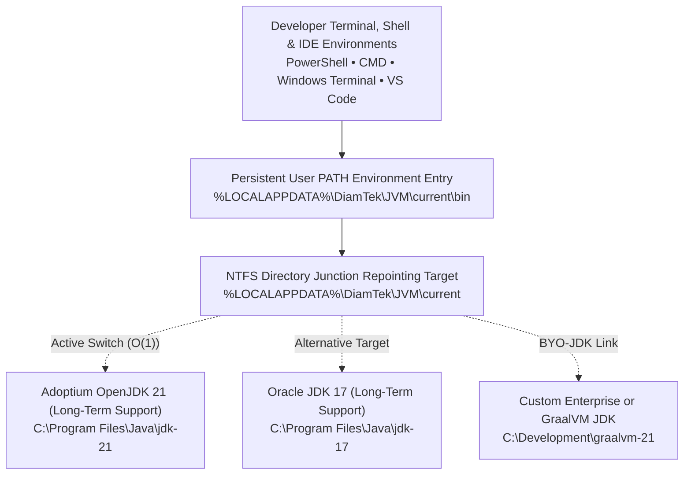
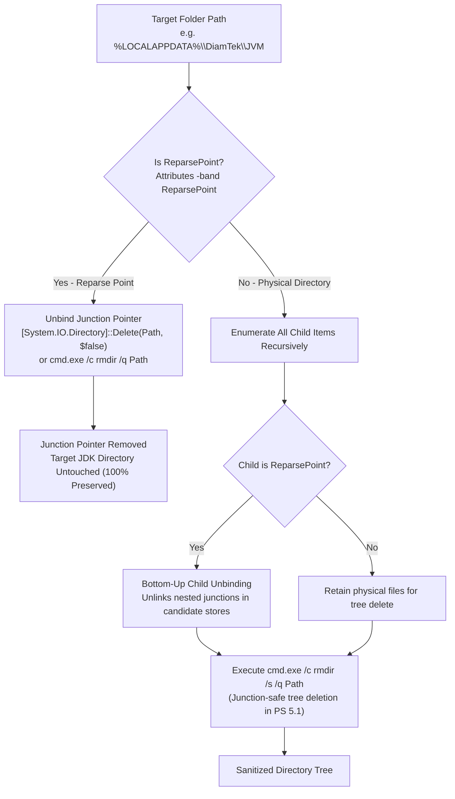
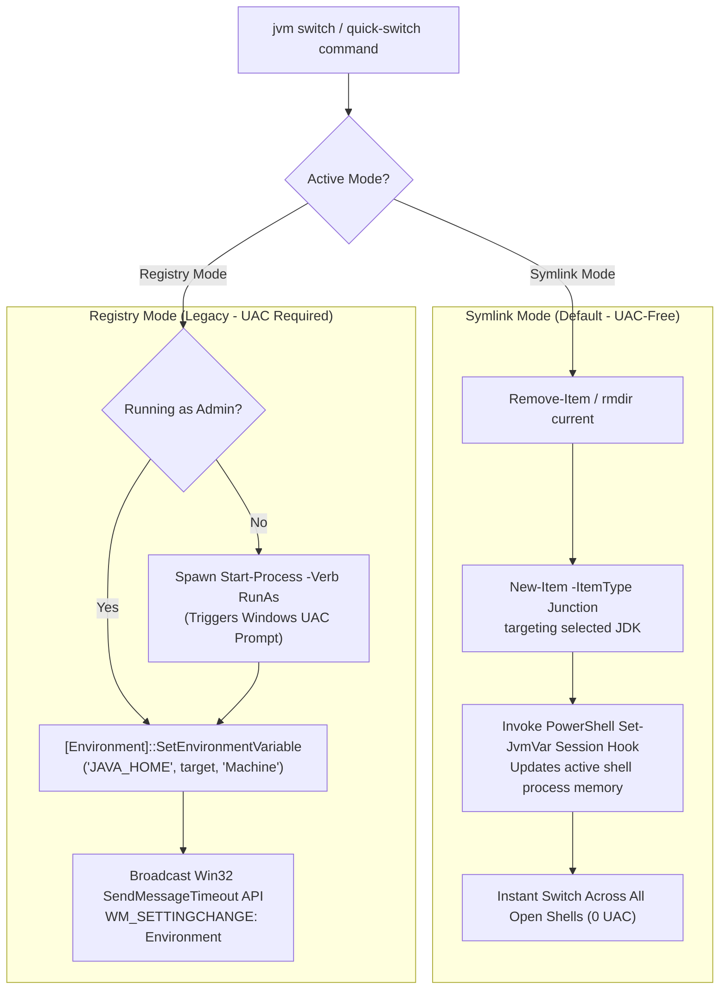
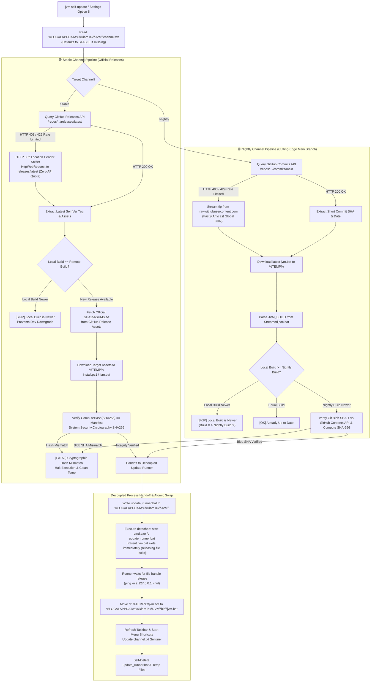
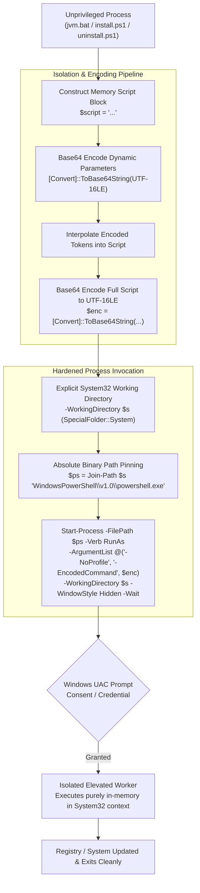
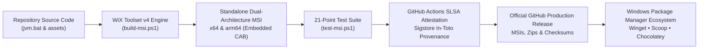

<h1 align="center">Architecture & Technical Implementation</h1>

<div align="center" markdown="1">

[🏠 Overview](../README.md) &nbsp;•&nbsp; [📦 Installation](INSTALLATION.md) &nbsp;•&nbsp; [📖 Usage](USAGE.md) &nbsp;•&nbsp; [🏗️ Architecture](ARCHITECTURE.md) &nbsp;•&nbsp; [❓ FAQ](FAQ.md) &nbsp;•&nbsp; [⚖️ SDKMAN! Comparison](SDKMAN-Comparison.md) &nbsp;•&nbsp; [📜 Changelog](CHANGELOG.md) &nbsp;•&nbsp; [🛡️ Security](SECURITY.md) &nbsp;•&nbsp; [🤝 Contributing](CONTRIBUTING.md) &nbsp;•&nbsp; [💬 Support](SUPPORT.md)

</div>


---

This project is a zero-dependency, lightweight, native Windows implementation designed to bypass the traditional complexities of virtualized bash scripts (like SDKMAN!) on Windows operating systems.

### 🔍 Quick Jump
- [The Core Mechanism: Directory Junctions](#the-core-mechanism-directory-junctions)
- [Directory Junction Lifecycle & Safe Unbinding](#directory-junction-lifecycle--safe-unbinding)
- [Dual-Architecture Core (Symlink Mode vs. Legacy Registry Mode)](#dual-architecture-core-symlink-mode-vs-legacy-registry-mode)
- [Dual Update Channel Engine & Trust Model Architecture](#dual-update-channel-engine-trust-model-architecture)
- [UAC Elevation Boundary & Process Isolation](#uac-elevation-boundary--process-isolation)
- [Environment Broadcast & Registry ValueKind Preservation](#environment-broadcast--registry-valuekind-preservation)
- [PowerShell Native Dynamic Environment Injection](#powershell-native-dynamic-environment-injection)
- [Windows Terminal Settings JSONC Parser Engine](#windows-terminal-settings-jsonc-parser-engine)
- [Packaging Architecture & Asset Distribution](#packaging-architecture--asset-distribution)

---

## The Core Mechanism: Directory Junctions
Instead of constantly appending and pruning your Windows `PATH` variable to point to different JDK folders (which quickly leads to the 1024-character `PATH` limit and environment variable bloat), the manager maintains a single **Directory Junction** (`mklink /J`) at:

`%LOCALAPPDATA%\DiamTek\JVM\current`

Your system `PATH` only ever needs to contain `%LOCALAPPDATA%\DiamTek\JVM\current\bin`. When you switch Java versions, the manager simply tears down the old junction and repoints it to the target JDK directory. This provides `O(1)` symlink resolution for the OS.

### JDK Discovery Engine & Scanned Locations
During startup, inventory listing (`jvm list`), and quick-switching, the discovery engine scans all recognized local storage locations for valid `bin\java.exe` targets. It dynamically queries 12 fixed filesystem locations plus user-space package manager directories (13 total entries in the discovery inventory):

| Discovered Location | Target Distribution / Managing Tool | Discovery Mode |
|---|---|---|
| `C:\Program Files\Java\*` | Standard Oracle, Adoptium, Microsoft, Corretto, Liberica, Semeru installs | Automatic Scan |
| `C:\Program Files (x86)\Java\*` | Legacy 32-bit JDKs and JREs | Automatic Scan |
| `C:\Program Files\Eclipse Adoptium\*` | Official Eclipse Adoptium / Temurin installer root | Automatic Scan |
| `C:\Program Files\Amazon Corretto\*` | Official Amazon Corretto installer root | Automatic Scan |
| `C:\Program Files\Zulu\*` | Official Azul Zulu OpenJDK installer root | Automatic Scan |
| `C:\Program Files\BellSoft\*` | Official BellSoft Liberica OpenJDK installer root | Automatic Scan |
| `C:\Program Files\Semeru\*` | Official IBM Semeru Runtime (OpenJ9) installer root | Automatic Scan |
| `C:\Program Files\Microsoft\*` | Official Microsoft Build of OpenJDK installer root | Automatic Scan |
| `C:\Java\*` | Enterprise standard root installations | Automatic Scan |
| `%USERPROFILE%\.jdks\*` | IntelliJ IDEA / JetBrains Toolbox managed JDKs | Automatic Scan |
| `%USERPROFILE%\.gradle\jdks\*` | Gradle automated toolchain downloads | Automatic Scan |
| `%USERPROFILE%\scoop\apps\*` | Scoop package manager Java installations (`apps\*\current\bin\java.exe`) | Dynamic Scan |
| `%LOCALAPPDATA%\JavaVersionManager\links\*` | Bring Your Own JDK (`jvm link`) custom junctions | Link Store Scan |

The discovery engine extracts release metadata (vendor, version, release type) from `release` files or parses binary headers, cataloging each JDK into memory without writing temporary files.



<a id="directory-junction-lifecycle--safe-unbinding"></a>
### Directory Junction Lifecycle & Safe Unbinding (`Remove-DirectorySafely`)

Directory junctions in Windows are NTFS reparse points (`IO_REPARSE_TAG_MOUNT_POINT`) that redirect directory path resolution at the kernel filesystem driver level. Managing junctions safely requires handling reparse point unbinding, recursive deletion hazards, and dangling junction deadlocks.



#### 1. Non-Destructive Reparse Point Unbinding (`Remove-DirectorySafely`)
In Windows automation, executing naive recursive deletions (such as PowerShell's `Remove-Item -Recurse` in Windows PowerShell 5.1 or batch `rmdir /s /q` across poorly managed junction trees) can inadvertently traverse into the target directory, deleting the user's real JDK installation (e.g. wiping `C:\Program Files\Java\jdk-21` when attempting to delete the symlink folder `%LOCALAPPDATA%\DiamTek\JVM\current`).

`Remove-DirectorySafely` (implemented in `uninstall.ps1` and `packages\msi\build-msi.ps1`) enforces deterministic, non-destructive junction unbinding:
1. **Root Reparse Point Audit**: Queries filesystem metadata using the Win32 file attribute flag:
   ```powershell
   $rootItem.Attributes -band [System.IO.FileAttributes]::ReparsePoint
   ```
2. **Atomic Unbind Without Target Mutation**: If the path is a reparse point container, it unlinks the junction via .NET `[System.IO.Directory]::Delete($rootItem.FullName, $false)` with the `recursive` parameter explicitly set to `$false` (falling back to `cmd.exe /c "rmdir /q \"$path\""` without `/s`). This destroys the reparse tag and link record in NTFS master file table (MFT) without recursing into the target folder.
3. **Bottom-Up Child Reparse Point Unlinking**: If the target path is a physical directory containing nested candidate junctions (e.g., `%LOCALAPPDATA%\DiamTek\JVM\candidates\`), the routine traverses children bottom-up, isolating each reparse point and unbinding it before attempting to remove physical parent folders.
4. **Junction-Safe Tree Teardown**: Uses `cmd.exe /c "rmdir /s /q \"$Path\""` to perform tree deletion, eliminating recursion bugs present in older PowerShell versions.

#### 2. Broken Junction Recovery Without `if exist` Deadlocks
Windows `cmd.exe` contains a well-known architectural quirk: the `if exist <path>` condition evaluates the existence of the **target** of a directory junction rather than the junction entry itself.
- **The Dangling Junction Deadlock**: If a user uninstalls, deletes, or moves a JDK folder from disk, the junction pointing to it (`%LOCALAPPDATA%\DiamTek\JVM\current`) becomes dangling/broken. Because the target directory no longer exists, batch `if exist "!CURRENT_SYMLINK!"` evaluates to `false`!
- **Error 183 Trap**: If a script relies on `if exist "!CURRENT_SYMLINK!" rmdir "!CURRENT_SYMLINK!"`, the `rmdir` call is bypassed because the condition evaluates to `false`. When the script subsequently runs `mklink /J "!CURRENT_SYMLINK!" "!NEW_JDK!"`, Windows aborts with:
  ```
  Cannot create a file when that file already exists (Win32 Error 183)
  ```
- **JVM Recovery Engine**: JVM resolves this deadlock by unconditionally executing:
  ```cmd
  rmdir "!CURRENT_SYMLINK!" >nul 2>&1
  mklink /J "!CURRENT_SYMLINK!" "!CURRENT_JDK_PATH!" >nul
  ```
  Calling `rmdir` directly without an `if exist` guard silently unbinds the broken reparse point if present (and returns errorlevel 2 harmlessly if absent), guaranteeing that `mklink /J` always succeeds with zero deadlocks.

## Dual-Architecture Core (Symlink Mode vs. Legacy Registry Mode)
The engine provides two distinct switching engines that users can toggle via the Settings menu or CLI flags:

1. **Symlink Mode (Default, UAC-Free):**
   - **Mechanism:** Updates the NTFS Directory Junction pointer (`%LOCALAPPDATA%\DiamTek\JVM\current`) in user-space.
   - **Privileges:** Standard user space (100% UAC-free, zero admin popups).
   - **Compatibility:** Native for 99% of modern tools (Maven, Gradle, IntelliJ IDEA, VS Code, Eclipse).

2. **Registry Mode (Legacy, UAC Required):**
   - **Mechanism:** Directly writes the absolute JDK path to the Machine-level Windows Registry (`HKLM\SYSTEM\CurrentControlSet\Control\Session Manager\Environment`) and updates the system-wide Machine `PATH`. Invoked on the CLI via `--legacy` or `--registry`.
   - **Privileges:** **Requires Administrator (UAC) Elevation** on every switch, spawning an elevated background PowerShell worker via `Start-Process -Verb RunAs`.
   - **Compatibility:** 100% unbreakable fallback for legacy enterprise applications, obscure Windows service runners, or ancient classloaders that perform strict canonical path checks and cannot resolve NTFS Directory Junctions.

> [!NOTE]
> **Internal Mode Sentinel:** The user's active mode preference is persisted in `%LOCALAPPDATA%\DiamTek\JVM\mode.txt`. Internally, `mode.txt` stores either `SYMLINK` (Symlink Mode) or `DIRECT` (Registry Mode, activated via `--legacy` or `--registry`).



<a id="dual-update-channel-engine-trust-model-architecture"></a>
## Dual Update Channel Engine & Trust Model Architecture

DiamTek JVM embeds an autonomous, dual-track self-update and verification engine designed to reconcile enterprise stability with rapid developer iteration. The engine decouples channel selection, remote manifest resolution, cryptographic integrity verification, ahead-of-remote downgrade blocking, and external atomic process replacement.



### 1. Channel Persistence & Runtime Selection
- **Persistence Sentinel:** The user's active channel configuration is persisted at:
  `%LOCALAPPDATA%\DiamTek\JVM\channel.txt`
  Containing either `STABLE` or `NIGHTLY`. If the file is missing (e.g. fresh installation), the runtime defaults to `STABLE`.
- **Channel Switching:** Configured non-interactively via `jvm channel [stable|nightly]`, interactively via TUI Option 4 in Settings (`jvm` -> `Settings`), or during bootstrapping via `install.ps1 -Channel [Stable|Nightly]`.
- **Command Overrides:** Commands such as `jvm self-update --channel nightly` or `jvm self-update --nightly` allow one-off evaluations without modifying the persistent `channel.txt` sentinel.

### 2. Upstream Resolution & Zero-Quota Rate Limit Resilience
To prevent GitHub's 60-request-per-hour unauthenticated REST API quota from breaking update checks:
- **Stable Channel:** When GitHub API returns HTTP 403 / 429, the engine triggers an automated fallback leveraging .NET `System.Net.HttpWebRequest` with `AllowAutoRedirect = $false` directed at `https://github.com/DiamTek/Java-Version-Manager-Windows/releases/latest`. The remote web server responds with an HTTP 302 Redirect containing the target release tag in the `Location` response header. This enables 100% reliable release discovery with zero GitHub API consumption.
- **Nightly Channel:** Bypasses API dependencies by fetching directly from `raw.githubusercontent.com` (served globally via Fastly Anycast CDN), streaming the latest `jvm.bat` header to parse `JVM_BUILD`.

### 3. Cryptographic Integrity & Downgrade Prevention
- **SHA-256 Manifest Verification (`[Stable]`):** Official releases publish an authenticated `SHA256SUMS.txt` manifest. JVM computes the SHA-256 digest of downloaded payload files in memory via `System.Security.Cryptography.SHA256` and asserts strict byte equality before replacing executable files on disk.
- **Git Blob SHA-1 Commit-Tree Verification (`[Nightly]`):** When updating on the `[Nightly]` channel where `main` is ahead of the last tagged release `SHA256SUMS.txt`, both `:SelfUpdate` (`jvm.bat` verifying `install.ps1`) and `install.ps1` (verifying `jvm.bat`) query the GitHub Contents API (`/repos/DiamTek/Java-Version-Manager-Windows/contents/<file>?ref=<ref>`) and verify `SHA1("blob " + length + "\0" + bytes)` against `.sha` in the commit tree, halting immediately (`MISMATCH`) if the downloaded file differs from the repository commit.
- **Ahead-of-Remote Downgrade Blocking (`[Stable]` & `[Nightly]`):** Developers frequently iterate on local code, incrementing internal `JVM_BUILD` integers (format `YYYYMMDD.REV`). When running `jvm self-update`, the engine compares the local `JVM_BUILD` integer against the upstream payload. If `local_build > remote_build`, the updater outputs a protective skip message (`[ SKIP ] You are on a newer local build`) and halts cleanly, preventing accidental rollbacks. Passing `--force` explicitly overrides this safeguard.

### 4. Decoupled Runner Handoff & Atomic Swap
Because Windows enforces strict kernel file locking (`ERROR_SHARING_VIOLATION` / `0x00000020`) on active running executables, a running batch file cannot overwrite itself in place. JVM resolves this through a detached handoff mechanism:
1. The active `jvm.bat` process stages the verified replacement file in `%TEMP%\jvm_update.bat`.
2. It generates an ephemeral runner script (`%LOCALAPPDATA%\DiamTek\JVM\update_runner.bat`).
3. It executes the runner in a detached, asynchronous subshell (`start "" cmd.exe /c "%RUNNER%"`) and immediately calls `exit /b 0` to release all file locks on `%LOCALAPPDATA%\DiamTek\JVM\bin\jvm.bat`.
4. The runner polls for lock release, atomically moves the replacement file into the binary directory, synchronizes pinned shortcuts and Windows Terminal profiles, and self-deletes upon completion.

## Deep OS Environment Management
To ensure deep OS integration without requiring users to download external binaries (like `setx` augmentations), the tool relies on inline PowerShell execution invoked seamlessly via `cmd.exe`.

### Global/Machine State (`HKLM`)
- Updates to the global `PATH` and `JAVA_HOME` are performed natively using the .NET framework bridging in PowerShell: 
  `[Environment]::SetEnvironmentVariable('JAVA_HOME', $target, 'Machine')`
- The script detects if it is running in standard user space. If required, it invokes an elevated background PowerShell worker via `Start-Process powershell -Verb RunAs -ArgumentList @(...)` with direct, in-memory parameterized command arguments. It never stages temporary scripts in `%TEMP%`, completely eliminating Time-of-Check to Time-of-Use (TOCTOU) race conditions and Local Privilege Escalation vectors.

### Session State Isolation
- Updating the Windows Registry does **not** update the live, running terminal session. To solve this, the script dynamically evaluates the environment block within the execution boundary.
- **Dynamic Filtering:** Instead of using batch string substitution (`!PATH:string=!`), which is vulnerable to quote-collisions and delayed expansion parsing bugs, the manager pipes the variable manipulation to PowerShell using the `-not` operator against `$env:PATH`. This guarantees 100% accurate string evaluation and prevents the accidental deletion of unrelated paths (e.g., pruning `JAVA_HOME_Backup` while searching for `JAVA_HOME`).

<a id="uac-elevation-boundary--process-isolation"></a>
### UAC Elevation Boundary & Process Isolation

When modifying Machine-level environment variables (`HKLM\SYSTEM\CurrentControlSet\Control\Session Manager\Environment`) or executing system-wide JDK cleanups, unprivileged users must elevate across the Windows User Account Control (UAC) security boundary. Traditional automation approaches often introduce Local Privilege Escalation (LPE), Time-of-Check to Time-of-Use (TOCTOU) race windows, or command-line quoting injection vulnerabilities.



#### 1. In-Memory Base64 UTF-16LE `-EncodedCommand` Protocol
Passing dynamic parameters (such as directory paths with spaces, single quotes, double quotes, ampersands, or parenthesis) across the `Start-Process -Verb RunAs` boundary via standard string concatenation (`-ArgumentList "-Command ..."`):
- Triggers command-line parser collisions in `cmd.exe` and `powershell.exe`.
- Creates quoting vulnerabilities where arbitrary commands could be injected and executed in an elevated security context.
- Causes silent syntax errors if paths contain special characters (e.g. `C:\Java (x86)\...`).

JVM completely neutralizes this by encoding both individual dynamic parameters and the overall payload into UTF-16LE Base64 strings:
```powershell
$target = $env:CURRENT_JDK_PATH;
$b64 = [Convert]::ToBase64String([System.Text.Encoding]::Unicode.GetBytes($target));
$script = '$target = [System.Text.Encoding]::Unicode.GetString([Convert]::FromBase64String(''' + $b64 + ''')); ' +
          '[Environment]::SetEnvironmentVariable(''JAVA_HOME'', $target, ''Machine''); ...';
$enc = [Convert]::ToBase64String([System.Text.Encoding]::Unicode.GetBytes($script));
$s = [Environment]::GetFolderPath([Environment+SpecialFolder]::System);
$ps = Join-Path $s 'WindowsPowerShell\v1.0\powershell.exe';
Start-Process -FilePath $ps -Verb RunAs `
    -WorkingDirectory $s `
    -WindowStyle Hidden -Wait `
    -ArgumentList @('-NoProfile', '-EncodedCommand', $enc)
```
Because `-EncodedCommand` consumes a Base64 Unicode string directly, the Windows process loader performs zero command-line tokenization or quote unescaping, preventing command injection and shell syntax errors.

#### 2. Process & Working Directory Isolation with Environment Saturation Immunity
When an elevated process is spawned via `Start-Process -Verb RunAs`, by default it inherits the caller process's current working directory and process environment.
- **The DLL Preloading / Hijacking Threat**: If the user runs `jvm switch` from an unprivileged, user-writable directory (e.g. a cloned git repository, network share, or `%TEMP%`), a malicious actor or malware could plant a Trojan DLL (e.g., `user32.dll`, `version.dll`, or .NET provider DLLs) in that directory. When the elevated worker starts, the Windows dynamic link library search order could load the untrusted DLL from the current working directory into the elevated process before system directories.
- **The Environment Saturation Threat**: In Windows, unprivileged standard users can define user-level environment variables (e.g. modifying `HKCU\Environment\SystemRoot`). If a parent non-elevated script resolves `$env:SystemRoot` before spawning an elevated process, an attacker can manipulate `$env:SystemRoot` to point to a malicious folder, redirecting the elevated binary invocation or working directory.
- **The Defense**: JVM completely avoids relying on `$env:SystemRoot`. Instead, it resolves system directories strictly through the immutable Win32 SpecialFolder API: `[Environment]::GetFolderPath([Environment+SpecialFolder]::System)` (calling native `SHGetKnownFolderPath(FOLDERID_System)`). It explicitly passes `-WorkingDirectory $s` and pins the executable path to `$ps = Join-Path $s 'WindowsPowerShell\v1.0\powershell.exe'`, locking the elevated execution context strictly inside the kernel-verified Windows system directory.
- **Console Isolation**: Elevated workers specify `-WindowStyle Hidden` and `-Wait` to execute silently in the background without intrusive terminal flashes and prevent race conditions.

<a id="environment-broadcast--registry-valuekind-preservation"></a>
### Environment Broadcast & Registry ValueKind Preservation

Modifying environment variables in the Windows Registry (`HKCU\Environment` or `HKLM\SYSTEM\CurrentControlSet\Control\Session Manager\Environment`) does not automatically update already running desktop processes (such as Windows Explorer, taskbar runners, or existing command prompts). The operating system requires an explicit environment change notification broadcast.

#### 1. Non-Blocking P/Invoke `SendMessageTimeout` Architecture
Windows applications listen for `WM_SETTINGCHANGE` (`0x001A`) messages sent to `HWND_BROADCAST` (`0xFFFF`) with `lParam` set to `"Environment"`.
- **The Deadlock Hazard with `SendMessage`**: Traditional scripts use standard synchronous `SendMessage` or high-level shell objects. If a single top-level window on the desktop is unresponsive (e.g. a hanging tray application, hung IDE, or modal dialog awaiting user input), `SendMessage` blocks indefinitely, freezing the installer, uninstaller, or command-line session.
- **The P/Invoke Solution**: JVM executes a native Win32 `user32.dll` P/Invoke call using `SendMessageTimeout`:
  ```powershell
  $code = @'
  [DllImport("user32.dll", SetLastError=true, CharSet=CharSet.Auto)]
  public static extern IntPtr SendMessageTimeout(
      IntPtr hWnd, uint Msg, UIntPtr wParam, string lParam,
      uint fuFlags, uint uTimeout, out UIntPtr lpdwResult);
  '@
  Add-Type -MemberDefinition $code -Name NativeMethods -Namespace Win32 -ErrorAction SilentlyContinue

  $HWND_BROADCAST = [IntPtr]0xFFFF
  $WM_SETTINGCHANGE = 0x001A
  $SMTO_ABORTIFHUNG = 0x0002
  $result = [UIntPtr]::Zero

  [Win32.NativeMethods]::SendMessageTimeout(
      $HWND_BROADCAST,
      $WM_SETTINGCHANGE,
      [UIntPtr]::Zero,
      'Environment',
      $SMTO_ABORTIFHUNG,
      5000,
      [ref]$result
  ) | Out-Null
  ```
- **Flag Mechanics**:
  - `SMTO_ABORTIFHUNG` (`0x0002`): Instructs the Windows window manager to immediately abort waiting on any recipient window if the thread hosting that window is hung or unpumped.
  - `uTimeout = 5000` (5,000 ms): Sets a strict ceiling on the total dispatch wait time (reduced to `3000` ms during interactive setup).
  - This architecture guarantees instantaneous environment broadcast propagation while ensuring the JVM CLI, installer, and uninstaller never hang.

#### 2. Registry `ValueKind` Preservation (`REG_EXPAND_SZ` vs `REG_SZ`)
The Windows `PATH` environment variable frequently relies on variable expansion tags (e.g., `%SystemRoot%\system32`, `%USERPROFILE%\AppData\Local\Microsoft\WindowsApps`).
- **The Demotion Risk**: If a tool queries `PATH` using standard .NET `[Environment]::GetEnvironmentVariable`, the framework automatically expands the `%...%` tokens to static paths. If written back to the registry as a static `REG_SZ` (String) value:
  - Variable references like `%SystemRoot%` are permanently lost.
  - On user profile migration or multi-user machines, hardcoded user paths break other accounts.
  - More critically, if `PATH` is stored as `REG_SZ`, Windows process creation fails to expand any nested variables dynamically, corrupting the execution path for subsequent processes.
- **Deterministic Preservation Pipeline**:
  1. Opens the key using `[Microsoft.Win32.RegistryValueOptions]::DoNotExpandEnvironmentNames` to retrieve unexpanded raw strings.
  2. Inspects `$envKey.GetValueKind("Path")` to record the existing type.
  3. Writes the updated PATH back using `REG_EXPAND_SZ` (`[Microsoft.Win32.RegistryValueKind]::ExpandString`) whenever `%` variable delimiters are present or previously configured, preserving `REG_SZ` only if the original type was `String` and strictly contains zero `%` markers.
- **Buffer Safety Ceiling**: Computes combined PATH length (Machine + User). If `combinedLength > 8191` characters, modifications are aborted with an error to prevent environment block overflow; if `combinedLength > 2048`, a warning is logged regarding legacy Win32 tool compatibility.

## Ecosystem Routing (Universal Candidate Engine)
Like SDKMAN!, this tool intercepts commands for popular Java tools (Maven, Gradle, Kotlin, Scala, Groovy). The CLI acts as a universal router:
1. It intercepts the `jvm install <candidate> <version>` command.
2. It executes a PowerShell `Invoke-RestMethod` to the respective API (Adoptium, GitHub Releases, Azul, BellSoft, IBM, etc.) to securely resolve the download URL and SHA-256 / SHA-1 checksums.
3. The payloads are extracted via `Expand-Archive` and isolated in `%LOCALAPPDATA%\DiamTek\JVM\candidates\<candidate>`.
4. Specific `<CANDIDATE>_HOME` variables are injected into the registry, mapping the ecosystem completely identically to native Java.

### LTS Target Resolution Architecture
The `lts` semantic target operates under two complementary models depending on the operation:
- **Local JDK Switching (`jvm lts`):** Operates 100% offline. The switcher matches installed JDKs against a recognized Long-Term Support release table: **8, 11, 17, 21, 25, 29**. It resolves to the highest major LTS version currently present on disk.
- **Remote JDK Installation (`jvm install lts --latest`):** Operates dynamically by querying the live Eclipse Adoptium v3 API (`/v3/info/available_releases`) to detect the newest official production LTS release published upstream before initiating the download.

<a id="powershell-native-dynamic-environment-injection"></a>
## Real-Time PowerShell Session Propagation (`Set-JvmVar`)
Because Windows process environments cannot ordinarily be modified by a child batch process, `install.ps1` injects a native PowerShell function hook into `$PROFILE`. 
When `jvm` switches an active tool or JDK:
1. `jvm.bat` writes target environment pairs (`KEY=VALUE`) to `$env:TEMP\.jvm_session_target`.
2. The PowerShell wrapper intercepts the return code and invokes `Set-JvmVar`.
3. `Set-JvmVar` surgically strips the old `\bin` directory from `$env:Path` and prepends the new `\bin` directory directly into the current PowerShell process memory.
4. It updates `$env:JAVA_HOME` (or corresponding tool variables) live, providing instantaneous switching without reopening terminal tabs.

### Decoupled Profile Hook Management (`jvm hook`)
The PowerShell profile wrapper is decoupled from global User `PATH` installation. Developers can manage the hook independently via `jvm hook [install|remove|status]` or via Option 2 in the interactive Settings menu. The hook automatically discovers and synchronizes both Windows PowerShell 5.1 and modern PowerShell 7+ profiles across standard or redirected Documents directories (`[Environment]::GetFolderPath('MyDocuments')`).

## Automated Health Diagnostics & Shadow Detection (`jvm doctor`)
The `jvm doctor` diagnostic engine runs a deterministic 7-point system health audit across:
1. **Storage Root Accessibility:** Verifies `%LOCALAPPDATA%\DiamTek\JVM` exists and has NTFS write permissions.
2. **Directory Junction Target Validity:** Validates that `%LOCALAPPDATA%\DiamTek\JVM\current` points to an active JDK containing `bin\java.exe`.
3. **Registry Synchronization:** Cross-references User (`HKCU`) and Machine (`HKLM`) `JAVA_HOME` variables.
4. **PATH Precedence & Rogue Shadowing:** Scans `where.exe java` to detect legacy Oracle `javapath` or `System32\java.exe` shims overriding JVM in your system PATH.
5. **PowerShell `$PROFILE` Hook:** Audits wrapper function presence across detected PowerShell profiles.
6. **CPU Architecture:** Confirms native architecture matches (`x64` / `ARM64`).
7. **Discovered JDK Distribution Inventory:** Audits recognized runtimes on disk.

## Ephemeral Execution Architecture (`jvm exec` / `jvm run`)
Unlike persistent switching which mutates directory junctions or registries, `jvm exec` / `jvm run` resolves the requested JDK build, spawns an isolated child subshell with local `JAVA_HOME` and prepended `bin\` in `PATH`, invokes the user command, and propagates the child process's exact exit code back to the host shell prompt, leaving global OS state 100% untouched.

## Bulletproof Batch Heredoc Escaping
Windows `cmd.exe` does not natively support Bash-style heredocs (`cat <<EOF`). Embedding multi-line PowerShell scripts inside a batch `( ... ) > script.ps1` redirection block requires careful escaping:
- Redirection operators (`<`, `>`) are escaped as `^<`, `^>`.
- Pipes (`|`) and command separators (`&`) are escaped as `^|`, `^&`.
- Parentheses (`(`, `)`) are escaped as `^(`, `^)` to prevent premature termination of the enclosing batch block.
- Exclamation marks (`!`) are escaped as `^^!` to prevent corruption by CMD's delayed variable expansion engine (`setlocal enabledelayedexpansion`).

## Deep Uninstaller & Windows Integration Architecture
The uninstaller subsystem (`uninstall.ps1`) is designed for 100% total system sanitization:
1. **UAC Escalation:** Uses .NET security principals to check for elevated tokens; if missing, automatically spawns an elevated PowerShell host via `Start-Process -Verb RunAs`.
2. **Registry Integration:** Registers under `HKCU:\Software\Microsoft\Windows\CurrentVersion\Uninstall\DiamTek.JVM` with native Windows "Installed apps" metadata, dynamic `EstimatedSize` computation (with a 1,024 KB floor for Windows 11 compatibility), and creates a Start Menu uninstaller shortcut in `Start Menu\Programs\DiamTek`.
3. **Dual-Scope Cleanup:** Cleans both `User` and `Machine` environment variables and `PATH` registries, surgically strips the `$PROFILE` hook, deletes the AppData Ecosystem cache, purges Windows Terminal profiles, removes pinned taskbar shortcuts, cleans session files, and prompts to clean `C:\Program Files\Java`.

## Windows Terminal & Shell Integration Architecture
To provide a first-class modern Windows developer experience while strictly maintaining 100% pure Batch & PowerShell code:
1. **Dynamic Profile Injection**: `install.ps1` scans for Windows Terminal configurations across Release, Preview, and Unpackaged locations (`LocalState\settings.json`). It injects a dedicated profile with GUID `{b20650a4-4212-4d64-9edf-744e9285e2be}`, pointing to high-resolution `assets/icon.png`.
2. **Tab Lifecycle Management**: Configured with `cmd.exe /c` and `closeOnExit: always`. When a developer exits the interactive JVM menu (`exit /B 0`), the hosting `cmd.exe` process terminates, signaling Windows Terminal to immediately close the tab.
3. **Shortcut Synchronization**: Creates Start Menu application shortcuts targeting `wt.exe -p "Java Version Manager"` (falling back to `cmd.exe /c` on systems without Windows Terminal). During installation and self-updates, the script automatically searches `%APPDATA%\Microsoft\Internet Explorer\Quick Launch\User Pinned\TaskBar\` to detect and update existing pinned taskbar shortcuts in place.
4. **AppUserModelID & Taskbar Mechanics**: Windows Terminal is a packaged WinUI app that hardcodes its own process-level AppUserModelID (`Microsoft.WindowsTerminal...`) on all hosting windows. By registering a dedicated profile with native icon and dropdown integration rather than forcing brittle binary wrappers, the utility respects the OS container model while maintaining a zero-binary, 100% script-based repository.

<a id="windows-terminal-settings-jsonc-parser-engine"></a>
<a id="windows-terminal-settings-jsonc-parser--profile-engine"></a>
### Windows Terminal Settings JSONC Parser Engine

Windows Terminal stores user profiles and preferences in `settings.json` located within package application local data or unpackaged user profiles across Release, Preview, and Unpackaged installations:
- **Release (Stable):** `%LOCALAPPDATA%\Packages\Microsoft.WindowsTerminal_8wekyb3d8bbwe\LocalState\settings.json`
- **Preview:** `%LOCALAPPDATA%\Packages\Microsoft.WindowsTerminalPreview_8wekyb3d8bbwe\LocalState\settings.json`
- **Unpackaged:** `%LOCALAPPDATA%\Microsoft\Windows Terminal\settings.json`

#### The JSONC Parsing Challenge
Microsoft Windows Terminal formats `settings.json` as **JSON with Comments (JSONC)**:
- Developers frequently include C-style block comments (`/* ... */`) and line comments (`// ...`) to document keybindings, appearance schemes, or disabled profiles.
- Trailing commas are permitted before closing braces (`}`) and closing brackets (`]`).

Standard PowerShell `ConvertFrom-Json` (particularly in Windows PowerShell 5.1, the default engine pre-installed on all Windows 10 and 11 workstations) is a strict RFC 8259 JSON parser and throws a terminating syntax error when encountering comments or trailing commas.

#### Regex Preprocessor Engine
To achieve zero-dependency JSONC parsing across all PowerShell versions without requiring external libraries or third-party modules, `install.ps1`, `uninstall.ps1`, and `packages\msi\build-msi.ps1` execute a high-performance regex preprocessing pipeline:

```powershell
$wtContent = Get-Content $wtSettings -Raw -ErrorAction Stop

# 1. Strip block comments (/* ... */) in single-line mode (?s)
# 2. Strip single-line comments (// ...) in multi-line mode (?m)
# 3. Strip trailing commas preceding closing braces or brackets
$cleanJson = $wtContent `
    -replace '(?s)/\*.*?\*/', '' `
    -replace '(?m)//.*$', '' `
    -replace ',\s*([\}\]])', '$1'

$wtJson = $cleanJson | ConvertFrom-Json
```

#### Idempotent Profile Synchronization
Once sanitized and parsed into a PowerShell object graph:
1. **Deduplication Check**: Queries `$wtJson.profiles.list` for matching profile GUID `{b20650a4-4212-4d64-9edf-744e9285e2be}` or name `'Java Version Manager'`.
2. **Profile Creation**: If missing, constructs a `[PSCustomObject]` with:
   - `commandline`: `'cmd.exe /c "%LOCALAPPDATA%\DiamTek\JVM\bin\jvm.bat"'`
   - `guid`: `'{b20650a4-4212-4d64-9edf-744e9285e2be}'`
   - `icon`: `'%LOCALAPPDATA%\DiamTek\JVM\assets\icon.png'`
   - `closeOnExit`: `'always'`
   - `startingDirectory`: `'%USERPROFILE%'`
3. **In-Place Update**: If the profile already exists, surgically updates `commandline`, `icon`, and `closeOnExit` without mutating custom font, color scheme, or keybinding customizations set by the user.
4. **Atomic UTF-8 Serialization**: Serializes the object graph back via `ConvertTo-Json -Depth 32` and writes the file via `Set-Content $wtSettings $newWtContent -Encoding utf8`.
5. **Clean Uninstallation**: During `uninstall.ps1`, the parser removes the JVM profile, checks if `defaultProfile` was assigned to JVM, redirects `defaultProfile` to the first available profile if necessary, and rewrites `settings.json` cleanly.

<a id="packaging-architecture--asset-distribution"></a>
## Multi-Channel Packaging Pipelines



- **Winget:** Native YAML manifest (`packages\winget\DiamTek.JVM.yaml`) declaring installer metadata and portable packaging.
- **Scoop:** JSON manifest (`packages\scoop\jvm.json`) that automates downloading and bootstraps `install.ps1`.
- **Chocolatey:** Package specification (`packages\choco\jvm.nuspec`) with automated `chocolateyInstall.ps1` and `chocolateyUninstall.ps1` scripts pulling official release assets pinned to the Stable channel. Includes `packages\choco\build-choco.ps1` to auto-detect version numbers from `jvm.bat`, synchronize metadata, and build `.nupkg` packages.
- **Release Staging & SLSA Provenance (`dist/`):** Release workflows (`.github/workflows/release.yml`) stage all distribution assets (`.msi`, `.zip`, `.nupkg`, `jvm.bat`, `install.ps1`, `uninstall.ps1`, `README.md`, `LICENSE`) into a flat `dist/` staging directory. This prevents nested subfolder structures inside uploaded release artifacts, produces unified cryptographic digests in `dist/SHA256SUMS.txt`, and generates cryptographically verifiable Sigstore SLSA build provenance attestations across all staged assets (`dist/*`) via `actions/attest-build-provenance@v2`.
- **WiX Toolset v4 (MSI):** Automated build script (`packages\msi\build-msi.ps1`) that auto-detects version and build numbers from `jvm.bat` and compiles native, per-user Windows Installers (`.msi`) bundling `jvm.bat`, companion branding assets, `uninstall.ps1`, `LICENSE`, and `README.md`:
  - **Embedded Cabinet Architecture**: Built with `<MediaTemplate EmbedCab="yes" />` to generate an internal `#cab1.cab` data stream inside the `.msi` binary. This produces truly standalone, single-file installers (~900 KB) without loose external `.cab` files, simplifying distribution and offline caching.
  - **Multi-Architecture Support (`x64` & `arm64`)**: Compiles native installers targeting both 64-bit Intel/AMD and ARM64 Windows platforms via WiX v4 `-arch` switches, setting native architecture properties while defaulting to building both (`$Arch = "all"`).
  - **Upgrade & Downgrade Safety**: Configured with `<MajorUpgrade DowngradeErrorMessage="..." Schedule="afterInstallInitialize" />` allowing clean upgrades over prior versions while preventing accidental downgrade conflicts.
  - **Deferred Action Execution Order & Hook Isolation**:
    - **Isolated Hook Architecture**: Internal hook scripts (`msi-install-hook.ps1` and `msi-uninstall-hook.ps1`) reside privately in `%LOCALAPPDATA%\DiamTek\JVM\`, strictly segregating them from the CLI `%LOCALAPPDATA%\DiamTek\JVM\bin\` folder so internal scripts never pollute the user's command line or `PATH`.
    - **Install Hook**: Scheduled `After="CreateShortcuts"` (sequence 4501) rather than `After="InstallFiles"` (sequence 4002). Standard Windows Installer action `CreateShortcuts` generates the Start Menu `.lnk` at sequence 4500; scheduling the hook afterward ensures the shortcut exists before PowerShell attempts to polish it with Windows Terminal (`wt.exe`) profiles and custom arguments. Also initializes update channel configuration to `STABLE`.
    - **Path Resolution in `WixQuietExec`**: Standard Windows Installer deferred custom actions run in the Windows Installer service context without inheriting standard shell environment PATHs. Hardcoding `[WindowsFolder]System32\WindowsPowerShell\v1.0\powershell.exe` guarantees deterministic 64-bit PowerShell invocation, completely eliminating `0x80070002` ("file not found") execution errors.
    - **Uninstall Hook**: Scheduled `Before="RemoveFiles"` to ensure PowerShell profile cleanup, Windows Terminal configuration scrubbing, dangling sub-process termination, environment variable removal, and deep directory hygiene (`candidates/`, `cache/`, `downloads/`, `backups/`, `channel.txt`, `mode.txt`, `config.ini`) occur safely before component teardown.
    - **Start Menu Uninstaller Shortcut**: Packages an explicit MSI shortcut targeting `[SystemFolder]msiexec.exe /x [ProductCode]` under `Start Menu\Programs\DiamTek`, allowing instant uninstallation discovery via Windows Search ("Uninstall Java Version Manager" and "Uninstall JVM").
    - **Race Condition Elimination**: The MSI uninstaller relies purely on standard Windows Installer actions (`RemoveFile`, `RemoveFolderEx`) for directory teardown, omitting background asynchronous CMD deletions to avoid file-lock race conditions (Windows Installer Error 2318).
  - **Automated Verification Suite (`packages\msi\test-msi.ps1`)**: Implements an automated 21-point synthetic integration suite (13 installation & registration checks + 8 uninstallation & residual hygiene checks) designed for CI/CD pipelines and GitHub Actions build provenance attestations (`actions/attest-build-provenance`). The suite actively tests live operating system integration (Windows Installer service `msiexec`, binary layout, CLI `bin/` directory hygiene, Start Menu application and uninstaller shortcuts indexed by Windows Search, registry metadata, PATH propagation, PowerShell profile & tab-completer channel integration, update channel persistence, Windows Terminal profile injection, CLI sanity subshell execution, clean uninstallation, and zero filesystem residuals). Features an autonomous 4-tier fallback engine (local MSI -> local WiX compiler -> GitHub Release binary -> remote source bootstrap + user-space .NET SDK / WiX CLI toolchain) and supports `-ShowUI` (native progress dialog `/qb`) and `-KeepInstalled` (retaining JVM post-test for direct terminal usage).

---

[← Back to Documentation Overview](../README.md#documentation)