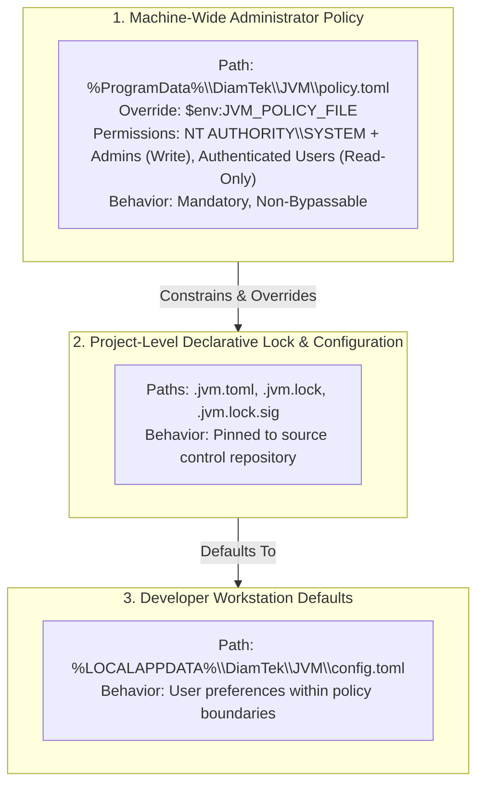
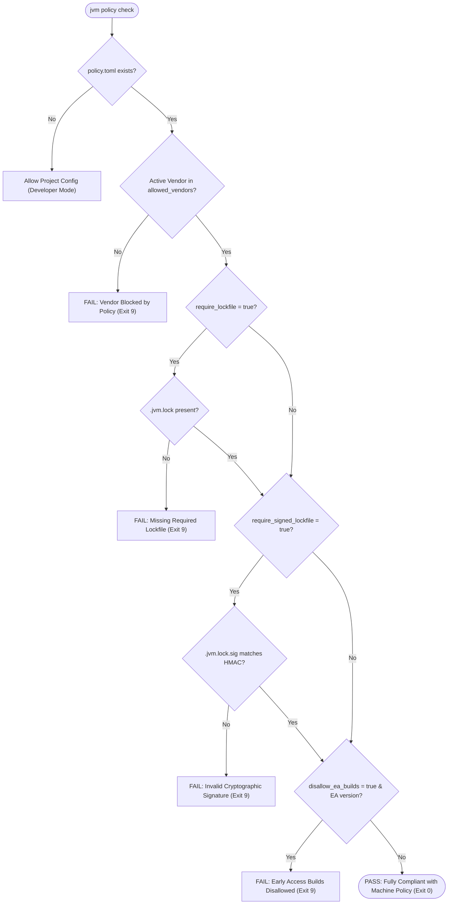
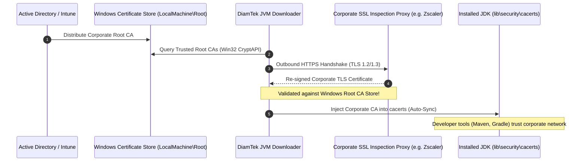
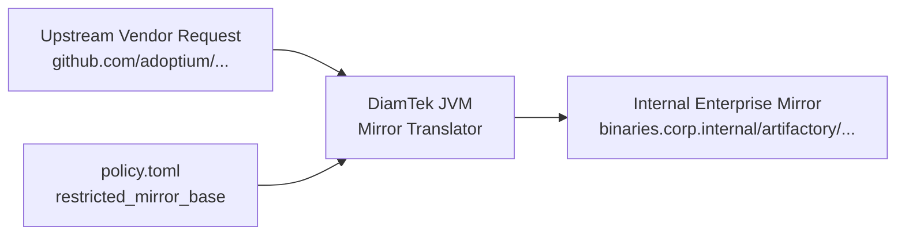
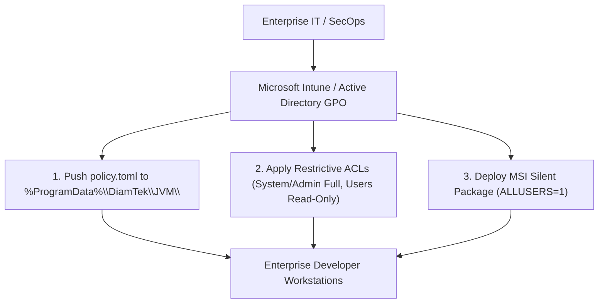

<h1 align="center">Enterprise Deployment & Policy Architecture</h1>

<div align="center" markdown="1">

[🏠 Overview](../README.md) &nbsp;•&nbsp; [📦 Installation](INSTALLATION.md) &nbsp;•&nbsp; [📖 Usage](USAGE.md) &nbsp;•&nbsp; [🏗️ Architecture](ARCHITECTURE.md) &nbsp;•&nbsp; [🏢 Enterprise](ENTERPRISE.md) &nbsp;•&nbsp; [🔒 Locking](LOCKING.md) &nbsp;•&nbsp; [🌐 Networking](NETWORKING.md) &nbsp;•&nbsp; [🐚 Shells](SHELLS.md) &nbsp;•&nbsp; [🎯 Threat Matrix](THREAT-MATRIX.md) &nbsp;•&nbsp; [❓ FAQ](FAQ.md) &nbsp;•&nbsp; [⚖️ SDKMAN! Comparison](SDKMAN-Comparison.md) &nbsp;•&nbsp; [📜 Changelog](CHANGELOG.md) &nbsp;•&nbsp; [🛡️ Security](SECURITY.md) &nbsp;•&nbsp; [🤝 Contributing](CONTRIBUTING.md) &nbsp;•&nbsp; [💬 Support](SUPPORT.md)

</div>

---

DiamTek Java Version Manager (JVM) is engineered from the ground up for high-security enterprise developer workstations, managed corporate VDI environments, and regulated automated CI/CD pipelines. Unlike legacy Unix port scripts that run with uncontrolled execution privileges and pull unverified binaries from arbitrary mirrors, DiamTek JVM provides **mandatory system-wide policy enforcement**, **Windows Certificate Store cryptographic integration**, **authenticated corporate proxy support**, and **reproducible signed build governance**.

Whether managing thousands of developer laptops through Microsoft Intune / Group Policy (GPO) or executing compliance-gated builds in air-gapped CI agents, DiamTek JVM guarantees that only authorized, verified, and audited Java runtime environments are provisioned across the enterprise.

### 🔍 Quick Jump
- [Executive Summary](#executive-summary)
- [Machine-Wide Policy Enforcement](#machine-wide-policy-enforcement)
  - [Policy Precedence Hierarchy](#policy-precedence-hierarchy)
- [Enterprise Policy Schema (`policy.toml`)](#enterprise-policy-schema-policytoml)
- [Policy Inspection & Compliance Auditing](#policy-inspection--compliance-auditing)
  - [1. View Active Enterprise Policy (`jvm policy show`)](#1-view-active-enterprise-policy-jvm-policy-show)
  - [2. Audit Project Compliance (`jvm policy check`)](#2-audit-project-compliance-jvm-policy-check)
  - [Compliance Verification Workflow](#compliance-verification-workflow)
- [Windows Certificate Store & Corporate TLS Inspection](#windows-certificate-store--corporate-tls-inspection)
  - [Legacy Tools Problem](#legacy-tools-problem)
  - [DiamTek JVM Native Solution](#diamtek-jvm-native-solution)
  - [Corporate PKI Trust Synchronization Flow](#corporate-pki-trust-synchronization-flow)
- [Air-Gapped & Offline Environments](#air-gapped--offline-environments)
  - [1. Internal Mirror Routing](#1-internal-mirror-routing)
  - [2. Strict Offline Flag (`--offline`)](#2-strict-offline-flag---offline)
  - [3. Pre-Seeded Distributions](#3-pre-seeded-distributions)
  - [4. Self-Contained Offline Distro Creation (`jvm distro create`)](#4-self-contained-offline-distro-creation-jvm-distro-create)
- [Active Directory & Microsoft Intune Deployment](#active-directory--microsoft-intune-deployment)
  - [GPO / Intune Deployment Recipe](#gpo--intune-deployment-recipe)
  - [Enterprise Workstation Rollout Topology](#enterprise-workstation-rollout-topology)

---

<a id="executive-summary"></a>
## Executive Summary

DiamTek Java Version Manager bridges the gap between high developer velocity and strict enterprise governance. In regulated financial, healthcare, aerospace, and government engineering organizations, unconstrained package managers present unacceptable supply chain risks (`CWE-494`, `CWE-295`). 

DiamTek JVM eliminates these risks through native Windows integration:
- **Zero-Bypass Policy Enforcement:** Hardened machine configuration residing in protected `%ProgramData%` paths overrides all user configurations.
- **Corporate PKI Interoperability:** Zero SSL interception failures (`SunCertPathBuilderException`) through automatic Windows Certificate Store trust inheritance.
- **Authenticated Proxy Traversal:** Transparent NTLM and Kerberos domain negotiation via Windows SSPI (`DefaultNetworkCredentials`).
- **Reproducible Build Assurance:** Cryptographic HMAC-signed toolchain lockfiles (`.jvm.lock.sig`) enforcing bit-for-bit build reproducibility across teams.

---

<a id="machine-wide-policy-enforcement"></a>
## Machine-Wide Policy Enforcement

<a id="policy-precedence-hierarchy"></a>
### Policy Precedence Hierarchy

DiamTek JVM evaluates configuration and policy across three strict structural layers:



When an enterprise policy file is present at `%ProgramData%\DiamTek\JVM\policy.toml` (or designated via the system-level `$env:JVM_POLICY_FILE` variable), DiamTek JVM runs in **Governed Enterprise Mode**. Any CLI flag or project configuration that conflicts with the enterprise policy is rejected with an immediate fail-closed exit code (`exit 1` / Exit Code `9: Configuration Error`).

---

<a id="enterprise-policy-schema-policytoml"></a>
## Enterprise Policy Schema (`policy.toml`)

Below is the complete specification of the `policy.toml` configuration format:

```toml
# ==============================================================================
# DiamTek JVM Enterprise Policy Specification
# Path: %ProgramData%\DiamTek\JVM\policy.toml
# ==============================================================================

# Global Policy Guard: Set to true to enforce strict validation
enforce_policy = true

# Unmanaged Installation Guard:
# When true, blocks developer installation of ad-hoc JDKs not matching policy.
disallow_unmanaged_installations = true

# Vendor Allowlist:
# Only distributions from these specific vendors may be installed or activated.
# Valid options: adoptium, corretto, zulu, bellsoft, semeru, microsoft,
#                oracle, graalvm, sapmachine, liberica, temurin, dragonwell
allowed_vendors = [
    "adoptium",
    "corretto",
    "microsoft",
    "zulu"
]

# Update Channel Allowlist:
# Restrict self-updates and candidate channels to certified stable builds.
# Options: "stable", "nightly"
allowed_channels = [
    "stable"
]

# Early Access & Preview Build Guard:
# Prevent developers from deploying experimental or non-LTS EA builds to production.
disallow_ea_builds = true

# Lockfile Enforcement:
# When true, 'jvm install' and 'jvm use' require a valid .jvm.lock in the project.
require_lockfile = false

# Cryptographic Signature Enforcement:
# When true, requires a valid .jvm.lock.sig matching the enterprise HMAC key.
require_signed_lockfile = false

# Allowed Signing Key Fingerprints:
# Hex-encoded SHA-256 fingerprints of enterprise signing keys permitted for lockfiles.
allowed_key_fingerprints = [
    "4a8e2b83c01f6871a25b13e9a5c43d78f23491ba32c1b504e76d912389ab4102"
]

# Internal Enterprise Mirror Redirection:
# Redirect all downloads to an internal Nexus, Artifactory, or cloud storage bucket.
# Must be an HTTPS URL ending with a trailing slash.
restricted_mirror_base = "https://binaries.corp.internal/artifactory/jvm-cache/"

# Corporate Proxy Configuration:
# Automatically configured if HTTP_PROXY or HTTPS_PROXY is defined in system environment.
[proxy]
enabled = true
url = "http://proxy.corp.internal:8080"
bypass_local = true
no_proxy = "localhost,127.0.0.1,.corp.internal"
use_default_credentials = true

# Telemetry & Diagnostics:
# Guarantees zero outbound diagnostic telemetry outside corporate networks.
[telemetry]
disabled = true
```

---

<a id="policy-inspection-compliance-auditing"></a>
## Policy Inspection & Compliance Auditing

DiamTek JVM provides native commands for developers and automated CI systems to verify policy alignment:

<a id="1-view-active-enterprise-policy-jvm-policy-show"></a>
### 1. View Active Enterprise Policy (`jvm policy show`)

Inspect the currently resolved machine policy, active source path, and enforced constraints:

```cmd
jvm policy show
```

Output:
```text
======================================================================
                  DiamTek JVM Enterprise Policy Status
======================================================================
  Policy Source        : C:\ProgramData\DiamTek\JVM\policy.toml
  Policy Enforcement   : ACTIVE (Fail-Closed)
  Allowed Vendors      : adoptium, corretto, microsoft, zulu
  Allowed Channels     : stable
  Disallow EA Builds   : YES
  Require Lockfile     : NO
  Require Signed Lock  : NO
  Internal Mirror Base : https://binaries.corp.internal/artifactory/jvm-cache/
  Corporate Proxy      : http://proxy.corp.internal:8080 (Windows Auth)
  Telemetry Disabled   : YES
======================================================================
```

To emit machine-readable output for compliance scanners:
```cmd
jvm policy show --json
```

<a id="2-audit-project-compliance-jvm-policy-check"></a>
### 2. Audit Project Compliance (`jvm policy check`)

Run a pre-flight compliance check against the local workspace directory:

```cmd
jvm policy check
```

- Verifies that any active or configured JDK vendor is present in `allowed_vendors`.
- Verifies that `.jvm.lock` exists if `require_lockfile = true`.
- Verifies `.jvm.lock.sig` HMAC signature if `require_signed_lockfile = true`.
- Exits with `0` on full compliance, or `1` with a detailed remediation report on failure.

<a id="compliance-verification-workflow"></a>
### Compliance Verification Workflow



---

<a id="windows-certificate-store-corporate-tls-inspection"></a>
## Windows Certificate Store & Corporate TLS Inspection

In modern enterprise architectures, corporate firewalls and SSL/TLS proxy appliances (such as Zscaler, Palo Alto Networks, or BlueCoat) perform deep packet inspection by resigning HTTPS traffic with an internal corporate Root Certificate Authority (CA).

<a id="legacy-tools-problem"></a>
### Legacy Tools Problem
Standard Java runtimes and open-source tools fail with `PKIX path building failed: sun.security.provider.certpath.SunCertPathBuilderException: unable to find valid certification path to requested target` because they rely on an isolated, static `cacerts` JKS/PKCS12 file bundled inside each individual JDK installation. Developers are forced to repeatedly import enterprise certs using `keytool.exe` for every newly installed JDK.

<a id="diamtek-jvm-native-solution"></a>
### DiamTek JVM Native Solution
1. **Operating System Trust Interoperability:** DiamTek JVM leverages native Windows Cryptographic APIs (`CryptQueryObject`, `CertCreateCertificateChainEngine`, and `CertVerifyCertificateChainPolicy`) via .NET WebClient and HttpClient pipelines.
2. **Automatic Root CA Inheritance:** All internal enterprise root certificates deployed by Active Directory / GPO into `Cert:\LocalMachine\Root` and `Cert:\CurrentUser\Root` are automatically recognized and trusted during download, metadata resolution, and self-update operations.
3. **Automated JDK Truststore Synchronization:** When extracting a new JDK runtime, DiamTek JVM can automatically inject the Windows Trusted Root CAs into the new JDK's `$JAVA_HOME\lib\security\cacerts` file, ensuring developer tools (`mvn`, `gradle`, `sbt`, Java applications) immediately trust corporate internal endpoints without manual intervention.

<a id="corporate-pki-trust-synchronization-flow"></a>
### Corporate PKI Trust Synchronization Flow



---

<a id="air-gapped-offline-environments"></a>
## Air-Gapped & Offline Environments

DiamTek JVM provides complete operational independence for disconnected environments (classified defense networks, secure banking enclaves, offline testing facilities):

<a id="1-internal-mirror-routing"></a>
### 1. Internal Mirror Routing
Configure `restricted_mirror_base` in `%ProgramData%\DiamTek\JVM\policy.toml`. All download requests translate vendor URLs into corporate intranet paths:



<a id="2-strict-offline-flag---offline"></a>
### 2. Strict Offline Flag (`--offline`)
Developers or CI jobs can execute `jvm --offline use 21` or `jvm --offline list`. The tool bypasses all external network resolution and operates exclusively against local Content-Addressable Storage (CAS) caches.

<a id="3-pre-seeded-distributions"></a>
### 3. Pre-Seeded Distributions
System administrators can distribute the pre-populated `%LOCALAPPDATA%\DiamTek\JVM\cache` or `%ProgramData%\DiamTek\JVM\cache` directory as part of standard corporate OS gold images (VDI / Windows Sandbox / AMI).

<a id="4-self-contained-offline-distro-creation-jvm-distro-create"></a>
### 4. Self-Contained Offline Distro Creation (`jvm distro create`)
System administrators and build engineers can generate a self-contained manager offline distribution kit (`kit_type: "manager-offline-kit"`) on an internet-connected staging host:
```cmd
jvm distro create --out C:\Distros\jvm-offline
# Or include pre-packaged active JDK and ecosystem tool payloads:
jvm distro create --out C:\Distros\jvm-offline --include-payloads
```
This builds an air-gapped distribution package bundling `jvm.bat`, auxiliary tools (`tools/`), `install.ps1`, `uninstall.ps1`, SHA-256 integrity digests (`SHA256SUMS.txt`), `distro-manifest.json`, and optional embedded runtime payloads (`payloads/`).

On the isolated or classified host, provision the workstation with zero outbound network calls:
```powershell
powershell -ExecutionPolicy Bypass -File .\install.ps1 -Offline -DistroDir C:\Distros\jvm-offline
```

---

<a id="active-directory-microsoft-intune-deployment"></a>
## Active Directory & Microsoft Intune Deployment

<a id="gpo-intune-deployment-recipe"></a>
### GPO / Intune Deployment Recipe

To deploy DiamTek JVM across all enterprise workstations:

1. **Distribute Machine Policy:**
   Deploy `%ProgramData%\DiamTek\JVM\policy.toml` via Group Policy Preferences or Intune Configuration Profiles.
2. **Set Restrictive Access Control (ACL):**
   ```powershell
   $PolicyDir = "C:\ProgramData\DiamTek\JVM"
   New-Item -ItemType Directory -Path $PolicyDir -Force | Out-Null
   
   $Acl = Get-Acl $PolicyDir
   $Acl.SetAccessRuleProtection($true, $false) # Disable inheritance, remove existing rules
   
   $AdminRule = New-Object System.Security.AccessControl.FileSystemAccessRule(
       "BUILTIN\Administrators", "FullControl", "ContainerInherit,ObjectInherit", "None", "Allow"
   )
   $SystemRule = New-Object System.Security.AccessControl.FileSystemAccessRule(
       "NT AUTHORITY\SYSTEM", "FullControl", "ContainerInherit,ObjectInherit", "None", "Allow"
   )
   $UsersRule = New-Object System.Security.AccessControl.FileSystemAccessRule(
       "BUILTIN\Users", "ReadAndExecute", "ContainerInherit,ObjectInherit", "None", "Allow"
   )
   
   $Acl.AddAccessRule($AdminRule)
   $Acl.AddAccessRule($SystemRule)
   $Acl.AddAccessRule($UsersRule)
   Set-Acl -Path $PolicyDir -AclObject $Acl
   ```
3. **Install DiamTek JVM Machine-Wide:**
   Execute MSI silent install:
   ```cmd
   msiexec /i jvm-windows-x64.msi /qn /norestart ALLUSERS=1
   ```

<a id="enterprise-workstation-rollout-topology"></a>
### Enterprise Workstation Rollout Topology



---

[← Back to Documentation Overview](../README.md#documentation)