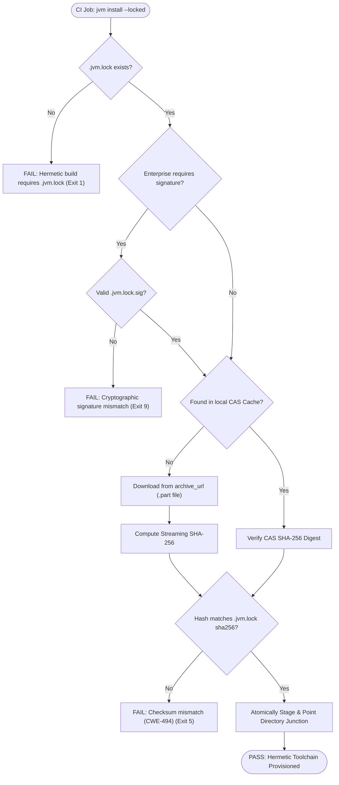
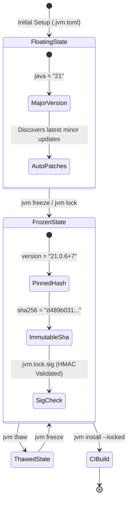
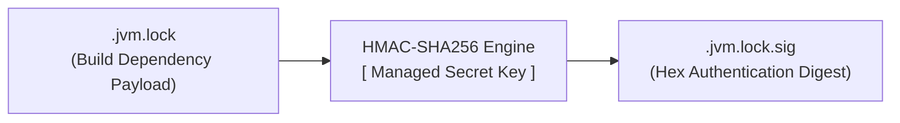
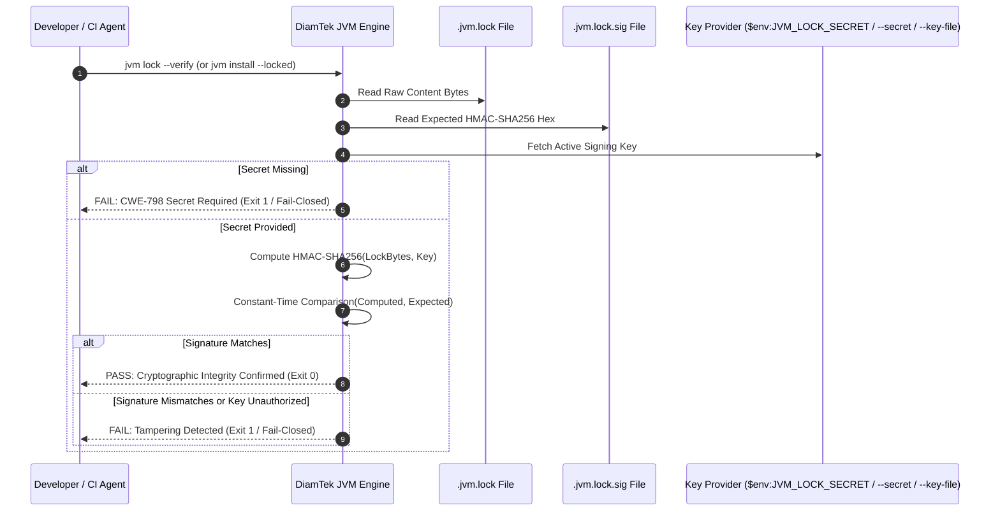

<h1 align="center">Hermetic Toolchain Locking & Cryptographic Provenance</h1>

<div align="center" markdown="1">

[🏠 Overview](../README.md) &nbsp;•&nbsp; [📦 Installation](INSTALLATION.md) &nbsp;•&nbsp; [📖 Usage](USAGE.md) &nbsp;•&nbsp; [🏗️ Architecture](ARCHITECTURE.md) &nbsp;•&nbsp; [🏢 Enterprise](ENTERPRISE.md) &nbsp;•&nbsp; [🔒 Locking](LOCKING.md) &nbsp;•&nbsp; [🌐 Networking](NETWORKING.md) &nbsp;•&nbsp; [🐚 Shells](SHELLS.md) &nbsp;•&nbsp; [🎯 Threat Matrix](THREAT-MATRIX.md) &nbsp;•&nbsp; [❓ FAQ](FAQ.md) &nbsp;•&nbsp; [⚖️ SDKMAN! Comparison](SDKMAN-Comparison.md) &nbsp;•&nbsp; [📜 Changelog](CHANGELOG.md) &nbsp;•&nbsp; [🛡️ Security](SECURITY.md) &nbsp;•&nbsp; [🤝 Contributing](CONTRIBUTING.md) &nbsp;•&nbsp; [💬 Support](SUPPORT.md)

</div>

---

In software development and CI/CD pipelines, "floating" toolchain dependencies are a major source of build instability, subtle compiler regressions, and supply chain vulnerabilities. 

DiamTek JVM solves this with **Hermetic Toolchain Locking** (`.jvm.lock`) and **HMAC-SHA256 Cryptographic Tamper-Proof Signing** (`.jvm.lock.sig`).

### 🔍 Quick Jump
- [The Reproducible Build Problem](#the-reproducible-build-problem)
- [The `.jvm.lock` v2 Specification](#the-jvmlock-v2-specification)
- [Lockfile Operations & Lifecycle](#lockfile-operations--lifecycle)
  - [1. Generating or Updating a Lock (`jvm lock`)](#1-generating-or-updating-a-lock-jvm-lock)
  - [2. Validating Workspace Consistency (`jvm lock --check`)](#2-validating-workspace-consistency-jvm-lock---check)
  - [3. Hermetic CI/CD Provisioning (`jvm install --locked`)](#3-hermetic-cicd-provisioning-jvm-install---locked)
  - [Hermetic Build Verification Pipeline](#hermetic-build-verification-pipeline)
- [Freezing & Thawing (`jvm freeze` & `jvm thaw`)](#freezing--thawing-jvm-freeze--jvm-thaw)
  - [Freezing Toolchains (`jvm freeze`)](#freezing-toolchains-jvm-freeze)
  - [Controlled Thawing (`jvm thaw`)](#controlled-thawing-jvm-thaw)
  - [Toolchain Freeze Lifecycle State Machine](#toolchain-freeze-lifecycle-state-machine)
- [Cryptographic Anti-Tampering Signatures (`.jvm.lock.sig`)](#cryptographic-anti-tampering-signatures-jvmlocksig)
  - [The Threat Model](#the-threat-model)
  - [HMAC-SHA256 Signatures](#hmac-sha256-signatures)
  - [1. Signing a Lockfile (`jvm lock --sign`)](#1-signing-a-lockfile-jvm-lock---sign)
  - [2. Verifying a Lockfile Signature (`jvm lock --verify`)](#2-verifying-a-lockfile-signature-jvm-lock---verify)
  - [Cryptographic Signature Verification Sequence](#cryptographic-signature-verification-sequence)
  - [3. Enterprise Policy Enforcement](#3-enterprise-policy-enforcement)

---

<a id="the-reproducible-build-problem"></a>
## The Reproducible Build Problem

In software development and CI/CD pipelines, "floating" toolchain dependencies are a major source of build instability, subtle compiler regressions, and supply chain vulnerabilities. 

A project configured simply as:
```text
java=21
```
might resolve to:
- Adoptium `21.0.2` on Monday
- Amazon Corretto `21.0.5` on Wednesday
- Microsoft `21.0.6+7` on Friday

Differences in minor patch levels, vendor-specific security backports, default JVM ergonomics, and compiler optimizations can cause test suites to fail intermittently or introduce subtle runtime discrepancies across developer laptops and production servers.

DiamTek JVM solves this with **Hermetic Toolchain Locking** (`.jvm.lock`) and **HMAC-SHA256 Cryptographic Tamper-Proof Signing** (`.jvm.lock.sig`).

---

<a id="the-jvmlock-v2-specification"></a>
## The `.jvm.lock` v2 Specification

DiamTek JVM uses a declarative TOML lockfile format designed to be committed directly into project source control (Git). It captures the complete immutable provenance of the active Java runtime and associated ecosystem build tools.

### Sample `.jvm.lock` File:

```toml
# ==============================================================================
# DiamTek JVM Hermetic Toolchain Lockfile (v2 Schema)
# Generated: 2026-10-09T20:30:00Z
# DO NOT EDIT DIRECTLY - Use 'jvm freeze' or 'jvm lock'
# ==============================================================================
schema_version = 2
timestamp = "2026-10-09T20:30:00Z"
jvm_version = "1.0.2"
platform = "windows-x64"

[tools.java]
candidate = "java"
vendor = "adoptium"
version = "21.0.6+7"
build = 7
distribution = "temurin"
archive_url = "https://github.com/adoptium/temurin21-binaries/releases/download/jdk-21.0.6%2B7/OpenJDK21U-jdk_x64_windows_hotspot_21.0.6_7.zip"
sha256 = "d489b03126f5546ca337c75628b05e04cb2c48bf5ba2ea72d73347c61775f0a1"
bin_path = "bin\\java.exe"

[tools.maven]
candidate = "maven"
version = "3.9.9"
archive_url = "https://archive.apache.org/dist/maven/maven-3/3.9.9/binaries/apache-maven-3.9.9-bin.zip"
sha256 = "a5552427a1f59efd50ab133285749f754ad4e2b0ef5d27845f0fcb718be7ec9b"
bin_path = "bin\\mvn.cmd"

[tools.gradle]
candidate = "gradle"
version = "8.12.1"
archive_url = "https://services.gradle.org/distributions/gradle-8.12.1-bin.zip"
sha256 = "6639537e6b01e389a64765d78a87b3378be260ebcae1df676479f6e2467d130a"
bin_path = "bin\\gradle.bat"
```

---

<a id="lockfile-operations-lifecycle"></a>
## Lockfile Operations & Lifecycle

<a id="1-generating-or-updating-a-lock-jvm-lock"></a>
### 1. Generating or Updating a Lock (`jvm lock`)

To inspect the current repository's `.jvm.toml`, `.java-version`, and ecosystem state, and write a locked dependency set to `.jvm.lock`:

```cmd
jvm lock
```

If specific candidates or versions are requested:
```cmd
jvm lock --vendor adoptium 21
```

<a id="2-validating-workspace-consistency-jvm-lock---check"></a>
### 2. Validating Workspace Consistency (`jvm lock --check`)

To verify whether the currently installed toolchains on the local workstation or CI runner match the pinned `.jvm.lock` without downloading or modifying files:

```cmd
jvm lock --check
```

- Returns **Exit Code 0** if all tools, versions, and SHA-256 checksums match.
- Returns **Exit Code 1** (or `5: Checksum Mismatch`) if discrepancies, unpinned tools, or signature tampering are found.
- Supports `--json` envelope for CI/CD automation pipelines.

#### 3-State Cryptographic Signature Audit
When checking lockfiles, `jvm lock --check` evaluates cryptographic signature status into three distinct states:
1. **`verified`**: `.jvm.lock.sig` is present and was evaluated against an authorized key (`$env:JVM_LOCK_SECRET`, `--secret`, or `--key-file`), passing constant-time HMAC-SHA256 verification. Output reports `[ OK ] Cryptographic signature verified` and JSON reports `"signature_status":"verified","signature_verified":true`.
2. **`failed`**: `.jvm.lock.sig` exists and verification failed against the key (tampered lockfile or invalid signature). Execution fails closed with Exit Code 1, reporting `[FAIL] Cryptographic signature verification failed` and JSON `"signature_status":"failed","signature_verified":false`.
3. **`not_verified`**: Either `.jvm.lock.sig` is absent, or no secret key was provided to perform cryptographic audit. Output reports `[ WARN ] Cryptographic signature present but unverified` (or skipped) and JSON reports `"signature_status":"not_verified","signature_verified":false`. The audit never reports `signature_verified: true` when verification was skipped or unverified.

<a id="3-hermetic-cicd-provisioning-jvm-install---locked"></a>
### 3. Hermetic CI/CD Provisioning (`jvm install --locked`)

In CI/CD environments (GitHub Actions, Azure DevOps, Jenkins, GitLab CI), builds should **never** alter lockfiles or pull unpinned packages:

```cmd
jvm install --locked
```

- Reads `.jvm.lock` strictly.
- Fails closed immediately if `.jvm.lock` is missing.
- Fails closed if the lockfile's declared SHA-256 digest does not match the downloaded archive.
- Installs and activates the exact vendor and binary version specified.

<a id="hermetic-build-verification-pipeline"></a>
### Hermetic Build Verification Pipeline



---

<a id="freezing-thawing-jvm-freeze--jvm-thaw"></a>
## Freezing & Thawing (`jvm freeze` & `jvm thaw`)

Teams often balance two competing needs:
1. **Flexibility during active development** (floating major versions like `21` to receive automatic minor security updates).
2. **Absolute immutability for releases and compliance audits** (pinning exact patch versions like `21.0.6+7`).

DiamTek JVM provides dedicated commands to transition smoothly between these states:

<a id="freezing-toolchains-jvm-freeze"></a>
### Freezing Toolchains (`jvm freeze`)

Converts floating or major-version specifications in `.jvm.toml` and `.jvm.lock` into fully resolved, immutable build locks across every active toolchain:

```cmd
jvm freeze
```

- **Authentic Distribution Archive Checksums:** Queries upstream vendor distribution APIs (e.g. Adoptium API v3) or candidate catalogs to resolve genuine distribution archive download URLs (`https://...`) and official archive checksums (SHA-256/SHA-512).
- **Strict Elimination of File-Level Hashing Fallbacks:** Strictly eliminates hashing of installed local files (such as `release`, `bin\java.exe`, or `<tool>.bat`). Because `jvm install --locked` verifies the downloaded distribution archive before extraction, lockfile entries require valid distribution archive checksums.
- **Lockfile Metadata Preservation:** Preserves all existing lockfile properties (`url`, `arch`, `checksum_type`, etc.) when refreshing frozen coordinates.
- **Fail-Closed Guarantee:** If genuine archive URLs or trusted distribution checksums cannot be resolved, `jvm freeze` fails closed immediately without modifying `.jvm.lock`.
- Prevents any implicit upgrading or mirror substitution until thawed.

<a id="controlled-thawing-jvm-thaw"></a>
### Controlled Thawing (`jvm thaw`)

When beginning a new sprint or maintenance cycle, thaw the project dependencies to allow controlled upgrades:

```cmd
jvm thaw
```

- Relaxes exact patch and build coordinates back to major semantic versions (e.g. `21.0.6+7` ──> `21`).
- Preserves vendor preferences (e.g. `adoptium`).
- Re-enables discovery of the latest upstream LTS security releases.

<a id="toolchain-freeze-lifecycle-state-machine"></a>
### Toolchain Freeze Lifecycle State Machine



---

<a id="cryptographic-anti-tampering-signatures-jvmlocksig"></a>
## Cryptographic Anti-Tampering Signatures (`.jvm.lock.sig`)

<a id="the-threat-model"></a>
### The Threat Model

If a malicious actor or compromised dependency achieves commit access to a repository, they could alter both the `archive_url` and the `sha256` in `.jvm.lock` simultaneously. Standard checksum validation would succeed, allowing malicious binaries into corporate build pipelines (`CWE-494`).

<a id="hmac-sha256-signatures"></a>
### HMAC-SHA256 Signatures

DiamTek JVM mitigates this by providing cryptographic signatures stored alongside the lockfile in `.jvm.lock.sig`.



> [!IMPORTANT]
> **Hardcoded Secret Immunity (CWE-798 Elimination):**
> DiamTek JVM strictly forbids hardcoded fallback secrets. Signing and verification require an explicitly managed secret key. If no secret is provided via environment variable or CLI parameter, `jvm lock --sign` and `jvm lock --verify` immediately fail closed with exit code 1 citing CWE-798.

<a id="1-signing-a-lockfile-jvm-lock---sign"></a>
### 1. Signing a Lockfile (`jvm lock --sign`)

Enterprise release engineers or authorized CI bots sign the verified lockfile using a managed secret:

```cmd
:: Via environment variable:
set JVM_LOCK_SECRET=secret-enterprise-hmac-key-string
jvm lock --sign

:: Or via direct CLI secret flag:
jvm lock --sign --secret "secret-enterprise-hmac-key-string"

:: Or via secret key file:
jvm lock --sign --key-file "C:\Keys\lockfile.secret"
```

This generates `.jvm.lock.sig` containing the HMAC-SHA256 digest of `.jvm.lock`.

<a id="2-verifying-a-lockfile-signature-jvm-lock---verify"></a>
### 2. Verifying a Lockfile Signature (`jvm lock --verify`)

To verify the integrity and provenance of `.jvm.lock`:

```cmd
:: Using active environment secret:
jvm lock --verify

:: Or using specific secret key:
jvm lock --verify --secret "secret-enterprise-hmac-key-string"
```

- Computes the HMAC-SHA256 digest of `.jvm.lock` using the active key.
- Compares against `.jvm.lock.sig` using constant-time comparison.
- If the signature is invalid or `.jvm.lock` has been altered, execution aborts with:
  ```text
  [ ERROR ] Cryptographic signature verification failed for .jvm.lock.
            The lockfile has been altered or signed with an unauthorized key.
  ```

<a id="cryptographic-signature-verification-sequence"></a>
### Cryptographic Signature Verification Sequence



<a id="3-enterprise-policy-enforcement"></a>
### 3. Enterprise Policy Enforcement

When `require_signed_lockfile = true` is set in `%ProgramData%\DiamTek\JVM\policy.toml`, any invocation of `jvm install --locked` or `jvm use` strictly mandates valid cryptographic signatures before activating any JDK.

---

[← Back to Documentation Overview](../README.md#documentation)