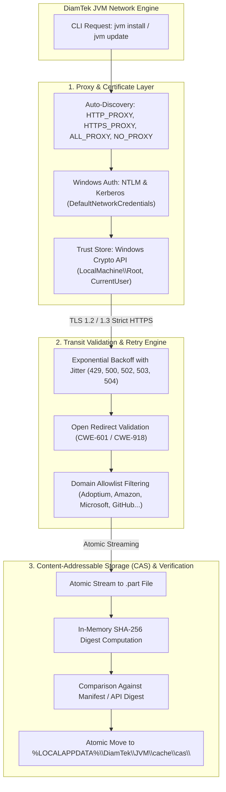
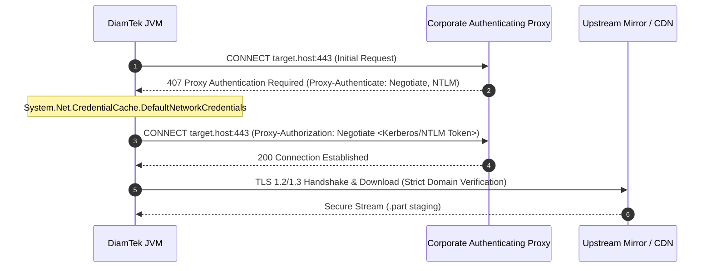
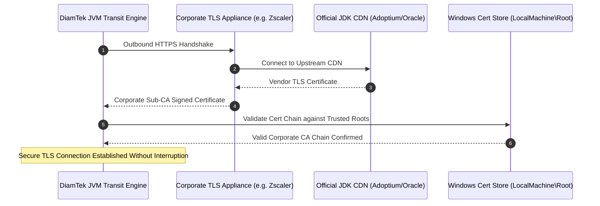
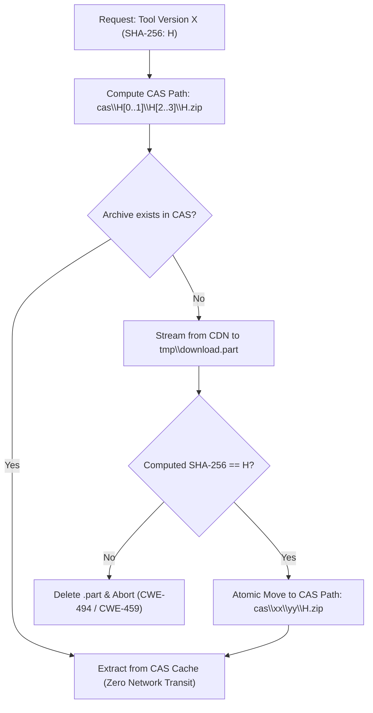
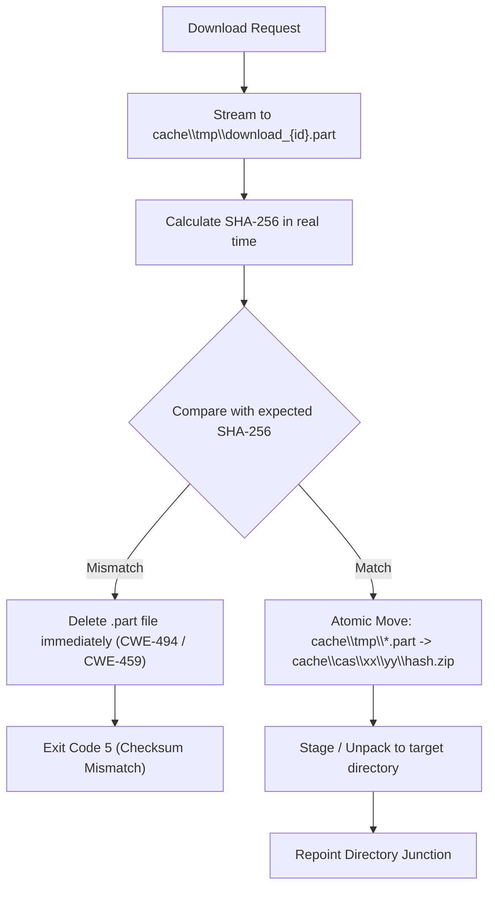

<h1 align="center">Network Transit Architecture & Corporate Proxy Integration</h1>

<div align="center" markdown="1">

[🏠 Overview](../README.md) &nbsp;•&nbsp; [📦 Installation](INSTALLATION.md) &nbsp;•&nbsp; [📖 Usage](USAGE.md) &nbsp;•&nbsp; [🏗️ Architecture](ARCHITECTURE.md) &nbsp;•&nbsp; [🏢 Enterprise](ENTERPRISE.md) &nbsp;•&nbsp; [🔒 Locking](LOCKING.md) &nbsp;•&nbsp; [🌐 Networking](NETWORKING.md) &nbsp;•&nbsp; [🐚 Shells](SHELLS.md) &nbsp;•&nbsp; [🎯 Threat Matrix](THREAT-MATRIX.md) &nbsp;•&nbsp; [❓ FAQ](FAQ.md) &nbsp;•&nbsp; [⚖️ SDKMAN! Comparison](SDKMAN-Comparison.md) &nbsp;•&nbsp; [📜 Changelog](CHANGELOG.md) &nbsp;•&nbsp; [🛡️ Security](SECURITY.md) &nbsp;•&nbsp; [🤝 Contributing](CONTRIBUTING.md) &nbsp;•&nbsp; [💬 Support](SUPPORT.md)

</div>

---

DiamTek Java Version Manager (JVM) treats network communication as an untrusted, high-latency boundary requiring strict cryptographic verification, zero-trust proxy negotiation, and atomic download mechanics. 

Whether provisioning JDK runtimes across corporate WANs, traversing authenticating enterprise proxies, or validating asset digests through CDN edge nodes, DiamTek JVM guarantees that transit operations are resilient, transparent, and secure against Man-in-the-Middle (MitM) tampering.

### 🔍 Quick Jump
- [Network Architecture Overview](#network-architecture-overview)
- [Corporate Proxy Discovery & Configuration](#corporate-proxy-discovery--configuration)
  - [Automatic Environment Discovery](#automatic-environment-discovery)
  - [Command-Line Overrides](#command-line-overrides)
  - [Windows Integrated Authentication (NTLM / Kerberos)](#windows-integrated-authentication-ntlm--kerberos)
  - [Proxy Authentication Handshake Flow](#proxy-authentication-handshake-flow)
- [Windows Certificate Store Integration (Corporate TLS Inspection)](#windows-certificate-store-integration-corporate-tls-inspection)
  - [The SSL Interception Problem](#the-ssl-interception-problem)
  - [DiamTek JVM Native Solution](#diamtek-jvm-native-solution)
  - [Corporate TLS Interception & Trust Resolution Flow](#corporate-tls-interception--trust-resolution-flow)
- [Content-Addressable Storage (CAS) Cache Architecture](#content-addressable-storage-cas-cache-architecture)
  - [Cache Directory Topology](#cache-directory-topology)
  - [Deduplication Across Projects & Tools](#deduplication-across-projects--tools)
  - [CAS Resolution & Deduplication Pipeline](#cas-resolution--deduplication-pipeline)
  - [Cache Telemetry & Maintenance](#cache-telemetry--maintenance)
- [Resilient Transit & Atomic Download Mechanics](#resilient-transit--atomic-download-mechanics)
  - [1. Atomic Staging Pipeline](#1-atomic-staging-pipeline)
  - [Atomic Staging Execution Flow](#atomic-staging-execution-flow)
  - [2. Exponential Backoff with Jitter](#2-exponential-backoff-with-jitter)
  - [3. Open Redirect & Domain Allowlisting Defense (`CWE-601` / `CWE-918`)](#3-open-redirect--domain-allowlisting-defense-cwe-601--cwe-918)

---

<a id="network-architecture-overview"></a>
## Network Architecture Overview

DiamTek JVM divides network transit into three strictly isolated, hardened processing layers:



---

<a id="corporate-proxy-discovery--configuration"></a>
## Corporate Proxy Discovery & Configuration

In enterprise environments, outbound Internet access is frequently restricted through forward proxies requiring domain authentication.

<a id="automatic-environment-discovery"></a>
### Automatic Environment Discovery

DiamTek JVM automatically detects standard corporate proxy environment variables:

| Variable | Description | Example |
| :--- | :--- | :--- |
| `HTTP_PROXY` | Proxy URL for HTTP requests | `http://proxy.corp.internal:8080` |
| `HTTPS_PROXY` | Proxy URL for HTTPS requests | `http://proxy.corp.internal:8080` |
| `ALL_PROXY` | Universal fallback proxy URL | `http://proxy.corp.internal:8080` |
| `NO_PROXY` | Comma-separated domain/IP bypass list | `localhost,127.0.0.1,.corp.internal` |

<a id="command-line-overrides"></a>
### Command-Line Overrides

For temporary sessions or specific automation scripts:

```cmd
# Route through a specific corporate proxy
jvm install 21 --proxy "http://proxy.corp.internal:8080"

# Explicit proxy authentication
jvm install 21 --proxy "http://proxy.corp.internal:8080" --proxy-auth "DOMAIN\user:password"
```

<a id="windows-integrated-authentication-ntlm--kerberos"></a>
### Windows Integrated Authentication (NTLM / Kerberos)

Many enterprise proxies do not accept raw username/password combinations in URLs, instead requiring Windows Integrated Authentication. DiamTek JVM leverages .NET's native `System.Net.CredentialCache.DefaultNetworkCredentials` and `System.Net.WebRequest.DefaultWebProxy`, automatically passing the logged-in Windows domain identity (Kerberos ticket or NTLM challenge-response) to the proxy without exposing plaintext credentials.

<a id="proxy-authentication-handshake-flow"></a>
### Proxy Authentication Handshake Flow



---

<a id="windows-certificate-store-integration-corporate-tls-inspection"></a>
## Windows Certificate Store Integration (Corporate TLS Inspection)

<a id="the-ssl-interception-problem"></a>
### The SSL Interception Problem

Security appliances (such as Zscaler, Palo Alto Networks, Netskope, or BlueCoat) perform deep packet inspection by intercepting outbound TLS handshakes, decrypting traffic, and resigning the connection using an internal corporate Root CA.

Traditional tools (curl, wget, native Java runtimes) fail immediately with certificate trust errors because their bundled trust stores do not include internal corporate certificates.

<a id="diamtek-jvm-native-solution"></a>
### DiamTek JVM Native Solution

DiamTek JVM integrates directly with the native Windows Cryptography API:

1. **System Trust Inheritance:** All certificates present in `Cert:\LocalMachine\Root` and `Cert:\CurrentUser\Root` (pushed by Active Directory Group Policy or Microsoft Intune) are automatically trusted by DiamTek JVM during download and verification.
2. **Revocation & Expiration Checking:** Certificate revocation lists (CRL) and Online Certificate Status Protocol (OCSP) stapling are honored via the Windows Crypto API engine (`CertVerifyCertificateChainPolicy`).
3. **Automated JDK Trust Injection:** Upon extracting any newly downloaded JDK, DiamTek JVM can synchronize corporate root certificates directly into the new JDK's `$JAVA_HOME\lib\security\cacerts` file, ensuring that subsequent developer builds (`mvn`, `gradle`, `sbt`) execute cleanly without `PKIX path building failed` errors.

<a id="corporate-tls-interception--trust-resolution-flow"></a>
### Corporate TLS Interception & Trust Resolution Flow



---

<a id="content-addressable-storage-cas-cache-architecture"></a>
## Content-Addressable Storage (CAS) Cache Architecture

To minimize network bandwidth, accelerate multi-project workflows, and support offline development, DiamTek JVM implements Content-Addressable Storage (CAS).

<a id="cache-directory-topology"></a>
### Cache Directory Topology

```text
%LOCALAPPDATA%\DiamTek\JVM\cache\
├── cas\
│   ├── d4\
│   │   └── 89\
│   │       └── d489b03126f5546ca337c75628b05e04cb2c48bf5ba2ea72d73347c61775f0a1.zip
│   └── 66\
│       └── 39\
│           └── 6639537e6b01e389a64765d78a87b3378be260ebcae1df676479f6e2467d130a.zip
├── metadata\
│   ├── adoptium-21.json
│   └── maven-3.9.9.json
└── tmp\
    └── download_a8f912c.part
```

<a id="deduplication-across-projects--tools"></a>
### Deduplication Across Projects & Tools

1. **Hash-Based Addressing:** Files in the CAS are stored according to their SHA-256 digest (`cas\xx\yy\<hash>.zip`).
2. **Deduplication:** If two developers or two different projects reference the exact same tool version, archive download is executed only once.
3. **Hardlink Optimization:** When extracting or staging runtimes, DiamTek JVM utilizes NTFS hardlinks where appropriate to eliminate redundant disk consumption.

<a id="cas-resolution--deduplication-pipeline"></a>
### CAS Resolution & Deduplication Pipeline



<a id="cache-telemetry--maintenance"></a>
### Cache Telemetry & Maintenance

Developers and CI administrators can inspect and manage cache utilization:

```cmd
# View disk consumption across JDKs, candidates, and CAS archives
jvm cache stats

# Remove obsolete archives or temporary staging artifacts
jvm cache prune

# Clear all cached archives (forces fresh downloads)
jvm clean --cache
```

---

<a id="resilient-transit--atomic-download-mechanics"></a>
## Resilient Transit & Atomic Download Mechanics

<a id="1-atomic-staging-pipeline"></a>
### 1. Atomic Staging Pipeline

Downloads are never written directly to their target destination:
1. Data streams to an isolated temporary file with a `.part` extension in `%LOCALAPPDATA%\DiamTek\JVM\cache\tmp\`.
2. The complete SHA-256 digest is calculated on-the-fly during the streaming read.
3. Once the download completes, the calculated hash is compared against the expected digest.
4. If valid, the file is atomically moved to its permanent location in `cache\cas\`. If invalid or interrupted, the `.part` file is deleted immediately.

<a id="atomic-staging-execution-flow"></a>
### Atomic Staging Execution Flow



<a id="2-exponential-backoff-with-jitter"></a>
### 2. Exponential Backoff with Jitter

For handling rate limits (e.g. GitHub Releases API `429 Too Many Requests`) and transient network dropouts (`500`, `502`, `503`, `504`):

$$\text{Delay} = \min\left(T_{\max}, T_{\text{base}} \times 2^{\text{attempt}}\right) \pm \text{Jitter}$$

DiamTek JVM retries transient failures up to 3 times before failing closed with actionable diagnostic guidance.

<a id="3-open-redirect--domain-allowlisting-defense-cwe-601--cwe-918"></a>
### 3. Open Redirect & Domain Allowlisting Defense (`CWE-601` / `CWE-918`)

All URL redirects are validated before being followed. Target domains must match the strict allowlist of certified vendor CDN providers (Adoptium, Amazon AWS, Microsoft Azure CDN, GitHub Releases, Oracle, Azul, BellSoft, SAP, Alibaba). Any redirect to an unauthorized third-party domain or internal private IP (`169.254.169.254`, `10.0.0.0/8`, `192.168.0.0/16`) is blocked immediately.

---

[← Back to Documentation Overview](../README.md#documentation)