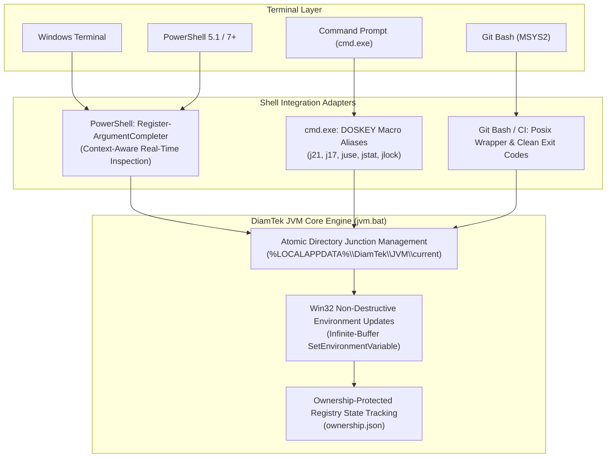
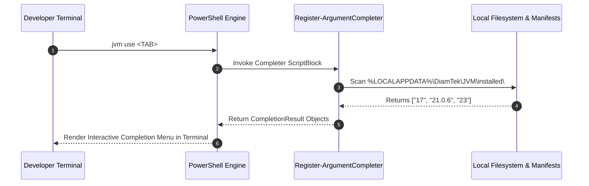
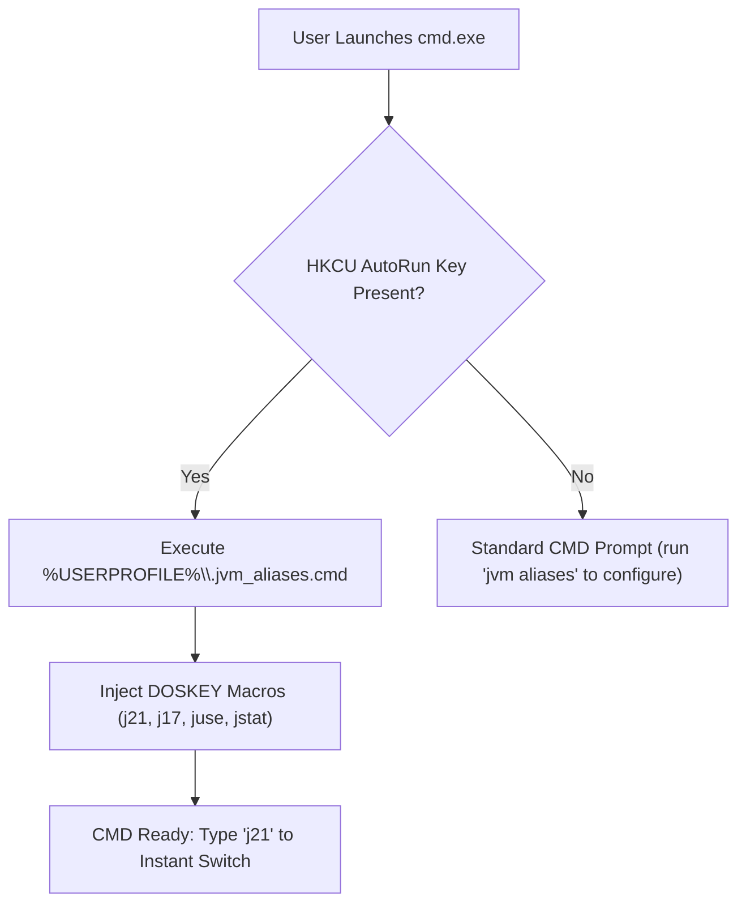
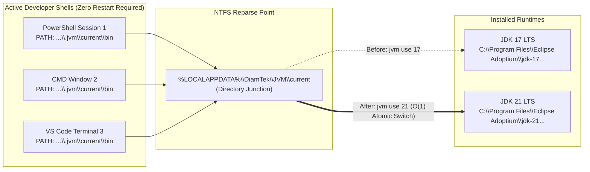

<h1 align="center">Multi-Shell Ergonomics & Terminal Integration</h1>

<div align="center" markdown="1">

[🏠 Overview](../README.md) &nbsp;•&nbsp; [📦 Installation](INSTALLATION.md) &nbsp;•&nbsp; [📖 Usage](USAGE.md) &nbsp;•&nbsp; [🏗️ Architecture](ARCHITECTURE.md) &nbsp;•&nbsp; [🏢 Enterprise](ENTERPRISE.md) &nbsp;•&nbsp; [🔒 Locking](LOCKING.md) &nbsp;•&nbsp; [🌐 Networking](NETWORKING.md) &nbsp;•&nbsp; [🐚 Shells](SHELLS.md) &nbsp;•&nbsp; [🎯 Threat Matrix](THREAT-MATRIX.md) &nbsp;•&nbsp; [❓ FAQ](FAQ.md) &nbsp;•&nbsp; [⚖️ SDKMAN! Comparison](SDKMAN-Comparison.md) &nbsp;•&nbsp; [📜 Changelog](CHANGELOG.md) &nbsp;•&nbsp; [🛡️ Security](SECURITY.md) &nbsp;•&nbsp; [🤝 Contributing](CONTRIBUTING.md) &nbsp;•&nbsp; [💬 Support](SUPPORT.md)

</div>

---

Developers on Windows work across a diverse spectrum of terminal environments: classical Command Prompt (`cmd.exe`), Windows PowerShell 5.1, PowerShell 7 (Core), Git Bash (MSYS2/MinGW), and Windows Terminal tabs.

DiamTek Java Version Manager (JVM) is engineered to provide a first-class, ergonomic, and consistent developer experience across all of these environments without requiring complex shell configurations, fragile subshells, or invasive environment variable modifications.

### 🔍 Quick Jump
- [Cross-Shell Philosophy](#cross-shell-philosophy)
- [PowerShell Dynamic Tab Completions](#powershell-dynamic-tab-completions)
  - [Setting Up Completions](#setting-up-completions)
  - [Context-Aware Dynamic Behaviors](#context-aware-dynamic-behaviors)
  - [Dynamic Tab Completion Resolution Flow](#dynamic-tab-completion-resolution-flow)
- [Windows Command Prompt (`cmd.exe`) & DOSKEY Ergonomics](#windows-command-prompt-cmdexe--doskey-ergonomics)
  - [Generating Aliases (`jvm aliases` / `jvm hook cmd`)](#generating-aliases-jvm-aliases--jvm-hook-cmd)
  - [AutoRun Integration for CMD](#autorun-integration-for-cmd)
  - [CMD AutoRun Workflow](#cmd-autorun-workflow)
- [Unified Multi-Tool Ecosystem Dashboard (`jvm status`)](#unified-multi-tool-ecosystem-dashboard-jvm-status)
- [Cross-Shell Compatibility Matrix](#cross-shell-compatibility-matrix)
- [Environment Variable Propagation & Non-Destructive PATH](#environment-variable-propagation--non-destructive-path)
  - [DiamTek JVM Architecture](#diamtek-jvm-architecture)
  - [Atomic Directory Junction Synchronization](#atomic-directory-junction-synchronization)

---

<a id="cross-shell-philosophy"></a>
## Cross-Shell Philosophy

DiamTek JVM adapts seamlessly to whatever shell developers prefer, mapping terminal inputs directly to the underlying atomic Windows junction engine:



---

<a id="powershell-dynamic-tab-completions"></a>
## PowerShell Dynamic Tab Completions

In modern PowerShell environments (Windows PowerShell 5.1 and PowerShell 7+), DiamTek JVM provides rich, context-aware dynamic tab completion for subcommands, flags, ecosystem tools, vendors, and installed versions.

<a id="setting-up-completions"></a>
### Setting Up Completions

To automatically configure the PowerShell profile hook and dynamic completions across all PowerShell environments (Windows PowerShell 5.1 and PowerShell 7+):
```powershell
jvm hook
```

To verify the hook registration status across your profiles:
```powershell
jvm hook status
```

To remove the hook from your PowerShell profile:
```powershell
jvm hook remove
```

<a id="context-aware-dynamic-behaviors"></a>
### Context-Aware Dynamic Behaviors

Unlike static completion scripts that only suggest hardcoded commands, DiamTek JVM completions inspect your local workstation state in real-time:

1. **Installed Version Completion (`jvm use <TAB>` & `jvm uninstall <TAB>`):**
   Automatically enumerates all locally installed JDK versions in `%LOCALAPPDATA%\DiamTek\JVM\installed\`, offering only versions that are actually available to switch to or uninstall.
2. **Subcommand Help Card Completion (`jvm help <TAB>`):**
   Suggests all top-level subcommands and developer aliases to instantly display dedicated subcommand usage cards (`install`, `switch`, `use`, `doctor`, `lock`, `cache`, `config`, etc.).
3. **Lockfile Subcommand Action Completion (`jvm lock <TAB>`):**
   Suggests valid lockfile management actions: `check`, `diff`, `update`, `sign`, `verify`.
4. **Vendor Allowlist Completion (`jvm install --vendor <TAB>`):**
   Suggests all 12 certified vendor identifiers:
   `adoptium`, `corretto`, `zulu`, `bellsoft`, `semeru`, `microsoft`, `oracle`, `graalvm`, `sapmachine`, `liberica`, `temurin`, `dragonwell`.
5. **Ecosystem Candidate Completion (`jvm ecosystem <TAB>`):**
   Suggests supported build tools: `maven`, `gradle`, `kotlin`, `scala`, `groovy`, `ant`, `sbt`, `jbang`, `quarkus`, `micronaut`, `spring`.
6. **Execution Telemetry & Global Flags Completion (`jvm <TAB>`):**
   Suggests global flags including `--timings`, `--json`, `--offline`, `--dry-run`, `--quiet`, `--verbose`, `--no-color`, `--no-lock`, `--desc`, `--out`, `--distro-dir`.
7. **Channel Selection (`jvm --channel <TAB>`):**
   Suggests `stable` or `nightly`.
8. **Profile Management & Dynamic Profile Names (`jvm profile <TAB>` & `jvm profile use <TAB>`):**
   Suggests sub-actions (`create`, `use`, `list`, `show`, `clone`, `delete`) and dynamically enumerates defined profile names from `%LOCALAPPDATA%\DiamTek\JVM\profiles\`.
9. **Snapshot Management & Dynamic Snapshot Names (`jvm snapshot <TAB>` & `jvm snapshot restore <TAB>`):**
   Suggests sub-actions (`create`, `restore`, `list`, `delete`) and dynamically enumerates point-in-time snapshot manifests from `%LOCALAPPDATA%\DiamTek\JVM\snapshots\`.
10. **Portable Bundle Actions (`jvm bundle <TAB>`):**
   Suggests bundle packaging actions: `create`, `inspect`, `install`, `list`.
11. **Air-Gapped Distro Commands (`jvm distro <TAB>`):**
   Suggests distribution commands (`create`) and offline provisioning flags.

<a id="dynamic-tab-completion-resolution-flow"></a>
### Dynamic Tab Completion Resolution Flow



---

<a id="windows-command-prompt-cmdexe--doskey-ergonomics"></a>
## Windows Command Prompt (`cmd.exe`) & DOSKEY Ergonomics

Because `cmd.exe` lacks an extensible dynamic tab completion API, DiamTek JVM provides native DOSKEY macro generators to give CMD developers rapid shortcuts and high-velocity workflow aliases.

<a id="generating-aliases-jvm-aliases--jvm-hook-cmd"></a>
### Generating Aliases (`jvm aliases` / `jvm hook cmd`)

To display or generate DOSKEY macro definitions:

```cmd
jvm aliases
```

Output:
```doskey
doskey juse=jvm use $*
doskey jstat=jvm status
doskey jlist=jvm list
doskey j21=jvm use 21
doskey j17=jvm use 17
doskey j11=jvm use 11
doskey j8=jvm use 8
doskey jlock=jvm lock $*
doskey jfreeze=jvm freeze
doskey jthaw=jvm thaw
```

<a id="autorun-integration-for-cmd"></a>
### AutoRun Integration for CMD

To have these aliases automatically load every time a new `cmd.exe` prompt is opened:

1. Export the aliases to your user profile:
   ```cmd
   jvm aliases > "%USERPROFILE%\.jvm_aliases.cmd"
   ```
2. Register the script in the CMD `AutoRun` registry key:
   ```cmd
   reg add "HKCU\Software\Microsoft\Command Processor" /v AutoRun /t REG_SZ /d "%USERPROFILE%\.jvm_aliases.cmd" /f
   ```

Now, opening any CMD window allows instant version switching with zero typing overhead:
```cmd
C:\Users\Developer> j21
[ OK  ] Active Java switched to: Adoptium 21.0.6+7

C:\Users\Developer> jstat
```

<a id="cmd-autorun-workflow"></a>
### CMD AutoRun Workflow



---

<a id="unified-multi-tool-ecosystem-dashboard-jvm-status"></a>
## Unified Multi-Tool Ecosystem Dashboard (`jvm status`)

Developers and DevOps engineers often need an instant, comprehensive snapshot of all active toolchains in their current workspace.

DiamTek JVM provides the `jvm status` (or `jvm ecosystem`) command:

```cmd
jvm status
```

Output:
```text
========================================================================================
                          DiamTek JVM Active Ecosystem Status                           
========================================================================================
 Tool       Vendor     Version       Resolution Source   Home Path
 ---------  ---------  ------------  ------------------  -------------------------------
 Java       Adoptium   21.0.6+7      .jvm.toml (Pinned)  C:\Users\Alex\.jvm\current
 Maven      Apache     3.9.9         Global Default      C:\Users\Alex\.jvm\candidates\maven\3.9.9
 Gradle     Gradle     8.12.1        .jvm.lock (Hermetic)C:\Users\Alex\.jvm\candidates\gradle\8.12.1
 Kotlin     JetBrains  2.1.0         Global Default      C:\Users\Alex\.jvm\candidates\kotlin\2.1.0
 Scala      EPFL       3.6.2         Global Default      C:\Users\Alex\.jvm\candidates\scala\3.6.2
========================================================================================
 Environment:
   JAVA_HOME  = C:\Users\Alex\.jvm\current
   PATH Entry = Present (Ahead of System PATH)
   Lockfile   = .jvm.lock (Valid v2, Signed)
========================================================================================
```

For JSON telemetry in scripts or status widgets:
```cmd
jvm status --json
```

---

<a id="cross-shell-compatibility-matrix"></a>
## Cross-Shell Compatibility Matrix

DiamTek JVM is continuously tested and validated across all Windows execution targets:

| Terminal / Shell | Version | Interactive Support | Non-Interactive / CI | Completion Type |
| :--- | :--- | :---: | :---: | :--- |
| **Windows Terminal** | 1.18+ | ✅ First-Class | N/A | Rich Shell-Dependent |
| **PowerShell 7 (Core)** | 7.0 - 7.5+ | ✅ First-Class | ✅ Supported | Dynamic Context-Aware |
| **Windows PowerShell** | 5.1 (Desktop) | ✅ First-Class | ✅ Supported | Dynamic Context-Aware |
| **Command Prompt** | `cmd.exe` | ✅ First-Class | ✅ Supported | DOSKEY Macros |
| **Git Bash (MSYS2)** | 2.40+ | ✅ Supported | ✅ Supported | Standard CLI |
| **GitHub Actions** | Windows-2022/2025 | N/A | ✅ First-Class | Headless Mode |
| **Azure DevOps** | Windows Hosted | N/A | ✅ First-Class | Headless Mode |

---

<a id="environment-variable-propagation--non-destructive-path"></a>
## Environment Variable Propagation & Non-Destructive PATH

A persistent issue with version managers on Windows is process environment synchronization: child processes cannot alter parent shell environments directly.

<a id="diamtek-jvm-architecture"></a>
### DiamTek JVM Architecture:
1. **Stable Junction Pointer:** `JAVA_HOME` is pointed to `%USERPROFILE%\.jvm\current`. When a developer switches versions via `jvm use 17`, DiamTek JVM updates the underlying NTFS Directory Junction atomically. All existing and newly spawned shells immediately resolve the new JDK binary without requiring a terminal restart!
2. **Infinite Length Buffer Defense:** Environment variables are updated using native Win32 .NET APIs (`[Environment]::SetEnvironmentVariable`), avoiding the 1,024-character buffer overflow limit inherent in legacy `setx.exe`.
3. **Ownership Tracking:** All registry modifications are recorded in `%LOCALAPPDATA%\DiamTek\JVM\ownership.json`. The uninstaller will only ever touch keys and PATH entries registered by DiamTek JVM, guaranteeing non-destructive operation on corporate workstations.

<a id="atomic-directory-junction-synchronization"></a>
### Atomic Directory Junction Synchronization



---

[← Back to Documentation Overview](../README.md#documentation)