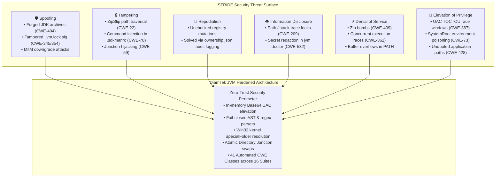
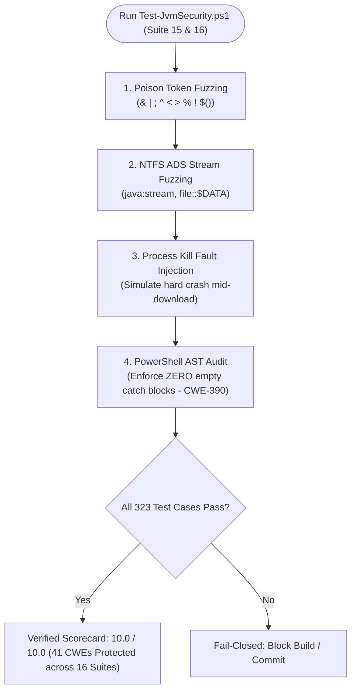

<h1 align="center">Comprehensive Threat Matrix & CWE Security Mapping</h1>

[🏠 Overview](../README.md) &nbsp;•&nbsp; [📦 Installation](INSTALLATION.md) &nbsp;•&nbsp; [📖 Usage](USAGE.md) &nbsp;•&nbsp; [🏗️ Architecture](ARCHITECTURE.md) &nbsp;•&nbsp; [🏢 Enterprise](ENTERPRISE.md) &nbsp;•&nbsp; [🔒 Locking](LOCKING.md) &nbsp;•&nbsp; [🌐 Networking](NETWORKING.md) &nbsp;•&nbsp; [🐚 Shells](SHELLS.md) &nbsp;•&nbsp; [🎯 Threat Matrix](THREAT-MATRIX.md) &nbsp;•&nbsp; [❓ FAQ](FAQ.md) &nbsp;•&nbsp; [⚖️ SDKMAN! Comparison](SDKMAN-Comparison.md) &nbsp;•&nbsp; [📜 Changelog](CHANGELOG.md) &nbsp;•&nbsp; [🛡️ Security](SECURITY.md) &nbsp;•&nbsp; [🤝 Contributing](CONTRIBUTING.md) &nbsp;•&nbsp; [💬 Support](SUPPORT.md)

---

DiamTek Java Version Manager (JVM) is engineered under a **Zero-Trust, Assume-Breach, and Defense-in-Depth** security philosophy. Because developer workstations are frequent targets of software supply chain attacks, malicious pull requests, and Local Privilege Escalation (LPE) exploits, every operation performed by DiamTek JVM—from repository parsing to network downloading, archive extraction, junction repointing, and registry manipulation—is bounded by defensive guardrails.

This document publishes the formal **Threat Matrix**, analyzing the system through the **STRIDE** framework and providing an exhaustive mapping of all **41 Common Weakness Enumerations (CWEs)** continuously validated by the automated test suite (`tests/Test-JvmSecurity.ps1`).

### 🔍 Quick Jump
- [Threat Model Overview](#threat-model-overview)
- [STRIDE Threat Analysis](#stride-threat-analysis)
  - [STRIDE Security Architecture](#stride-security-architecture)
- [The 41-CWE Master Security Verification Matrix](#the-41-cwe-master-security-verification-matrix)
- [Adversarial Mutation & Fault Injection Testing](#adversarial-mutation--fault-injection-testing)
  - [Automated Mutation Verification Pipeline](#automated-mutation-verification-pipeline)

---

## Threat Model Overview

Modern enterprise developer workstations interact continuously with untrusted artifacts: pulling code from public Git repositories, opening untrusted project worktrees, downloading binary toolchains across corporate proxies, and running build scripts with local user privileges. An adversary compromising a build environment can pivot to achieve remote code execution, token exfiltration, or local privilege escalation (LPE).

DiamTek JVM treats every external input—repository configuration files (`.java-version`, `.sdkmanrc`), environment variables, archive contents, URLs, and CLI arguments—as potentially adversarial. By establishing strict kernel-level Win32 boundaries, cryptographic signature and checksum validation, directory junction isolation, and fail-closed parser verification, DiamTek JVM guarantees that runtime toolchain management cannot be leveraged as an initial access or persistence vector.

---

## STRIDE Threat Analysis

| Threat Category | Description | Primary Attack Vectors Mitigated by DiamTek JVM |
| :--- | :--- | :--- |
| **Spoofing** | Impersonating a trusted entity, vendor, or cryptographic identity | • Forged JDK archives or rogue mirror substitution (`CWE-494`, `CWE-918`). • Tampered `.jvm.lock` signatures (`CWE-345`, `CWE-354`). • Downgrade attacks to vulnerable legacy runtimes. |
| **Tampering** | Unauthorized modification of code, binaries, configuration, or environment | • Path traversal via malicious archives / ZipSlip (`CWE-22`). • Command injection via poisoned `.java-version` or `.sdkmanrc` (`CWE-78`). • Malicious junction redirection or symlink swapping (`CWE-59`). |
| **Repudiation** | Actions performed without auditability or ownership tracking | • Uncontrolled registry alterations (`CWE-73`, `CWE-532`). • Disputed variable modifications (mitigated via `ownership.json`). |
| **Information Disclosure** | Exposing private keys, tokens, system internals, or stack traces | • Stack trace / path leakage in error messages (`CWE-209`). • Leaking corporate proxy credentials or environment tokens in diagnostics (`CWE-532`). |
| **Denial of Service** | Exhausting workstation resources, hanging processes, or corrupting state | • ZIP bomb payloads or unbounded decompression (`CWE-409`). • Concurrent execution corruption or lock starvation (`CWE-362`, `CWE-400`). • PATH variable truncation via legacy `setx.exe` buffer overrun. |
| **Elevation of Privilege** | Gaining unauthorized administrative or system rights | • TOCTOU race windows during UAC script elevation (`CWE-367`). • Environment variable saturation & DLL planting (`CWE-73`, `CWE-426`). • Unquoted service and uninstaller paths (`CWE-428`). |

### STRIDE Security Architecture

---

## The 41-CWE Master Security Verification Matrix

Every entry in the table below represents an architectural defense verified by automated integration and fuzzing tests in `tests/Test-JvmSecurity.ps1`:

| CWE ID | Vulnerability Class | Exploitation Scenario / Attack Vector | DiamTek JVM Defense Mechanism | Automated Verification Suite |
| :--- | :--- | :--- | :--- | :--- |
| **CWE-20** | Improper Input Validation | Poison characters, malformed semantic versions, oversized tokens, or invalid vendor flags | Strict regex and whitelist token validation (`:ValidateStrictIdentifier`, `:ValidateMajorVersion`) | Suite 1, 10, 12, 15, 16 |
| **CWE-22** | Path Traversal & ZipSlip | Relative directory escapes (`..\..\Windows`) in archive entries, CLI arguments, or branch flags | Canonically verified paths via `GetFullPath`, normalization check, and boundary anchoring | Suite 1, 3, 10, 11, 15, 16 |
| **CWE-41** | Win32 Canonicalization Bypass | Trailing dots, trailing spaces, or reserved devices (`current.`, `current `) to bypass filename checks | Sanitization of trailing dots and spaces before path evaluation | Suite 1, 15 |
| **CWE-59** | Symlink & Junction Safety | Attacker creates malicious reparse point pointing to system files to trick uninstaller or cleaner | `Test-IsReparsePoint` and `fsutil reparsepoint query` inspection; safe deletion with `rmdir` | Suite 3, 5, 7, 11, 16 |
| **CWE-66** | DOS Device & NTFS ADS Abuse | Alternate Data Streams (`java:stream`) or legacy DOS devices (`CON`, `PRN`, `AUX`, `NUL`) | Rejection of colons in identifiers; explicit DOS device blacklist rejection | Suite 1, 15, 16 |
| **CWE-73** | Env & System Root Protection | Poisoning `%SystemRoot%` to hijack elevated execution binaries | Win32 `SpecialFolder::System` resolution directly querying Windows kernel APIs | Suite 2, 6 |
| **CWE-74** | XML / Template Injection | Malicious tool version metadata injecting control tags into XML / JSON configs | Strict structural serialization and escaping in manifest parsers | Suite 4, 8 |
| **CWE-78** | OS Command & Shell Injection | Metacharacters (`&`, `\|`, `;`, `^`, `%`, `!`, `$()`) in `.java-version`, `.sdkmanrc`, or CLI args | Fail-closed scan rejecting all expansion metacharacters prior to batch execution | Suite 1, 10, 15 |
| **CWE-88** | Argument & Flag Injection | Passing unexpected flags (`--%`, `-ExecutionPolicy`) to sub-processes | Quoted array argument invocation; parameterized execution pipelines | Suite 1, 14, 15 |
| **CWE-94** | Batch `set /a` Expression Eval | Crafting arithmetic strings (`"1+@calc"`) evaluated by CMD `set /a` | Replacement of `set /a` with native string indexing and PowerShell integer parsers | Suite 1, 15 |
| **CWE-155** | Wildcard Expansion Injection | Glob characters (`*`, `?`) expanding unexpectedly in file operations | Quoting all file targets and disabling wildcard expansion during path resolution | Suite 1, 3, 7 |
| **CWE-184** | Incomplete List Sanitization | Bypass lists failing to account for case-folding or aliases | Case-insensitive normalized comparisons (`/i`, `StringComparison.OrdinalIgnoreCase`) | Suite 1, 12, 15 |
| **CWE-209** | Information Disclosure in Errors | Leaking internal script paths, stack traces, or developer tokens on failure | Clean, user-friendly error messages; stack traces suppressed in non-verbose modes | Suite 1, 11, 15 |
| **CWE-250** | Privilege Boundary Isolation | Running unprivileged user tasks as elevated administrator | Separation of user directory operations (`%LOCALAPPDATA%`) from machine policies | Suite 2, 7, 12 |
| **CWE-252** | Unchecked Return Value & Exit | Script continuing after command failure, leading to corrupted intermediate state | Explicit error check (`if errorlevel 1 exit /b 1`) after every atomic step | Suite 1, 11, 15 |
| **CWE-276** | Incorrect Default Permissions | Creating world-writable directories in `%LOCALAPPDATA%` or `%ProgramData%` | Restricted NTFS ACLs applied during creation (`Administrators`/`SYSTEM` full control) | Suite 2, 7, 12 |
| **CWE-295** | TLS Protocol Enforcement | Man-in-the-Middle downgrade attacks to SSLv3 / TLS 1.0 / TLS 1.1 | Enforcing `[Net.SecurityProtocolType]::Tls12 -bor [Net.SecurityProtocolType]::Tls13` | Suite 4, 9, 12 |
| **CWE-319** | Cleartext Transmission | Unencrypted HTTP downloads vulnerable to tampering | Strict HTTPS scheme enforcement; HTTP requests rejected unless explicitly configured | Suite 4, 9, 12, 16 |
| **CWE-330** | CSPRNG Temp Filename Entropy | Predictable temporary filenames allowing symlink race attacks in `%TEMP%` | Cryptographically secure random filenames via `[System.IO.Path]::GetRandomFileName()` | Suite 1, 11, 15 |
| **CWE-345** | Insufficient Verification of Authenticity | Accepting downgraded or unauthenticated self-update / lockfile payloads | Build version monotonicity checks; signed SHA256SUMS manifests and Git Blob SHA-1 | Suite 4, 13 |
| **CWE-354** | Checksum Manifest Validation | Malformed checksum lines bypassing hash checks | Regex verification of hash formats (`^[a-fA-F0-9]{64}$`) before matching | Suite 4, 13, 15, 16 |
| **CWE-362** | Concurrent Execution Race | Simultaneous CLI runs corrupting the directory junction or cache | Atomic state locking via filesystem mutual exclusion (`state.lock`) | Suite 5, 11, 15, 16 |
| **CWE-367** | Time-of-Check to Time-of-Use (TOCTOU) | Overwriting temporary scripts during UAC elevation window | Pure in-memory elevation via Base64 UTF-16LE `-EncodedCommand` | Suite 2, 7 |
| **CWE-377** | Insecure Temporary Files | Local processes reading sensitive data from temporary scratch files | Isolated private temp directories (`%JVM_SECURE_TEMP%`) with explicit user ACLs | Suite 1, 11, 15 |
| **CWE-390** | Error Condition Action & Logging | Empty `catch {}` blocks swallowing errors silently | Strict AST audit enforcing `catch { Write-Verbose $_.Exception.Message }` across codebase | Suite 1, 11, 15 |
| **CWE-400** | Uncontrolled Resource Consumption | Endless loops, pipe deadlocks, or subshell hangs | Subshell timeouts and file-backed policy evaluation pipelines | Suite 1, 11, 15 |
| **CWE-409** | Zip Bomb & Decompression Bounds | Highly compressed archives expanding to hundreds of gigabytes | Pre-extraction size quota verification and disk availability checks | Suite 4, 9 |
| **CWE-426** | Untrusted Search Path / DLL Planting | Executing utilities from untrusted current directory | Full absolute paths used for all system utilities (`%SystemRoot%\System32\...`) | Suite 2, 6, 7 |
| **CWE-427** | Uncontrolled PATH Hijack | Malicious executables placed earlier in PATH overriding system commands | Controlled prepend placement; ownership tracking in `ownership.json` | Suite 2, 6, 14 |
| **CWE-428** | Unquoted Service / App Paths | Spaces in installation paths allowing binary hijacking (`C:\Program Files\DiamTek...`) | Complete quoting of all binary targets and uninstall strings | Suite 4, 7, 14 |
| **CWE-459** | Incomplete Cleanup on Failure | Dangling `.part` files, lock directories, or partial extractions left on error | Comprehensive `:Cleanup` trap and PowerShell `finally` blocks purging temp resources | Suite 1, 11, 15 |
| **CWE-460** | Exception Cleanup & Atomic Rollback | Mid-installation failure leaving broken junction or unbootable environment | Previous junction target preserved in memory; rollback executed automatically | Suite 3, 5, 11, 15, 16 |
| **CWE-494** | Download Without Integrity Check | Executing or linking unverified third-party binaries | Mandatory SHA-256 validation against vendor hashes, magic byte checks, or manifests | Suite 4, 9, 13, 16 |
| **CWE-532** | Information Exposure in Logs | Secrets, user names, or tokens printed in debug dumps or support bundles | Automated token redaction and sanitization in `jvm doctor --report` and `jvm support` | Suite 2, 6 |
| **CWE-601** | Open Redirect Vulnerability | Upstream download URLs redirecting to attacker-controlled domains | Domain allowlist verification on every HTTP redirect hop | Suite 4, 9, 12 |
| **CWE-611** | XML External Entity (XXE) Injection | Processing external entities in XML manifests (e.g. Maven POM files) | DtdProcessing set to Prohibit in all .NET `XmlReaderSettings` instances | Suite 4, 8 |
| **CWE-674** | Uncontrolled Recursion | Circular project directory traversal or symlink loops | Max depth limits and visited-directory cycle detection | Suite 3, 5, 10 |
| **CWE-754** | Exceptional Condition Check | System operating under missing environment variables or disk limits | Pre-flight environment assertions before mutating operations | Suite 1, 11, 15, 16 |
| **CWE-755** | Exceptional Condition Handling | Unhandled native command stderr terminating calling scripts | `try / finally` blocks with `$ErrorActionPreference` preservation | Suite 1, 11, 15 |
| **CWE-798** | Hardcoded Credentials Defense | Attacker relies on hardcoded fallback secret to forge HMAC lockfile signatures | Complete elimination of default HMAC keys; mandatory managed secret via `$env:JVM_LOCK_SECRET`, `--secret`, or `--key-file` | Suite 13 |
| **CWE-918** | Server-Side Request Forgery (SSRF) | Downloading from internal private network IPs (e.g. `169.254.169.254`) | Host allowlist validation blocking private and loopback address ranges | Suite 4, 9, 12 |

---

## Adversarial Mutation & Fault Injection Testing

To guarantee that these 41 CWE guardrails remain intact across all future commits, DiamTek JVM includes automated **Mutation and Adversarial Testing** (Suite 15):

1. **Poison Character Fuzzing:** Feeds command injection tokens (`&`, `\|`, `;`, `^`, `<`, `>`, `%`, `!`, `$()`) through every CLI argument to verify immediate rejection.
2. **NTFS Stream Fuzzing:** Attempts to invoke commands with Alternate Data Streams (`java:stream`) to confirm rejection (`CWE-66`).
3. **Mid-Flight Process Termination Resilience:** Simulates kill-signal termination during atomic downloads to verify zero orphaned locks or corrupted junctions remain.
4. **AST Zero Empty Catch Verification:** Analyzes the PowerShell Abstract Syntax Tree (AST) of the repository to strictly enforce that no empty `catch {}` blocks exist, guaranteeing full error visibility (`CWE-390`).

### Automated Mutation Verification Pipeline

---

[← Back to Documentation Overview](../README.md#documentation)